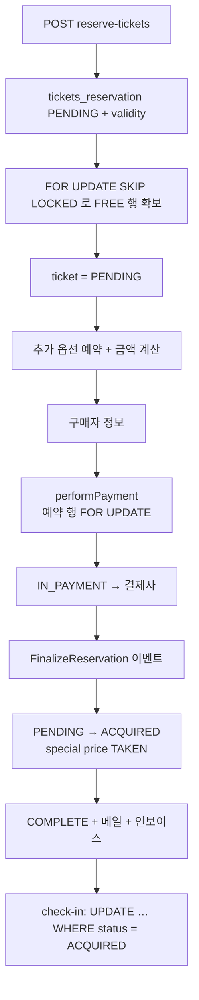

# alf.io 2.0-M6 — 티켓 1장 = 행 1개

**경로:** `alf.io/`  
**버전:** `2.0-M6-SNAPSHOT` (`gradle.properties`)  
**스택:** Java 25, Spring Boot 4.1.1, PostgreSQL, Flyway. Gradle 단일 모듈.

JPA 엔티티가 없다. 불변 POJO + `@QueryRepository`에 SQL을 직접 적는다.  
스키마: `src/main/resources/alfio/db/PGSQL/`  
도메인: `src/main/java/alfio/manager/`, `model/`, `repository/`

---

## 상품은 무엇인가

| 모델 | 테이블 | 의미 |
|------|--------|------|
| `Event` | `event` | 행사. `available_seats`, 통화, VAT, 허용 결제수단. 상태 `DRAFT/PUBLIC/DISABLED` |
| `TicketCategory` | `ticket_category` | 권종. 판매 시작·끝, 정원, bounded 여부 |
| `Ticket` | `ticket` | **재고 1단위.** 상태 머신 그 자체 |
| `TicketReservation` | `tickets_reservation` | 주문 헤더. UUID, 만료 `validity` |
| `SpecialPrice` | `special_price` | 제한 권종의 초대 코드. 티켓 1장에만 연결 (unique) |
| `PromoCodeDiscount` | `promo_code` | 할인 / 입장 코드 / 동적 코드 |
| `AdditionalService` | `additional_service` | 도네이션·추가 옵션. `available_qty`, 주문당 상한 |
| `Subscription` | `subscription` | 구독권. 티켓과 같은 상태 이름을 재사용 |

### bounded와 unbounded

이벤트 생성 시 티켓 행을 미리 만든다 (`EventManager.prepareTicketsBulkInsertParameters`).

- **bounded** (`bounded=true`, 기본): 권종마다 `max_tickets`개의 행. `category_id`가 이미 박혀 있다.
- **unbounded**: `category_id IS NULL`인 공용 풀에서 꺼낸 뒤, 예약 순간에 권종을 붙인다. 취소하면 `category_id`를 다시 null로 돌려 풀에 넣는다.
- **날짜**는 재고 종류가 아니라 제약이다. `inception`/`expiration`이 판매 창, `valid_checkin_*`·`ticket_validity_*`가 사용 창.

티켓 상태:

```
FREE → PENDING → ACQUIRED → CHECKED_IN
                 TO_BE_PAID (현장 결제)
       PRE_RESERVED (판매 전 대기열)
CANCELLED, EXPIRED, INVALIDATED, RELEASED
```

예약 상태(일부): `PENDING → IN_PAYMENT → FINALIZING → COMPLETE`, 그리고 `CANCELLED`, `CREDIT_NOTE_ISSUED`, 오프라인 결제용 상태들.

`src/main/java/alfio/model/Ticket.java`  
`src/main/java/alfio/model/TicketCategory.java`

---

## 재고를 집어 가는 방법

`TicketReservationManager.reserveTickets`:

- bounded → `selectTicketInCategoryForUpdateSkipLocked`
- unbounded → `selectNotAllocatedTicketsForUpdateSkipLocked` (`category_id is null`)

```sql
select id from ticket
where status in (:requiredStatuses)
  and category_id = :categoryId
  and event_id = :eventId
  and tickets_reservation_id is null
order by id
limit :amount
for update skip locked
```

잠근 행 수가 요청 수와 다르면 `NotEnoughTicketsException`.  
이어서 `status='PENDING'`, `tickets_reservation_id`를 채운다.

대기열(`waiting_queue`, unique `(event_id, email)`):

- `PRE_SALES`: 판매 시작 전
- `SOLD_OUT`: 매진 후
- 티켓이 `RELEASED`가 되면 `distributeSeats`가 대기자에게 예약을 만들어 준다

추가 옵션 `AdditionalServiceItem`도 티켓과 같은 상태 전이(`FREE → PENDING → ACQUIRED`)를 탄다.

---

## 환불·취소

돈이 두 갈래다.

| 갈래 | 하는 일 |
|------|---------|
| 게이트웨이 환불 | `PaymentManager.refund` → Stripe/Mollie/Saferpay/PayPal. 오프라인은 불가. Stripe는 `Refund.create(charge, amount)` |
| 크레딧 노트 | `issueCreditNoteForReservation`. 예약 상태 `CREDIT_NOTE_ISSUED`, PDF 문서. 회계 취소이지 카드 취소는 아님 |

관리자 취소 (`AdminReservationManager`):

- `CHECKED_IN`이 있으면 거절
- 환불 플래그가 있으면 게이트웨이 환불. 티켓 단위로는 `final_price_cts`
- 청구서가 있으면 크레딧 노트(전액 또는 부분)
- `batchReleaseTickets`: 상태 `RELEASED`, **UUID를 새로 발급** (예전 QR 무효화)
- special price는 `FREE`로 리셋
- unbounded는 `category_id`를 null로

참가자 셀프 취소는 **무료 티켓**이고 `ALLOW_FREE_TICKETS_CANCELLATION`일 때만 `releaseTicket`.  
SQL 조건: `status in ('ACQUIRED','PENDING','TO_BE_PAID')`.

`src/main/java/alfio/manager/PaymentManager.java`  
`src/main/java/alfio/manager/payment/BaseStripeManager.java`  
`src/main/java/alfio/manager/AdminReservationManager.java`

---

## 예약 흐름

기본 홀드 시간은 25분(`RESERVATION_TIMEOUT`).



확정은 결제 성공 트랜잭션 안에서 끝내지 않고 `ReservationFinalizer` 이벤트로 넘긴다. 재시도 잡이 있다.

만료 청소: `findExpiredReservationForUpdate`도 `SKIP LOCKED`. 지우면서 티켓을 풀로 되돌린다.

체크인 SQL (`TicketRepository.performCheckIn`):

```sql
update ticket set status = 'CHECKED_IN', locked_assignment = true
where uuid = :uuid and event_id = :eventId and status = 'ACQUIRED'
```

갱신 행 수가 0이면 이미 체크인됐거나 상태가 바뀐 것이다.

---

## DB 제약

| 제약 | 의미 |
|------|------|
| `unique(uuid)`, `unique(public_uuid)` | 티켓 공개 식별자 |
| `unique(special_price_id_fk)` | 초대 코드 1개당 티켓 1장 |
| unique `(event_id, ext_reference)` | 외부 참조 |
| `special_price.code` unique | |
| `waiting_queue (event_id, email)` unique | |

티켓 status에 DB CHECK는 없다. `WHERE status = '…'`가 전이 조건이다.

---

## 락

| 기법 | 쓰임 |
|------|------|
| `FOR UPDATE SKIP LOCKED` | 빈 티켓 집기, 만료 예약 청소, 대기 티켓 |
| `FOR UPDATE` | 결제 중 예약 행, 체크인용 티켓 UUID, 액세스 코드 |
| `UPDATE … WHERE status = …` | 해제, 체크인. compare-and-swap |
| JPA `@Version`, Redis, `synchronized` | 재고에는 없음 |

`SKIP LOCKED`라서 마지막 장을 두고 두 사람이 붙으면, 한 사람은 그 행을 잠그고 다른 사람은 잠긴 행을 건너뛴다. 남은 행이 모자라면 예외로 끝난다. 서로를 3초씩 기다리지 않는다 (pretix advisory lock과의 차이).

`src/main/java/alfio/repository/TicketRepository.java`  
`src/main/java/alfio/repository/TicketReservationRepository.java`  
동시성 테스트: `src/test/java/alfio/manager/TicketReservationManagerConcurrentTest.java`

---

## 이 코드에서 가져갈 것

- 수량이 작고 개체(좌석, QR)가 중요하면 **행 하나 = 재고 하나**가 카운터보다 단순하다.
- `SKIP LOCKED`는 대기 없이 풀을 나눠 갖는다. 쿼터처럼 “숫자 하나”를 잠글 때는 advisory lock이 맞고, “빈 행을 집어 갈 때”는 SKIP LOCKED가 맞다.
- 취소 시 UUID를 회전시키면 유출된 QR을 무효로 만들 수 있다.
- 카드 환불과 세금계산서 역발행(크레딧 노트)은 다른 문서다. 둘 다 해야 할 때가 있다.
