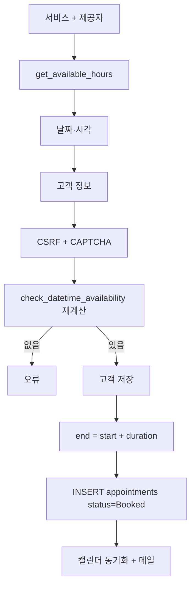

# Easy!Appointments 1.6 — 서비스 시간 슬롯

**경로:** `easyappointments/`  
**버전:** `application/config/app.php`의 1.6.0 (`composer.json`은 1.5.2)  
**스택:** PHP ≥ 8.2, CodeIgniter 3 (`system`은 3.2.0-dev), MySQL, jQuery 위자드

결제·장바구니·SKU가 없다. `services.price`는 확인 화면에 보여주는 숫자다.

```
application/controllers/Booking.php          공개 예약
application/controllers/Booking_cancellation.php
application/libraries/Availability.php       슬롯 생성
application/models/Appointments_model.php
application/migrations/                      001–069
```

---

## 상품 자리에 있는 것

| 개념 | 테이블 | 필드 |
|------|--------|------|
| 서비스 | `services` | `duration`(분, 최소 5), `price`, `currency`, `slot_interval`(시작 간격, 기본 15), `attendants_number`(동시 인원, 기본 1), `is_private` |
| 카테고리 | `service_categories` | 이름만. 재고와 무관 |
| 제공자 | `users` + `user_settings` | `working_plan` JSON(요일 시작·끝·휴식), 역할 `provider` |
| 제공 가능 서비스 | `services_providers` | `(id_users, id_services)` PK |
| 고객 | `users` 역할 `customer` | 이메일로 찾음 |
| 예약 | `appointments` | `start_datetime`, `end_datetime`, `hash`(12자), `status` |
| 제공자 휴무 | 같은 `appointments`, `is_unavailability=true` | 고객·서비스 없음 |
| 전체 휴무 | `blocked_periods` | 모든 제공자 |
| 날짜 예외 | `working_plan_exceptions` | 기간 동안 근무시간을 덮어씀 |

`status` 기본 옵션(마이그레이션 043): `Booked`, `Confirmed`, `Rescheduled`, `Cancelled`, `Draft`.  
공개 예약은 배열의 첫 값(보통 `Booked`)을 넣는다. **취소는 이 값을 바꾸지 않고 행을 지운다.**

---

## 용량

`Availability::get_available_hours`

1. 그날 전체가 `blocked_periods`면 빈 목록
2. 제공자 요일 근무시간, 없으면 예외 근무시간
3. 같은 날의 예약·불가·휴무·휴식 구간을 빼 빈 구간을 만든다
4. `slot_interval`로 걸어 가며, 남은 시간이 `duration` 이상인 시작 시각만 내놓는다
5. `attendants_number > 1`이면 그 슬롯의 같은 서비스 인원이 상한 미만일 때만 연다. **다른 서비스와 시간이 겹치면 거절**
6. `book_advance_timeout`(기본 30분), `future_booking_limit`(기본 90일)

같은 고객이 같은 슬롯을 또 잡는 것도 `Booking::register`에서 막는다.

관리자 캘린더는 `Appointments_model::has_provider_conflict`로 겹침을 보되, `force_save`로 통과시킬 수 있다.  
공개 API `Appointments_api_v1::store`는 가용 검사 없이 `save`한다.

`application/libraries/Availability.php`

---

## 환불·취소

결제 게이트웨이, 주문, 환불 테이블이 없다.

취소 (`Booking_cancellation`):

- `POST booking_cancellation/of/{hash}` + `cancellation_reason`
- hash 형식 검사, IP당 10분에 5회
- `appointments` 행 DELETE
- 삭제 메일, Google/CalDAV 동기화, `WEBHOOK_APPOINTMENT_DELETE`

슬롯은 행이 사라지면 다음 `get_available_hours`부터 다시 비어 보인다.

---

## 예약 흐름



변경 모드 `booking/reschedule/{hash}`는 자기 예약을 가용 계산에서 제외하고 같은 `register`를 탄다.

---

## DB

`application/migrations/001_specific_calendar_sync.php`가 기본 스키마.

`appointments`에 `(provider, start_datetime)` 유니크가 없다. 인덱스는 있어도 겹침을 금지하지 않는다.  
FK: 제공자·고객·서비스 삭제 시 CASCADE.  
`user_settings`는 `users`와 1:1 (`id_users` PK).

---

## 락

`trans_start` / `FOR UPDATE` / advisory lock / 버전 컬럼이 없다.

`Booking::check_datetime_availability`가 슬롯을 다시 계산한 뒤, 그 다음 줄에서 `save`한다. 두 호출이 둘 다 “비어 있음”을 보면 둘 다 INSERT된다. 코드 주석도 이 레이스를 인정한다 (`Booking.php`의 availability 검사 근처).

```
available_hours 재계산
  → 아직 있으면
  → appointments_model->save   # 둘을 한 트랜잭션으로 묶지 않음
```

---

## 이 코드에서 가져갈 것

- 재고가 시간이면 **근무시간 − (예약 ∪ 휴식 ∪ 휴무)** 로 슬롯을 생성한다.
- 용량은 `attendants_number` 하나다. 1이면 배타, 2 이상이면 같은 서비스만 세고 다른 서비스와는 여전히 배타다.
- 취소 = 소프트 상태가 아니라 DELETE. 외부 캘린더 동기화가 “삭제 이벤트”에 의존한다.
- 검사와 삽입을 트랜잭션·유니크 제약으로 묶지 않으면 동시 예약이 통과한다. 공개 API는 검사조차 없다.
