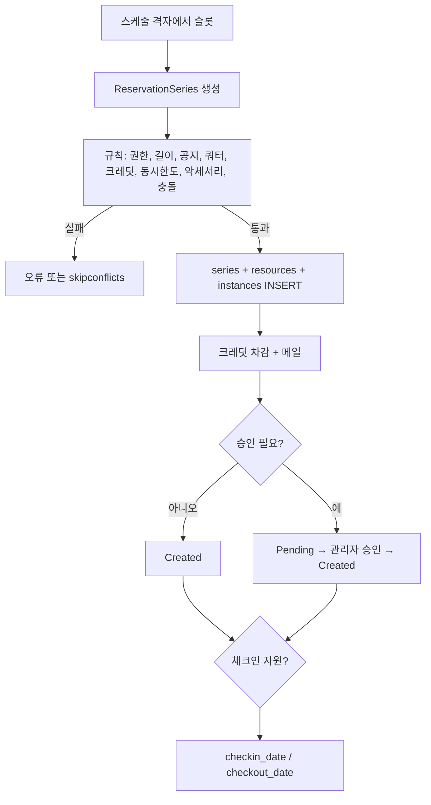

# LibreBooking 5.3 — 자원의 시간 배타와 크레딧

**경로:** `librebooking/`  
**버전:** 5.3.0 (`lib/Config/Configuration.php`)  
**스택:** PHP ≥ 8.2, MySQL 8 / MariaDB, Smarty 5. Booked Scheduler 포크.

SKU 없이 회의실·장비의 시간을 예약한다. 층은 Pages → Presenters → `lib/Application` → `Domain` → SQL 커맨드.

```
lib/Application/Reservation/     검증 규칙, 충돌, 저장
Domain/                          BookableResource, ReservationSeries, Quota
lib/Database/Commands/Queries.php
database_schema/create-schema.sql
database_schema/upgrades/2.5 … 2.9
```

---

## 상품 자리에 있는 것

| 엔티티 | 하는 일 |
|--------|---------|
| `BookableResource` | 예약 대상. 스케줄, 최소·최대·증가 시간, 승인 필요, 참가자 상한, 버퍼, 체크인, 크레딧 |
| `Schedule` | 시간 격자. `total_concurrent_reservations`, 예약당 최대 자원 수 |
| `ReservationSeries` | 예약의 논리 단위. 제목, 반복, 소유자, `status_id` |
| `Reservation` (instance) | 한 번의 발생. `start_date`, `end_date`, `reference_number`, `credit_count` |
| `Accessory` | 유한 수량 부가물. NULL이면 무제한. 시리즈에 붙음 |
| `ResourceGroup`, `ResourceType` | 묶음·분류 |
| `Blackout` | 관리자 차단. 충돌로 항상 실패 |
| `CustomAttribute` | 예약·사용자·자원·자원타입 추가 필드 |

자원마다 다른 규칙 (`resources` + 업그레이드 컬럼, 일부는 `additional_properties` JSON):

- `min_duration`, `max_duration`, `min_increment`, `min_notice_time`, `max_notice_time`
- `requires_approval`
- `buffer_time` — 비관리자 충돌 검사 때 앞뒤로 시간을 늘림
- `enable_check_in`, `auto_release_minutes`
- `credit_count`, `peak_credit_count`
- `MaxConcurrentReservations` — 한 자원에 겹침 N건 허용. 기본 1

시리즈와 발생을 나눈 이유: 반복 예약은 시리즈 1개 + 인스턴스 N개다. 자원 연결은 `reservation_resources (series_id, resource_id)`.

`Domain/BookableResource.php`  
`Domain/ReservationSeries.php`

---

## 충돌 = 재고 검사

```
ReservationHandler::Handle
  → ResourceAvailabilityRule
      → ReservationConflictIdentifier::GetConflicts
          → 기간 안의 활성 예약 + 블랙아웃
```

겹침은 PHP `DateRange::Overlaps`. **끝이 다른 예약의 시작과 같으면 겹치지 않는다.** 버퍼가 있으면 그 간격까지 벌린 뒤 비교한다.

쿼리 조각 (`Queries.php` `DATE_FRAGMENT`):

```sql
(ri.start_date BETWEEN @start AND @end)
 OR (ri.end_date BETWEEN @start AND @end)
 OR (ri.start_date <= @start AND ri.end_date >= @end)
-- 그리고
rs.status_id <> 2
```

추가 규칙:

| 규칙 | 내용 |
|------|------|
| 블랙아웃 | 하나라도 있으면 불가 |
| 자원 동시 한도 | 겹친 수가 `MaxConcurrentReservations` 미만일 때만 |
| 스케줄 동시 한도 | `schedules.total_concurrent_reservations > 0`이면 스케줄 전체 겹침 수 |
| 악세서리 | 겹치는 구간의 수량 합 ≤ `accessory_quantity` |
| 반복 자기 겹침 | `ReservationOverlappingRule` |
| `skipconflicts` | 반복 중 충돌 나는 회차만 버리고 나머지 저장 |

`lib/Application/Reservation/ReservationConflictIdentifier.php`  
`lib/Application/Reservation/Validation/ResourceAvailabilityRule.php`  
`lib/Application/Reservation/Validation/AccessoryAvailabilityRule.php`

---

## 크레딧과 환불

예약의 “가격”은 돈보다 **크레딧**이다.

| 저장 | 의미 |
|------|------|
| `users.credit_count` | 잔액 |
| `reservation_instances.credit_count` | 그 회차 비용 |
| `resources.credit_count` / `peak_credit_count` | 자원 단가 |
| `credit_log` | 변경 전 잔액, 변경 후, 메모 |
| `quotas` | 시간/건수 한도. 일·주·월·년, 자원·그룹·스케줄 범위. 돈이 아님 |

`CreditsRule`은 `필요 크레딧 <= 잔액`.  
생성 시 `AdjustUserCreditsCommand`로 차감.  
삭제 시 `0 - 미사용 크레딧`을 넣어 잔액에 더한다. SQL은 `credit_count = credit_count - @credit_count`라서 음수 조정이 환불이다.

```sql
INSERT INTO credit_log (...)
  SELECT user_id, credit_count, COALESCE(credit_count,0) - @credit_count, ...
UPDATE users SET credit_count = COALESCE(credit_count,0) - @credit_count WHERE user_id = @userid;
```

카드 결제는 **크레딧 팩 구매**다 (`payment_configuration`, `payment_transaction_log`, 업그레이드 2.7).  
`refund_transaction_log`와 `ManagePaymentsPresenter::IssueRefund`는 그 구매를 관리자가 환불할 때다. 예약 취소가 Stripe 환불을 자동으로 부르지는 않는다.

`Domain/Quota.php`  
`Pages/Credits/CheckoutPage.php`

---

## 예약 흐름

상태 (`ReservationStatus`): `1 Created`, `2 Deleted`, `3 Pending`.



취소:

- 전부 취소 → `reservation_series.status_id = 2` (소프트 삭제). 충돌 쿼리가 `<> 2`로 제외
- 일부 회차 → 해당 `reservation_instances` DELETE
- 이어서 미사용 크레딧 복원

`lib/Application/Reservation/` 의 Handler, `Domain/Access/ReservationRepository`

---

## DB

| 테이블 | 포인트 |
|--------|--------|
| `resources` | 시간 규칙, `requires_approval`, 이후 컬럼으로 buffer, check-in, credit, `additional_properties` |
| `reservation_series` | `status_id`, `owner_id`, 반복 옵션 |
| `reservation_instances` | `start_date`, `end_date` 인덱스. **(자원, 시간) 유니크 없음** |
| `reservation_resources` | PK `(series_id, resource_id)` |
| `blackout_series` / `blackout_instances` / `blackout_series_resources` | |
| `accessories` | `accessory_quantity` NULL = 무제한 |
| `quotas` | `quota_limit`, `unit`, `duration`, 범위 FK |
| `credit_log` | 잔액 감사 |
| `payment_transaction_log`, `refund_transaction_log` | 크레딧 구매와 그 환불 |

---

## 락

예약 경로에 `GET_LOCK`, `beginTransaction`, `SERIALIZABLE`, 배타 제약이 없다. `MySqlConnection`은 문장마다 autocommit에 가깝다.

그래서:

1. A와 B가 동시에 같은 자원을 읽으면 둘 다 충돌 0
2. 둘 다 `reservation_instances` INSERT 성공
3. 이중 예약이 남고, 다음 조회에서야 보인다

`MaxConcurrentReservations > 1`이어도 “N-1을 둘 다 보고 N+1이 되는” 같은 레이스가 있다.

`InstanceAddedEventCommand` 안에, 삽입 실패 시 시리즈를 지우려던 코드가 **주석 처리**되어 있다. 예전에는 DB 삽입 실패를 한 번 더 막으려 했던 흔적이다.

---

## 이 코드에서 가져갈 것

- 반복 예약은 **시리즈(정책·자원·악세서리) / 인스턴스(시각·크레딧·체크인)** 로 나누면 한 회차만 지울 수 있다.
- 시간 겹침은 인덱스로 후보를 줄이고, 버퍼·한도·블랙아웃은 애플리케이션 규칙으로 쌓는다.
- 크레딧 원장(`credit_log`에 변경 전 값)은 잔액 컬럼만 있을 때보다 감사가 쉽다. 취소 환불은 음수 차감으로 통일했다.
- 제약이 없으면 충돌 검사는 안내일 뿐이고, 동시성 보장은 아니다. QloApps가 오버부킹 플래그라도 남기는 것과 비교하면, 여기서는 두 예약이 그냥 둘 다 `Created`가 된다.
