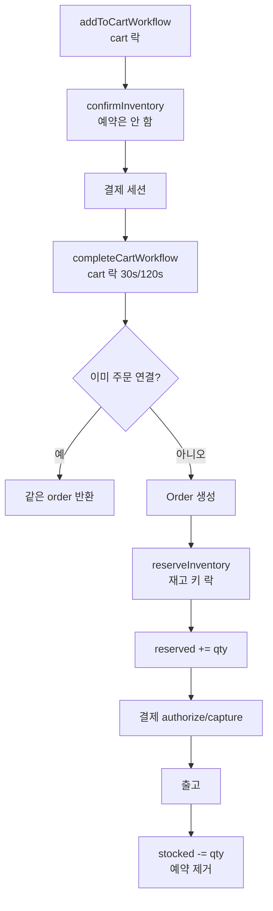

# Medusa 2.20 — 모듈로 쪼갠 헤드리스 커머스

**경로:** `medusa/`  
**버전:** `@medusajs/medusa` 2.20.1  
**스택:** Node.js, TypeScript, MikroORM, PostgreSQL, 워크플로 엔진(Redis 또는 인메모리)

상품·가격·재고·주문·결제가 각각 npm 패키지이고, 패키지끼리 **모듈 링크 테이블**로 붙는다. 비즈니스 절차는 `packages/core/core-flows`의 워크플로가 묶는다.

```
packages/modules/product|pricing|inventory|stock-location|cart|order|payment|fulfillment
packages/modules/link-modules     # variant↔재고, variant↔가격, 채널↔창고
packages/core/core-flows          # 장바구니 완료, 출고, 환불
packages/modules/providers/locking-postgres|locking-redis
```

---

## 상품은 무엇인가

구매 단위는 항상 **ProductVariant**다. Product는 이름·핸들·상태의 그릇이다.

```
Product
  ├── ProductOption (Color, Size)
  │     └── ProductOptionValue (Red, M)
  ├── ProductVariant  ← SKU, 재고 관리 여부, 백오더 허용
  │     ├── link: product_variant_inventory_item (required_quantity)
  │     └── link: product_variant_price_set → Price
  ├── ProductType, ProductCategory(트리), ProductCollection
  └── SalesChannel ── link ── StockLocation
```

| 개념 | 이 코드에서의 의미 |
|------|-------------------|
| 단순 상품 | Product 1 + Variant 1 |
| 옵션 상품 | 옵션 값 조합마다 Variant |
| 키트 | Variant 1개가 InventoryItem 여러 개에 연결. `required_quantity`만큼 재고를 깎음 |
| 기프트카드 | `Product.is_giftcard`. 카드 원장은 loyalty 플러그인 쪽 |
| 디지털 | `InventoryItem.requires_shipping = false`, 필요하면 `manage_inventory = false` |
| 가격 | v1의 MoneyAmount는 삭제됨. `Price.amount`가 금액 |

변형이 재고를 끄면(`manage_inventory = false`) 항상 재고 있음으로 본다. `allow_backorder = true`면 모자라도 주문을 받는다.

모델: `packages/modules/product/src/models/`, `packages/modules/pricing/src/models/price.ts`

---

## 재고

세 층이다.

| 테이블 | 역할 | 핵심 컬럼 |
|--------|------|-----------|
| `inventory_item` | SKU 원장 | `sku` unique |
| `inventory_level` | 창고(location)별 수량 | `stocked_quantity`, `reserved_quantity`, `incoming_quantity`. unique `(inventory_item_id, location_id)` |
| `reservation_item` | 주문 라인에 묶어 둔 홀드 | `line_item_id`, `quantity`, `location_id` |

```
available = stocked_quantity - reserved_quantity
```

`allocated_quantity` 컬럼은 없다. 예약이 소프트 할당이다.

| 시점 | 하는 일 |
|------|---------|
| 장바구니 담기 | `confirmInventory`로 available만 검사. **예약 행은 안 만든다** |
| 주문 확정 `completeCartWorkflow` | `createReservationItems` → `reserved_quantity` 증가 |
| 출고 | `stocked_quantity` 감소, 예약 삭제·감소 |
| 반품 수령 | `stocked_quantity` 증가 |
| 주문 취소 | 라인의 예약 삭제 |

예약 생성 시 `available < 요청 수량`이면 거절한다. 백오더면 이 검사를 건너뛴다.

`packages/modules/inventory/src/services/inventory-module.ts`  
`packages/core/core-flows/src/cart/steps/reserve-inventory.ts`  
`packages/core/core-flows/src/order/workflows/create-fulfillment.ts`

---

## 환불·반품·교환

돈과 물건이 갈라져 있다.

- **Payment / Capture / Refund / RefundReason** — 결제 모듈. 환불은 캡처된 금액을 넘지 못한다.
- **Return** — 반품. `refund_amount`, 수령 위치.
- **OrderClaim**, **OrderExchange** — 클레임·교환. 교환은 `difference_due`.
- **OrderChange** — 반품·교환·주문수정의 상태 그릇. `PENDING → CONFIRMED | DECLINED | CANCELED`. 확정되면 `order.version`이 올라간다.

```
반품 시작 → OrderChange PENDING
  → 반품 확정 → 물건 수령 → stocked 증가
  → 관리자가 refundPaymentWorkflow
       → payment 행 FOR UPDATE
       → Refund 행 생성
       → provider.refundPayment(idempotency_key = refund.id)
       → order_transaction (reference = refund, 금액 음수)
```

전액 환불은 `refundCapturedPaymentsWorkflow`가 결제마다 `captured - 이미 환불`을 계산한다.

`packages/core/core-flows/src/payment/workflows/refund-payment.ts`  
`packages/modules/payment/src/services/payment-module.ts`

---

## 주문 흐름



결제 실패 보상: 승인만 됐으면 취소, 캡처됐는데 주문이 없으면 환불. 같은 cart에 주문이 이미 있으면 그 주문을 돌려준다.

---

## DB에서 볼 테이블

| 묶음 | 테이블 |
|------|--------|
| 카탈로그 | `product`, `product_variant`, `product_option`, `product_option_value`, `product_category` |
| 링크 | `product_variant_inventory_item`, `product_variant_price_set`, `sales_channel_stock_location` |
| 재고 | `inventory_item`, `inventory_level`, `reservation_item` |
| 주문 | `order`(`version`), `order_item`(`version`), `order_line_item`, `order_change`, `return`, `order_claim`, `order_exchange`, `order_transaction` |
| 결제 | `payment_collection`, `payment`, `capture`, `refund`, `refund_reason` |
| 가격 | `price_set`, `price` |

`inventory_level`은 `(inventory_item_id, location_id)` 부분 유니크(soft delete 제외). variant의 `sku`, `barcode`, `ean`, `upc`도 유니크.

---

## 락

| 대상 | 방법 |
|------|------|
| 재고 예약·조정 | 재고 아이템 id로 `pg_advisory_xact_lock` 또는 Redis `SET NX`. **inventory_level 행 FOR UPDATE는 없다** |
| 장바구니 완료 | `acquireLockStep(cart_id)` |
| 환불 | `SET LOCAL lock_timeout = '3s'` 후 `payment` 행 `FOR UPDATE`. 락 안에서 캡처·기존 환불을 다시 읽음 |
| 프로모션 | `promotion`, `promotion_campaign_budget`을 id 순 `FOR UPDATE` |
| 주문 수정 | `order.version` 낙관적 스냅샷 |

카트 단계에는 재고 락이 없어서, 두 사람이 마지막 재를 같이 담을 수 있다. 막는 지점은 **주문 확정의 재고 키 락 + available 검사**다.

`packages/modules/providers/locking-postgres/src/services/advisory-lock.ts`

---

## 이 코드에서 가져갈 것

- 가격·재고·주문을 테이블로 직접 묶지 않고 링크 테이블로 떼었다. 모듈 DB를 따로 둘 수 있다.
- 재고 수명주기: **검사(카트) → 예약(주문) → 차감(출고) → 복원(반품 수령)**.
- 돈의 동시성은 행 락, 재고의 동시성은 advisory/Redis 락으로 역할을 나눴다.
