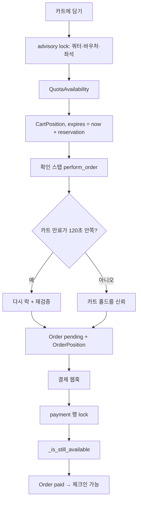

# pretix 2026.8 — 쿼터를 저장하지 않고 매번 센다

**경로:** `pretix/`  
**버전:** `2026.8.0.dev0` (`src/pretix/__init__.py`)  
**스택:** Python ≥ 3.11, Django 5.2, Celery, Redis, PostgreSQL

이벤트 티켓 샵이다. 상품 모델 이름은 `Item`이다.

```
src/pretix/base       모델, 카트, 주문, 쿼터, 락
src/pretix/presale    구매 화면, 체크아웃 스텝
src/pretix/control    주최자 백오피스
src/pretix/plugins    Stripe, PayPal, 계좌이체, PDF 티켓
```

---

## 상품은 무엇인가

| 모델 | 의미 |
|------|------|
| `Item` | 파는 것. `admission=True`면 입장권 |
| `ItemVariation` | 사이즈·등급 같은 변형 |
| `ItemCategory` | 묶음. `is_addon`이면 추가 옵션 카테고리 |
| `ItemAddOn` | 본품이 고를 수 있는 애드온 카테고리 |
| `ItemBundle` | 본품을 사면 `count`만큼 자동으로 붙는 구성품. 포지션은 `is_bundled=True` |
| `Quota` | 용량 풀. 아이템·변형·(시리즈면) 서브이벤트에 연결 |
| `SubEvent` | 시리즈 안의 회차 |
| `Seat` | 지정석 |
| `Voucher` | 할인·지정석·쿼터 선점(`block_quota`) |
| `Question` | 체크아웃/체크인 질문 |
| `Discount` | 장바구니 자동 할인 규칙 |

`require_bundling=True`인 아이템은 혼자 팔리지 않고 번들 안에서만 팔린다. `issue_giftcard=True`면 구매 시 기프트카드를 발행한다.

포지션(카트 줄 = 주문 줄)은 `orders.py`의 `AbstractPosition`을 공유한다. 줄이 속한 쿼터는 **변형이 없으면 아이템 쿼터, 있으면 변형 쿼터**이고 서브이벤트로 한 번 더 거른다.

`src/pretix/base/models/items.py`

---

## 재고 = 쿼터 가용성

`Quota.size`가 null이면 무제한, 0이면 품절, 양수면 그 수가 정원이다. **팔린 수 컬럼은 없다.**

`QuotaAvailability` (`src/pretix/base/services/quotas.py`) 계산 순서:

1. `closed` / `size == 0`이면 즉시 품절
2. `OrderPosition` 중 주문이 `pending` 또는 `paid`
3. `block_quota` 바우처의 남은 사용 횟수
4. `expires >= now`인 `CartPosition`
5. 대기열 (설정 시)

상태 코드: `GONE(0) < ORDERED(10) < RESERVED(20) < OK(100)`.  
`ORDERED`는 결제대기·완료가 정원을 채운 것, `RESERVED`는 카트가 채운 것이다.

빼는 예외:

- `ignore_from_quota_while_blocked`이고 `blocked`가 있으면 쿼터에서 뺀다 (체크인 차단 중 자리를 돌려줌)
- `release_after_exit`면 퇴장한 사람을 정원에서 뺀다

카트 줄의 `expires`는 `now + reservation_time`. 만료되면 다음 계산부터 빠진다.

지정석은 숫자 쿼터와 별도다. `Seat.is_available`이 주문·미만료 카트·좌석 바우처를 보고, `seating_minimal_distance`로 옆 자리까지 비울 수 있다.

Redis `quotas:{event}:availabilitycache`는 읽기 캐시(약 120초)다. 쓰기의 기준이 아니다.

---

## 환불

`OrderRefund` 상태: `created | transit | done | failed | canceled | external`  
출처: `buyer | admin | external`

`pending` 잔액 = `주문 총액 - 확정 결제 + (done|transit|created 환불)`.

| 동작 | 내용 |
|------|------|
| 결제 확정 | `OrderPayment.confirm` → 잔액이 총액 이상이고 `_can_be_paid`가 쿼터를 다시 보면 `paid` |
| 자동 환불 | `propose_auto_refunds`로 결제 건에 나눠 `execute_refund` |
| 기프트카드 환불 | `refund_as_giftcard` |
| 수동 환불 | provider `manual` |
| 취소 수수료 | `OrderFee.FEE_TYPE_CANCELLATION`. 포지션은 취소하고 수수료만 남길 수 있음 |
| 기프트카드 상품 | 발행 카드를 일부 쓰면 주문 취소가 막힌다 |

결제 프로바이더 기본 `execute_refund`는 “자동 환불 미지원” 예외다. Stripe 플러그인은 결제 행을 잠그고 `stripe.Refund.create` 후 `refund.done()`.

주문 상태: `n` pending, `p` paid, `e` expired, `c` canceled.  
결제 상태: `created → pending → confirmed | failed | canceled | refunded`.

`src/pretix/base/models/orders.py`  
`src/pretix/base/services/orders.py`  
`src/pretix/base/payment.py`

---

## 구매 흐름

체크아웃 스텝 (`presale/checkoutflow.py`):  
고객 → (멤버십) → 애드온 → 질문 → 결제 → 확인.



`require_approval`이면 주최자 승인 전에 결제가 진행되지 않는다.  
체크인은 `OrderPosition`에 `Checkin` 행을 쌓는다.

취소: 주문 `canceled` → 바우처 사용 횟수 감소 → (선택) 취소 수수료 → (선택) 자동 환불. 쿼터는 컬럼을 되돌리지 않는다. 다음 가용 계산에서 그 주문이 빠진다.

---

## DB (`pretixbase_` 접두사)

| 테이블 | 포인트 |
|--------|--------|
| `pretixbase_item`, `itemvariation`, `quota` | 쿼터↔아이템, 쿼터↔변형 M2M |
| `pretixbase_cartposition` | `cart_id`, `expires` 인덱스 |
| `pretixbase_order` | unique `(organizer, code)` |
| `pretixbase_orderposition` | unique `(organizer, secret)` — QR 비밀값 |
| `pretixbase_orderpayment`, `orderrefund`, `orderfee` | |
| `pretixbase_seat` | **한 좌석의 이중 예약을 막는 DB 유니크는 없음**. 애플리케이션이 막음 |
| `pretixbase_voucher` | `max_usages`, `redeemed`, `block_quota` |

---

## 락

`src/pretix/base/services/locking.py`

PostgreSQL이면 `pg_advisory_xact_lock` / shared. 반드시 `transaction.atomic()` 안.  
키 공간: Event=1, Quota=2, Seat=3, Voucher=4, Membership=5.  
대기 한도 3초. 독점 락이 20개를 넘으면 **이벤트 전체 독점 락**으로 올려 락 폭주를 막는다.  
Postgres가 아니면 `select_for_update`로 폴백.

카트 변경(`cart.py` `_perform_operations`)은 수량이 늘어나는 쿼터·바우처·좌석만 독점 락하고, 이벤트는 공유 락이다.

`LOCK_TRUST_WINDOW = 120`초. 카트 만료가 2분보다 많이 남았으면 주문 생성 시 락을 생략하고 카트 홀드를 믿는다. 만료가 가까우거나 결제 확정(`_is_still_available(lock=True)`)에서는 다시 잠근다.

결제 웹훅은 `OrderPayment`를 `select_for_update`로 잠가 중복 confirm을 막는다.

Redis 락은 가용성 **캐시 쓰기** 쏠림만 막는다.

마지막 티켓: 두 요청이 같은 쿼터 advisory lock에서 만난다. 락을 가진 쪽만 가용 수를 갱신하고, 진 쪽은 3초 안에 실패하거나 품절로 거절된다. 둘 다 pending 주문이 되면 그 주문들이 쿼터를 차지하므로, 한 쪽이 만료·취소되기 전에는 둘 다 결제될 수 없다.

---

## 이 코드에서 가져갈 것

- 용량을 카운터로 두면 취소·만료·차단마다 증감 버그가 난다. pretix는 **사실 원장(주문·카트·바우처)을 합산**한다.
- 합산은 느리고 레이스가 있으므로, 합산 구간만 advisory lock으로 감싼다.
- “카트가 아직 오래 유효하면 락을 생략”하는 최적화(`LOCK_TRUST_WINDOW`)는 성능과 정확도의 타협이다. 결제 직전에는 다시 잠근다.
