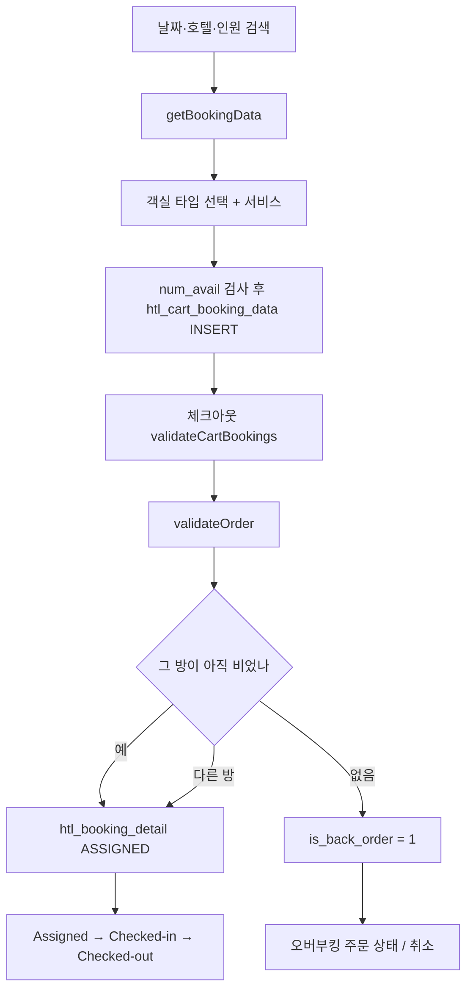

# QloApps 1.7 — 객실 × 날짜가 재고인 호텔 커머스

**경로:** `QloApps/`  
**기반:** PrestaShop 1.6.1.23 포크. QloApps 릴리스 v1.7.0, 호텔 모듈 `hotelreservationsystem` 1.7.1  
**스택:** PHP 8.1+, MySQL, Smarty, ObjectModel

호텔 로직은 override 폴더가 아니라 코어 `Product`, `Cart`, `Order`, `PaymentModule`과 모듈이 같이 갖고 있다.

```
modules/hotelreservationsystem/classes/     도메인 모델, DDL
modules/wkroomsearchblock/                  날짜·인원 검색
classes/PaymentModule.php                   결제 시 예약 확정
classes/Product.php                         booking_product 플래그
```

---

## 상품은 무엇인가

PrestaShop 상품을 두 종류로 쓴다.

| `product.booking_product` | 정체 |
|---------------------------|------|
| 1 | 객실 타입. 검색·예약의 상품 |
| 0 | 조식, 픽업 같은 서비스 상품. `selling_preference_type`으로 객실/호텔/단독 판매 |

```
HotelBranchInformation (htl_branch_info)     호텔. 체크인 시각, active_refund
  └── Category                               호텔 = 카테고리 노드
  └── HotelRoomType (htl_room_type)          객실 타입 = Product
        ├── 정원: adults, children, max_guests
        ├── LOS: min_los, max_los (+ 날짜 구간 제한)
        └── HotelRoomInformation             물리 방. room_num, floor, id_status
```

물리 방 상태: `ACTIVE(1) | INACTIVE(2) | TEMPORARY_INACTIVE(3)`  
임시 중지는 `htl_room_disable_dates` 구간.

요금은 상품 기본가 + `htl_room_type_feature_pricing`(기간·요일 impact).  
선결제는 `htl_advance_payment`가 객실 타입마다 정액/정률.

**`stock_available`은 객실 타입에 999999999 같은 값을 넣어 둔다.** 가용 수량이 아니다.

`modules/hotelreservationsystem/classes/HotelRoomType.php`  
`classes/Product.php`

---

## 재고 = 날짜가 겹치는 방

확정 예약 `htl_booking_detail.id_status`:

| 값 | 의미 |
|----|------|
| 1 ASSIGNED | 확정, 미도착 |
| 2 CHECKED_IN | 투숙 |
| 3 CHECKED_OUT | 퇴실. 겹침은 `check_out` 기준 |
| 4 NO_SHOW | 노쇼 |
| 5 CANCELLED | 취소 |

`HotelBookingDetail::getSearchAvailableRooms`는 `htl_room_information`의 활성 방에서 아래를 뺀다.

1. 날짜가 겹치는 `htl_booking_detail` (환불 완료 id는 서브쿼리로 제외, `is_back_order = 0`만)
2. `htl_room_disable_dates`
3. 최소/최대 숙박 위반
4. **이 카트**가 이미 잡은 방

다른 손님의 `htl_cart_booking_data`는 검색에서 빼지 않는다. 카트 홀드는 그 손님의 장부일 뿐, 전역 선점이 아니다.

카트 행(`htl_cart_booking_data`): 방 1개 × 기간. `quantity`는 박 수. `id_order = 0`인 동안 카트.  
상품 카트 수량은 `방 수 × 박 수`로 `Cart::updateQty`에 들어간다.

결제 `PaymentModule::validateOrder`:

1. 배정된 방이 아직 비었으면 정상 확정
2. 아니면 다른 빈 방으로 교체
3. 그것도 없으면 `is_back_order = 1`

오버부킹은 `PS_OVERBOOKING_ORDER_ACTION`, `PS_MAX_OVERBOOKING_PER_HOTEL_PER_DAY`로 주문 상태를 바꾸거나 취소할 수 있다.

`modules/hotelreservationsystem/classes/HotelBookingDetail.php`  
`modules/hotelreservationsystem/classes/HotelCartBookingData.php`

---

## 환불

호텔 규칙 테이블 `htl_order_refund_rules`.

| 컬럼 | 의미 |
|------|------|
| `days` | 체크인까지 남은 일수 하한. 크거나 같은 첫 규칙 적용 |
| `payment_type` | 1 정액, 2 정률 |
| `deduction_value_full_pay` | 완납 주문의 공제 |
| `deduction_value_adv_pay` | 선결제 주문의 공제 |

`getBookingCancellationDetails`:

```
daysBeforeCancel = 요청일 ~ 체크인
맞는 규칙이 있으면 공제 = 정률이면 총액 * 비율, 정액이면 그 금액
맞는 규칙이 없으면 공제 100% (환불 0)
```

총액 = 객실 세금 포함가 + 붙은 서비스.  
호텔은 `htl_branch_info.active_refund`와 `htl_branch_refund_rules`로 규칙을 켠다.

PrestaShop 환불 테이블을 호텔 id로 확장했다.

| 테이블 | 호텔에서의 역할 |
|--------|-----------------|
| `order_return` | 요청 헤더. `event_type` = 취소(1) / 노쇼(2) / 환불(3) |
| `order_return_detail` | `id_htl_booking`으로 예약 행 연결. 수량은 박 수 |
| `order_slip` | 크레딧 전표 |

미결제 취소는 `processRefundInBookingTables`를 바로 호출한다.  
결제된 건은 관리자 승인(`AdminOrderRefundRequestsController`)에서 금액을 넣고, 필요하면 `OrderSlip::create`.  
환불 완료 상태는 `OrderReturn::getRefundedBookingIdsSubquery`에 들어가 다음 가용 검색에서 빠진다. 예전 `is_refunded` 플래그를 대체한다.

주문에는 `is_advance_payment`, `advance_paid_amount`가 있다.

`modules/hotelreservationsystem/classes/HotelOrderRefundRules.php`

---

## 예약 흐름



검색 모드: `PS_FRONT_SEARCH_TYPE`이 인원 기준(OWS) 또는 방 개수.  
운영 전이는 `HotelBookingStatus::getAllowedTransitions`, 이력은 `htl_booking_status_history`.

---

## DB (접두사 보통 `ps_`)

DDL: `modules/hotelreservationsystem/classes/HotelReservationSystemDb.php`

```
htl_branch_info ──< htl_room_type ──< htl_room_information
                         │ id_product
                         ▼
                      product (booking_product=1)
htl_cart_booking_data ── cart ── orders ── order_detail
         │
         └── htl_booking_detail ── order_return_detail.id_htl_booking
```

| 테이블 | 핵심 |
|--------|------|
| `htl_room_information` | 물리 방. `id_product`, `room_num`, `id_status` |
| `htl_cart_booking_data` | `id_cart`, `id_room`, `date_from/to`, `id_order` |
| `htl_booking_detail` | `id_order`, `id_room`, 날짜, 가격 스냅샷, `id_status`, `is_back_order` |
| `htl_room_disable_dates` | 방/타입 중지 구간 |
| `htl_order_refund_rules` | 일수별 공제 |
| `orders` | `is_advance_payment`, `advance_paid_amount` |
| `order_detail` | `is_booking_product`, 수량 = 방·박 |

날짜별 수량 테이블은 없다. 방 목록에서 겹치는 예약을 빼서 센다.

---

## 락

애플리케이션 코드에 호텔 재고용 `GET_LOCK`, `SELECT FOR UPDATE`, 카트·예약 INSERT를 감싼 트랜잭션이 없다.

세 번 다시 조회한다. 담을 때, 체크아웃 `validateCartBookings`, 결제 `validateOrder`.  
두 요청이 동시에 같은 방의 `num_avail`을 통과하면 둘 다 `htl_cart_booking_data`에 들어간다. 결제에서 한 쪽은 방 교체 또는 `is_back_order=1`이 된다.

오버부킹은 버그 처리가 아니라 **설계된 퇴로**다.

`controllers/front/CartController.php` (담기 검사)  
`classes/PaymentModule.php` (`validateOrder` 근처)

---

## 이 코드에서 가져갈 것

- 날짜 상품은 수량 컬럼 대신 **자원 × 구간 겹침**이다. 기존 커머스 재고 테이블을 억지로 쓰지 않고 더미 수량으로 껍데기만 유지한 점이 그렇다.
- 강한 락이 없으면 결제 시점의 재검증과 오버부킹 플래그가 운영 안전판이 된다.
- 환불액은 정책 테이블(체크인 N일 전, 선결제/완납 별도 공제)에서 나오고, 규칙 미매칭은 전액 공제다.
- 환불 완료 집합을 서브쿼리로 정의해, 예약 행의 bool 플래그와 어긋나지 않게 했다.
