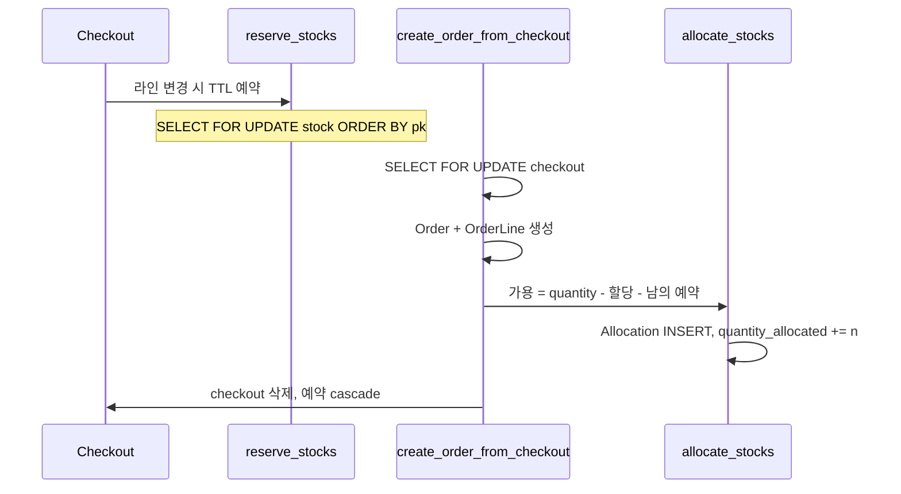

# Saleor 3.24 — 창고 할당이 분명한 헤드리스 커머스

**경로:** `saleor/`  
**버전:** 3.24.0-a.0 (`pyproject.toml`)  
**스택:** Python 3.12, Django 5.2, Graphene GraphQL, Celery, PostgreSQL

도메인 앱이 모델과 절차를 갖고, `saleor/graphql/`은 API 껍질이다. 결제의 최신 경로는 플러그인 직접 호출보다 **결제 앱 + TransactionItem** 쪽이다.

```
saleor/product      카탈로그
saleor/warehouse    재고·할당·예약
saleor/checkout     체크아웃 → 주문
saleor/order        주문·출고·환불 허가
saleor/payment      Payment(레거시), TransactionItem(현재)
saleor/giftcard
```

---

## 상품은 무엇인가

```
ProductType          kind = normal | gift_card, 배송 필요 여부, 세금
  └── Product        이름, slug, 카테고리(MPTT), 컬렉션
        └── ProductVariant     SKU. 체크아웃 라인은 항상 variant
              ├── ProductVariantChannelListing   채널별 가격
              └── Stock (창고별)
```

채널(`Channel`)이 통화, 창고 배분 전략, “미결제 주문 허용”, “결제 완료 시 자동 주문”을 정한다. 가격·공개 여부는 상품 자체가 아니라 **채널 리스팅**에 있다.

| 축 | 필드 |
|----|------|
| 기프트카드 | `ProductType.kind == gift_card`. 별도 상품 클래스가 아님 |
| 재고 추적 끄기 | `ProductVariant.track_inventory = false` 이면 할당·예약·가용 검사를 건너뜀 |
| 선주문 | `is_preorder`, `preorder_global_threshold`. 3.24에서 API는 빠지고 필드는 남음 |
| 디지털 파일 | `DigitalContent`는 3.24 상태에서 제거. 배송 필요 여부로 구분 |
| 고객당 한도 | `quantity_limit_per_customer` |
| 변형을 가르는 값 | `AssignedVariantAttributeValue` (사이즈, 색) |

`saleor/product/models.py`, `saleor/channel/models.py`, `saleor/attribute/models/`

---

## 재고

| 모델 | 테이블 | 의미 |
|------|--------|------|
| Stock | `warehouse_stock` | 창고 × variant. `quantity`, 비정규화 `quantity_allocated`. unique `(warehouse, product_variant)` |
| Allocation | `warehouse_allocation` | **주문 라인**이 가져간 수량. unique `(order_line, stock)` |
| Reservation | `warehouse_reservation` | **체크아웃 라인**의 TTL 홀드. unique `(checkout_line, stock)` |
| Warehouse | `warehouse_warehouse` | 채널·배송구역에 연결 |

```
available = max(quantity - quantity_allocated - 미만료 reservation, 0)
```

| 함수 | 파일 | 하는 일 |
|------|------|---------|
| `reserve_stocks` | `warehouse/reservations.py` | 체크아웃 라인 변경 시 소프트 홀드 |
| `allocate_stocks` | `warehouse/management.py` | 주문 생성 시 Allocation 생성, `quantity_allocated` 증가 |
| `decrease_stock` | 같은 파일 | 출고: 할당 해제 + `quantity` 감소 |
| `increase_stock` | 같은 파일 | 반품 입고 |
| `deallocate_stock` | 같은 파일 | 취소·반품 시 할당만 되돌림 |

예약 길이는 로그인 사용자 / 비로그인 설정이 다르다. 주문 생성 시 `check_reservations=True`로 **자기 체크아웃 예약은 가용 계산에서 빼지 않고**, 다른 사람의 예약은 뺀다. 체크아웃을 지우면 예약은 cascade로 사라진다.

`quantity_allocated`는 할당 합과 어긋날 수 있어 Celery `update_stocks_quantity_allocated_task`가 맞춘다. DB CheckConstraint로 `quantity >= allocated`를 강제하지는 않는다.

---

## 환불

두 갈래다.

### 현재: TransactionItem + OrderGrantedRefund

1. 스태프가 `OrderGrantRefundCreate`로 **환불해도 되는 금액**을 기록한다. 라인 수량, 배송비 포함 여부를 적을 수 있다.
2. `TransactionRequestRefundForGrantedRefund`가 결제 앱에 `TRANSACTION_REFUND_REQUESTED` 웹훅을 보낸다.
3. 앱이 `REFUND_SUCCESS` / `REFUND_FAILURE` 이벤트를 돌려준다.
4. `OrderGrantedRefund.status`: `NONE → PENDING → SUCCESS | FAILURE`.

금액은 `transaction.charged_value`를 넘지 못한다. 주문 `charge_status`는 `총액 - 허가된 환불`로 다시 계산된다.

### 레거시: Payment.charge_status

`NOT_CHARGED → PARTIALLY_CHARGED → FULLY_CHARGED → PARTIALLY_REFUNDED → FULLY_REFUNDED`

반품은 `create_fulfillments_for_returned_products` (`order/actions.py`). 돈 환불과 재고 복원을 같이 하고, fulfillment 상태가 `RETURNED`, `REFUNDED`, `REFUNDED_AND_RETURNED`, `REPLACED`로 갈린다. `replace=True`면 교체용 draft 주문을 만든다.

### 주문 상태 (출고 기준)

```
DRAFT → UNCONFIRMED → UNFULFILLED → PARTIALLY_FULFILLED → FULFILLED
                    → PARTIALLY_RETURNED → RETURNED
                    → CANCELED / EXPIRED
```

`authorize_status`, `charge_status`는 출고 상태와 별도 축이다. `saleor/order/models.py`, `saleor/payment/models.py`

---

## 주문 흐름



`complete_checkout`은 결제 방식에 따라 갈린다. 트랜잭션(앱) 흐름, 전액 승인, 미결제 허용이면 주문부터 만들고, 레거시 결제는 캡처 후 주문을 만든다.

출고 `create_fulfillments`는 주문 라인을 잠근 뒤 `decrease_stock`으로 물리 수량을 줄인다. 기프트카드 variant는 이때 카드가 발급된다.

---

## 락

`saleor/warehouse/lock_objects.py`

```python
qs.order_by("pk").select_for_update(of=["self"])
# 할당+재고를 같이 잠글 때
Allocation.objects.select_for_update(of=("self", "stock")).order_by("stock__pk")
```

| 지점 | 잠그는 것 |
|------|-----------|
| 할당·예약·차감 | Stock 행, pk 오름차순 |
| 체크아웃 완료 | `Checkout` 행 (`complete_checkout.py`) |
| 출고 | 주문 라인 |
| 환불 실행 | 주문 + TransactionItem (`payment/lock_objects.py`) |
| 카테고리 트리 | `pg_advisory_xact_lock` — **재고에는 안 씀** |

잠금 순서를 pk로 고정해 교착을 피한다. 예약 TTL을 끄면, 두 체크아웃이 할당 전까지는 둘 다 가용 검사를 통과할 수 있다. 할당 트랜잭션의 행 락이 마지막 관문이다.

`@traced_atomic_transaction()` = `transaction.atomic()` + 트레이싱. 재고 변경은 이 데코레이터 안에서 일어난다.

---

## 이 코드에서 가져갈 것

- **Reservation(체크아웃)과 Allocation(주문)을 테이블로 분리**한 것이 가장 교과서적이다.
- 채널이 가격·창고·정책의 경계다. 상품 테이블에 가격을 넣지 않는다.
- 비정규화 컬럼(`quantity_allocated`)은 편하지만 드리프트가 나서 배치로 맞춘다.
- 환불 “허가”와 환불 “실행”을 나눈다. 실행은 결제 앱이 한다.
