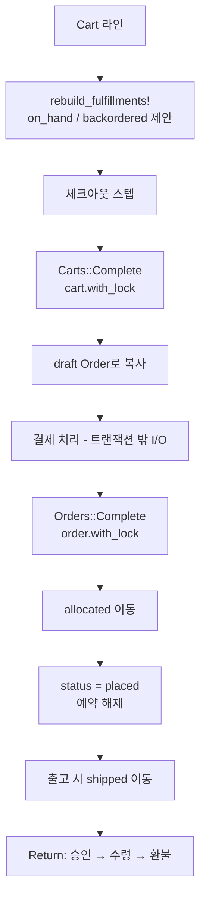

# Spree 6.0 alpha — 카트와 주문을 나누고, 재고 이동을 원장으로 남긴다

**경로:** `spree/` (gem 모노레포, 핵심은 `spree/core`)  
**버전:** 6.0.0.alpha (`spree/core/lib/spree/core/version.rb`)  
**스택:** Ruby ≥ 3.2, Rails ≥ 8.1, PostgreSQL

Spree 4/5 문서와 이름이 많이 다르다. 이 트리는 **6.0 alpha**다.

| 예전 이름 | 6.0 |
|-----------|-----|
| 미완료 Order = 카트 | `Cart`와 `Order`가 별도 테이블 |
| `is_master` variant | `product.default_variant_id` |
| StockItem | `StockLevel` |
| InventoryUnit | `FulfillmentItem` |
| Shipment | `Fulfillment` |
| Taxon | `Category` |
| ReturnAuthorization → CustomerReturn → Reimbursement | `Return` 하나 |
| state machine 컬럼 | `status` + `app/workflows` |

모델: `spree/core/app/models/spree/`  
절차: `spree/core/app/workflows/spree/`  
스키마: `spree/core/db/migrate/` (`schema.rb` 없음)

---

## 상품은 무엇인가

```
ProductType          만들 때 옵션·카테고리·배송 프로필을 찍어 줌
Product              status: draft | active | archived
  └── Variant        default_variant가 상품의 얼굴 (가격, SKU, 재고 위임)
        ├── OptionValue (Size, Color)
        ├── Price      통화, price_list, min_quantity (수량 구간 가격)
        ├── StockLevel 창고별
        └── DigitalAsset
GiftCard             별도 모델. 카트/주문에 적용
```

variant는 `seller_id`를 가질 수 있어 한 상품에 판매자가 여럿일 수 있다. 배송은 `DeliveryProfile`(예전 ShippingCategory). 디지털은 `digital_assets`, 주문 완료 시 자동 출고될 수 있다.

`track_inventory`, `backorder_limit`, `minimum_order_quantity`, `order_multiple`이 variant에 있다.

---

## 재고

```
available_count = count_on_hand - allocated_count
```

`StockMovement.kind`

| kind | 선반 `count_on_hand` | 약속 `allocated_count` |
|------|----------------------|------------------------|
| `received` | + | |
| `adjusted` | ± | |
| `allocated` | | + |
| `released` | | − |
| `shipped` | − | − (출고에 연결된 경우) |

이동은 불변 원장이다. 원인 FK로 `order_id`, `fulfillment_id`, `return_id`, `exchange_id`를 단다.

**FulfillmentItem 상태:** `on_hand | backordered | shipped | returned`

시점별로 나누면:

1. **카트** — `Stock::Packer`가 `fill_status`로 on_hand / backordered를 나누기만 한다. 숫자는 안 바꾼다. 선택적으로 `StockReservation`(기본 TTL 10분).
2. **주문 완료** — `allocated` 이동. `allocated_count`만 증가. 선반은 그대로.
3. **출고** — `shipped` 이동. 선반 감소 + 할당 해제. 아이템 상태 `shipped`.
4. **입고** — `received`가 양수면 `process_backorders`가 backordered 아이템을 `on_hand`로 채운다.

`spree/core/app/models/spree/stock_level.rb`  
`spree/core/app/models/spree/stock/packer.rb`  
`spree/core/app/workflows/spree/orders/complete.rb`  
`spree/core/app/workflows/spree/fulfillments/fulfill.rb`

---

## 환불

`Return` 상태: `requested → approved → received → refunded` (또는 `canceled`)

환불 수단은 둘뿐이다 (`RefundMethods::METHODS`).

- `original_payment` — 결제사 크레딧. `Refunds::Create`
- `store_credit` — `StoreCredit` 원장

여러 번 나눠 환불할 수 있다. `refunded_total = refunds 합 + store_credits 합`.

받을 때(`Returns::Receive`) 재판매 가능 수량만 `received` 이동으로 선반에 되돌린다.

결제 상태: `checkout | processing | pending | completed | failed | void | invalid`  
주문 상태: `draft | placed | canceled`  
출고 상태: `unfulfilled | fulfilled | delivered | canceled`

`spree/core/app/models/spree/return.rb`  
`spree/core/app/workflows/spree/returns/`  
`spree/core/app/workflows/spree/refunds/create.rb`

---

## 주문 흐름

체크아웃 스텝은 상태 컬럼이 아니라 `Checkout::Registry`다.

`address → delivery → payment → confirm → complete`  
(digital처럼 배송이 없으면 delivery를 건너뜀)



`cart_id`는 주문에 unique라서, 같은 카트 완료가 주문을 두 번 만들지 않는다. 판매자가 여럿이면 `Orders::Complete`가 주문을 나눈다.

---

## DB

| 테이블 | 기억할 컬럼 |
|--------|-------------|
| `spree_products` | `slug` unique, `status`, `default_variant_id`, `product_type_id`, `seller_id` |
| `spree_variants` | `sku`(판매자 범위 unique), `track_inventory`, `delivery_profile_id` |
| `spree_prices` | `amount`, `currency`, `price_list_id`, `min_quantity` |
| `spree_stock_levels` | `count_on_hand`, `allocated_count`, `backorderable`. unique `(variant, location)` where deleted_at is null |
| `spree_stock_movements` | `quantity`, `kind`, 원인 FK |
| `spree_stock_reservations` | 체크아웃 TTL |
| `spree_orders` | `number` unique, `status`, `cart_id` unique, `lock_version`, `payment_status`, `fulfillment_status` |
| `spree_payments` | `status`, `response_code` |
| `spree_refunds` | `payment_id`, `amount`, `originator` (보통 Return) |
| `spree_returns`, `spree_return_line_items` | 6.0 반품 |

레거시 테이블(`spree_return_authorizations`, `spree_reimbursements` 등)은 baseline 마이그레이션에 남아 있다. 앱 코드의 현재 모델은 `Return`이다.

---

## 락

```ruby
# stock_level.rb — 선반 가감은 항상 이 락 안
def adjust_count_on_hand(value, force: false)
  with_lock do
    set_count_on_hand(count_on_hand + value, force: force)
  end
end
```

| 지점 | 락 |
|------|-----|
| 선반 증감 | `StockLevel#with_lock` |
| 할당 해제 | `release_allocated_count`도 행 락. 0 아래로 안 내려가게 상한을 락 안에서 확인 |
| 카트 완료 PREPARE | `cart.with_lock` |
| 주문 완료 | `order.with_lock` |
| 환불 생성 | `payment.with_lock`. 락 없이 하면 두 환불이 환불 전 잔액을 같이 통과함 |
| 기프트카드 | `order.with_lock` + `gift_card.lock!` |

`lock_version`은 있다. 다만 `self.lock_optimistically = false`라서 Rails가 저장마다 버전 예외를 내지 않는다. API가 클라이언트가 보낸 버전을 비교해 409를 준다.

---

## 이 코드에서 가져갈 것

- 재고 변경을 **종류가 있는 원장**으로 남기면 “왜 이 숫자가 됐는지”를 재구성할 수 있다.
- 할당과 선반 차감을 출고 시점까지 미룬다. Saleor·Medusa와 같은 결정이다.
- 반품·환불·크레딧을 상태 머신 사슬 대신 **한 레코드 + 워크플로**로 접었다.
- 결제사 호출은 DB 트랜잭션 밖 `external_step`이다. 락을 잡은 채 외부 HTTP를 하지 않는다.
