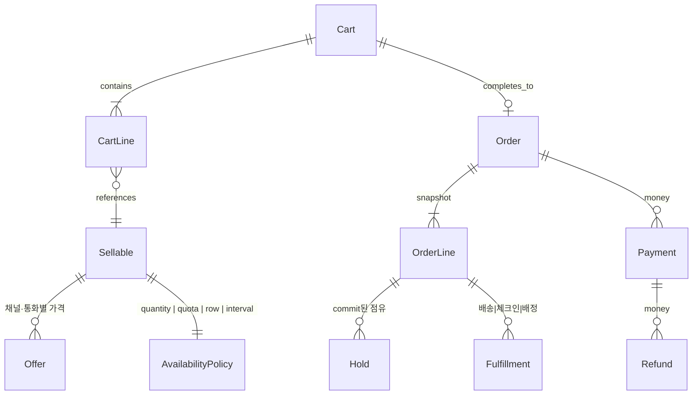

# 여러 상품군을 한 주문으로 모으는 설계

이 문서는 8개 레포의 아키텍처에서 **공통으로 꺼낼 수 있는 뼈대**만 모은다. 개별 디렉터리·요청 경로·테이블은 같은 폴더의 레포 문서를 본다. 상품·재고·환불·락의 동작은 [../README.md](../README.md)에 있다.

목표 한 줄: 셔츠(SKU), 티켓(쿼터 또는 좌석 행), 호텔(날짜 구간), 예약(시간 슬롯)이 **같은 카트와 같은 결제**를 타고, 가용성·이행·환불만 종류별로 갈린다.

---

## 1. 레포들이 이미 나눠 둔 여섯 겹

이름을 통일하면 이렇다. 어느 레포도 이 여섯 겹을 한 테이블에 넣지 않는다. 넣은 곳(QloApps의 `stock_available`, Easy!Appointments의 결제 부재)이 학습할 반례다.

| 겹 | 하는 일 | 어디를 보면 깨끗한가 |
|----|---------|----------------------|
| 카탈로그 | 이름, 옵션, 판매 가능 단위 | Saleor `Product`/`Variant`, Medusa `ProductVariant`, Spree `Variant` |
| 제안(offer) | 채널·통화·기간에 따른 가격과 공개 | Saleor `*ChannelListing`, pretix `Event`+`Item`, Spree `Price`+`store_id` |
| 가용성 정책 | “지금 이 수량/자리를 줘도 되는가” | 아래 4전략 |
| 홀드 → 확정 | 카트는 소프트, 주문은 하드 | Saleor Reservation/Allocation, Medusa reservation, pretix CartPosition.expires |
| 주문 | 헤더 + 이질적인 라인 + 가격 스냅샷 | Spree Cart/Order 분리, Saleor OrderLine 스냅샷, pretix AbstractPosition |
| 돈 | 승인·캡처·환불. 재고와 다른 시계 | Saleor TransactionItem+웹훅, Medusa payment `FOR UPDATE`, alf.io `b_transaction` |
| 이행 | 배송, 체크인, 객실 배정, 캘린더 | Spree FulfillmentProvider, pretix Checkin, QloApps booking status |

가용성과 이행을 상품 테이블에 컬럼으로 늘리면, 호텔 날짜가 티켓 쿼터 코드를 오염시킨다. 여덟 레포 중 잘 된 쪽은 **판매 단위(variant/item)는 두고, 가용성만 전략으로 뺀다.**

---

## 2. 가용성 전략 네 개

한 인터페이스로 충분하다. pretix의 `QuotaAvailability`, Saleor의 `allocate_stocks`, alf.io의 `SKIP LOCKED`, QloApps의 날짜 겹침이 같은 자리에 들어간다.

```
availability(sellable, context) -> 남은 수 또는 거절 이유
hold(line, ttl)                 -> 소프트 점유
commit(order_line)              -> 하드 점유
release(hold | order_line)      -> 반환
```

| 전략 | 원전 | 저장 | 동시성 |
|------|------|------|--------|
| 수량 | Saleor, Medusa, Spree | `(창고, SKU)` 행의 정수. 할당·예약은 별도 행 | 행 락 또는 advisory lock 안에서 가감 |
| 합산 쿼터 | pretix | 용량 숫자만 저장. 사용량은 주문·카트·바우처를 센다 | 쿼터 id advisory lock |
| 행 할당 | alf.io | 재고 1개 = 행 1개. 상태가 FREE/PENDING/ACQUIRED | `FOR UPDATE SKIP LOCKED` |
| 구간 점유 | QloApps, LibreBooking, Easy!Appointments | `(자원, 시작, 끝)` 이 겹치면 불가 | QloApps·예약 둘은 락이 약하다. 설계 시에는 구간 락이나 exclusion constraint를 새로 넣어야 한다 |

같은 카트 라인이라도 `sellable.availability_policy`만 다르면 된다.

- 셔츠: 수량 전략, `required_quantity = 1` (Medusa 링크의 `required_quantity`가 이 자리다)
- 3박 호텔: 구간 전략. 라인 수량에 박 수를 넣는 QloApps 방식은 가능하지만, 진실은 날짜 행이다
- 티켓 100석: 쿼터 전략. 지정석이면 alf.io처럼 행 할당으로 바꾼다
- 상담 30분: 구간 전략 + `capacity`(Easy!Appointments의 `attendants_number`)

**홀드는 전략 공통이다.** Saleor는 체크아웃 예약과 주문 할당을 테이블로 나눈다. Medusa는 카트에서 검사만 하고 주문 때 예약한다. pretix는 카트 만료 시각이 홀드다. 호텔은 `htl_cart_booking_data`가 홀드, `htl_booking_detail`이 확정이다. 전략을 숨겨도 이 두 단계는 남겨야 한다. 카트에 담는 즉시 확정하면(Easy!Appointments) 결제 실패 시 되돌릴 주문이 없다.

---

## 3. 최소 스키마



가져올 컬럼만:

| 테이블 | 필수에 가까운 것 | 근거 |
|--------|------------------|------|
| `sellable` | id, kind는 **정책 FK**로. 이름·옵션은 카탈로그 | Saleor는 kind가 `normal\|gift_card`뿐이라 날짜 상품이 속성에 밀린다 |
| `offer` | sellable, channel, currency, price, 판매 시작·끝 | 가격을 상품 행에 두면 채널이 못 갈라진다 (Saleor, Spree price list) |
| `cart` / `order` | 헤더 분리. `order.cart_id` unique | Spree 6. 중복 완료의 멱등 키 |
| `order_line` | sellable id **복사본**(이름, sku, 단가, 통화). 정책 스냅샷(박 수, 좌석, 슬롯) | Saleor OrderLine, Medusa order_line_item. 카탈로그를 고쳐도 과거 주문이 안 바뀜 |
| `hold` | policy 종류, 대상 id, 수량 또는 구간, 만료, cart_line 또는 order_line | Saleor reservation/allocation을 한 개념의 두 상태로 |
| `payment` / `refund` | 주문과 별 트랜잭션. 환불 상한은 캡처액 | Medusa는 결제 행 락, 재고는 advisory lock. 역할을 나눈다 |
| `fee` | 라인 밖. 결제 수수료, 취소 수수료, 배송 | pretix OrderFee, QloApps 취소 공제 |

금액 타입은 레포가 둘로 갈린다. **정수 센트**(alf.io `*_cts`, 반올림은 경계에서만)와 **decimal(13,2) 또는 decimal(10,2)**(pretix, Spree). Medusa는 numeric + `raw_*` jsonb로 소수 전체를 보존한다. 한 시스템을 만든다면 통화 소수 자릿수에 맞는 decimal 또는 센트 정수 중 하나를 고르고, 라인·결제·환불이 같은 타입을 쓴다. 섞으면 1센트 차이가 환불 상한 검사에서 난다.

---

## 4. 요청 경로의 공통 형태

잘 나뉜 레포는 전부 이 순서다.

```
HTTP 어댑터 (얇다)
  → 유스케이스 (workflow / service / manager)
      → 검증 훅 (플러그인이 거절할 수 있음)
      → 가용성 전략
      → 같은 DB 트랜잭션 안에서 홀드 또는 주문 행
      → 커밋 후 외부 I/O (결제사, 메일, 웹훅)
```

| 레포 | HTTP | 유스케이스 | 외부 I/O를 트랜잭션 밖으로 |
|------|------|------------|------------------------------|
| Medusa | `packages/medusa/src/api` | `core-flows` workflow + compensation | 결제 authorize는 주문 생성 스텝 근처. 실패 시 compensation |
| Saleor | GraphQL mutation | `checkout/*.py`, `warehouse/*.py` | 결제 앱은 sync webhook. 주문 생성은 코어 |
| Spree 6 | `spree/api` 컨트롤러 | `app/workflows`. `external_step`은 트랜잭션 금지 | `Carts::Complete`가 PREPARE 락 → PAYMENT 외부 → FINALIZE |
| pretix | presale CheckoutView | `services/cart.py`, `orders.py` | 주문 생성 자체가 Celery. 락 대기 재시도 |
| alf.io | v2 컨트롤러 | `TicketReservationManager` `@Transactional` | 결제 후 `ReservationFinalizer`는 AFTER_COMMIT |
| QloApps | Dispatcher → Controller | PaymentModule::validateOrder 안에 호텔 삽입 | 결제 모듈 한 함수에 주문·재고·메일이 몰림 |
| LibreBooking | Web → Page → Presenter | `ReservationHandler` | DB 레이어가 autocommit |
| Easy!Appointments | CI 컨트롤러 | `Booking::register` | 트랜잭션 없음 |

설계할 때 Spree의 `external_step`과 alf.io의 `AFTER_COMMIT`을 같이 가져간다. **락을 잡은 채로 결제사 HTTP를 하지 않는다.** pretix는 그 긴 일을 Celery로 빼서 락 타임아웃(3초)을 재시도한다.

---

## 5. 확장은 “코어가 부르는 빈 자리”

새 상품군을 넣으려고 주문 클래스를 포크한 레포는 없다. 빈 자리가 다르다.

| 레포 | 빈 자리 | 상품군을 넣을 때 |
|------|---------|------------------|
| Medusa | `defineLink` + workflow hook. 모듈은 서로 서비스를 import하지 않음 | `StayModule` 테이블을 variant에 링크. `addToCart` validate 훅에서 날짜 겹침 |
| Saleor | 앱 + sync/async webhook. 코어는 주문을 소유, 돈은 앱 | 가용성 검사(`warehouse/availability.py`) 앞에 kind별 분기를 **추가**해야 함. 지금은 속성(EAV)으로 필드만 늘린다 |
| Spree | `InventoryProvider`, `FulfillmentProvider`, `Spree.hooks`, dependency로 workflow 교체 | 디지털은 `track_inventory`를 끄고 이행 provider만 바꾼다. 호텔은 그것으로 부족하고 provider가 구간 재고를 말해야 한다 |
| pretix | `PluginSignal`, `checkout_flow_steps`, `quota_availability`, `register_payment_providers` | 쿼터 계산을 신호로 덮을 수 있다. 다만 거의 모든 행이 `event_id`라 카탈로그가 행사 안에 갇힌다 |
| alf.io | `PaymentProvider` capability, `extension` 패키지 | 할당 SQL이 매니저에 있다. 두 번째 판매물은 `additional_service`로 **같은 예약 UUID**에 붙는다 |
| LibreBooking | `plugins/PreReservation`이 검증 규칙에 합류 | 규칙 추가는 쉽고, 저장은 series/instance에 고정 |
| QloApps | Hook + 모듈 + override | 호텔이 코어 `PaymentModule`까지 들어가 경계가 약하다 |
| Easy!Appointments | 라이브러리와 아웃바운드 웹훅 | 주문 경계 자체가 없다 |

---

## 6. 복사하면 안 되는 것

- **Easy!Appointments, LibreBooking의 검사 후 삽입.** 구간 상품의 정확도는 DB exclusion 또는 구간을 잠그는 트랜잭션이 필요하다. 두 레포는 그 장치가 없다.
- **QloApps가 객실 타입 `stock_available`에 큰 수를 넣는 것.** 껍데기 커머스 재고와 진짜 재고가 둘이 된다. 전략이 하나여야 한다.
- **Saleor `quantity_allocated` 비정규화만 믿고 제약 없이 두기.** 드리프트를 배치가 고친다. 원장은 Allocation 행이다. Spree는 원장을 `stock_movements`로 남긴다. 둘 중 원장을 남기는 쪽을 따른다.
- **pretix처럼 모든 판매물에 `event_id`를 강제.** 멀티 상품 카탈로그는 테넌트(Organizer, Store, Organization) 아래에 카탈로그가 있고, 행사·숙박·슬롯은 가용성 정책의 파라미터다.
- **결제와 재고를 한 함수에서 확정** (QloApps `validateOrder`). 실패 보상과 락 범위가 커진다.

---

## 7. 레포 문서

| 문서 | 이 설계에 주는 것 |
|------|-------------------|
| [medusa.md](medusa.md) | 모듈 DB 분리, 링크 테이블, 워크플로 보상 |
| [saleor.md](saleor.md) | 채널, 얇은 GraphQL, 예약/할당 이분, 앱이 돈을 소유 |
| [spree.md](spree.md) | 카트/주문 분리, 재고 원장, `external_step` |
| [pretix.md](pretix.md) | 플러그인 시그널, 합산 쿼터, 한 주문의 이질적 라인 |
| [alfio.md](alfio.md) | SQL로 잠그는 행 할당, 예약 헤더에 여러 판매물, 커밋 후 확정 |
| [qloapps.md](qloapps.md) | 기존 주문에 날짜 자원을 붙인 실례와 그 비용 |
| [easyappointments.md](easyappointments.md) | 가장 작은 슬롯 모델. 주문 없이 어디가 빠지는지 |
| [librebooking.md](librebooking.md) | 반복(series/instance), 규칙 파이프라인, 크레딧 원장 |
