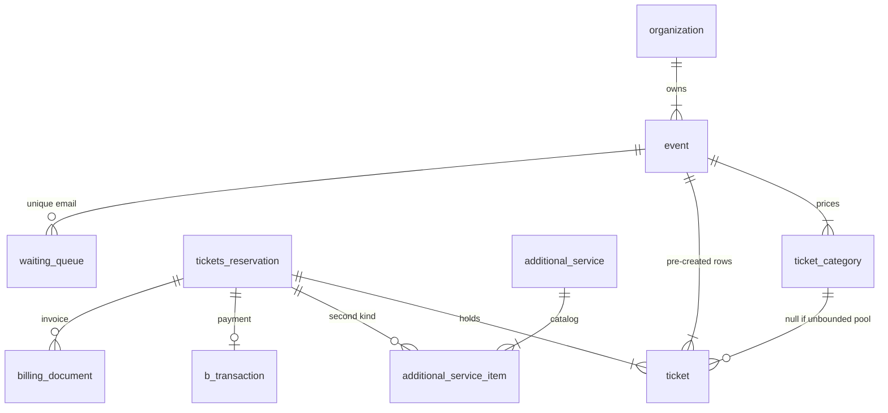

# alf.io — SQL이 도메인이다

**코드:** `alf.io/` · 2.0-M6-SNAPSHOT · Java 25 · Spring Boot 4.1.1 · PostgreSQL · Flyway · Gradle 단일 모듈  
도메인 동작(bounded, SKIP LOCKED, 환불)은 [../alfio.md](../alfio.md).

**한 줄:** JPA 엔티티가 없다. `@QueryRepository` 인터페이스에 SQL을 적고, 불변 모델 생성자의 `@Column`으로 행을 받는다. 예약 헤더 하나에 티켓과 부가 상품이 붙고, 결제 성공 트랜잭션이 커밋된 *다음*에 티켓이 `ACQUIRED`가 된다.

---

## 부팅과 패키지

`src/main/java/alfio/config/SpringBootLauncher.java`가 `SpringApplication`에 설정 클래스를 직접 넘긴다. `SpringBootInitializer`는 Flyway 자동설정, 기본 트랜잭션 매니저 등을 뺀다.

| 패키지 | 역할 |
|--------|------|
| `config` | DataSource, npjt, Flyway, 보안 |
| `controller` | HTTP. v2 public API는 `controller/api/v2/user/` |
| `manager` | `@Transactional` 유스케이스 |
| `repository` | SQL |
| `model` | 불변 행 |
| `manager/payment` | 결제 SPI 구현 |
| `job` | `@Scheduled`. `DataSourceConfiguration`이 `@Bean`으로 등록. 프로파일 `disable-jobs`면 끔 |
| `extension` | 확장 훅 |

`DataSourceConfiguration`의 `@EnableNpjt(basePackages = "alfio.repository")`.  
매니저 스캔은 `alfio.manager`, `alfio.extension`.

쿼리를 추가하는 법: repository 인터페이스에 `@Query` 메서드와 `@Bind`. 동적 배치는 `@Query(type = QueryType.TEMPLATE)`와 `NamedParameterJdbcTemplate` (`TicketRepository`의 batch 예약이 그 예).

Flyway는 자동이 아니라 `DataSourceConfiguration.migrator()`. 위치 `src/main/resources/alfio/db/PGSQL/`. `outOfOrder(true)`. 파일 이름 `V12_1.5.9__….sql`, `V203_2.0.0.25__SUBSCRIPTION_SUPPORT.sql`처럼 순서와 버전 조각을 같이 넣는다.

---

## 요청이 지나가는 길

`POST /api/v2/public/event/{eventName}/reserve-tickets`

```
EventApiV2Controller.reserveTickets          트랜잭션 없음. 캡차·요청 검증
  ReservationUtil.validateCreateRequest
  TicketReservationManager.createTicketReservation     클래스 @Transactional
    ticketReservationRepository.createNewReservation   PENDING, validity = now+타임아웃
    reserveTicketsForCategory
      bounded  → selectTicketInCategoryForUpdateSkipLocked
      unbounded → selectNotAllocatedTicketsForUpdateSkipLocked
      reserveTickets UPDATE status=PENDING, category_id, 가격 센트
    AdditionalServiceManager.bookAdditionalServicesForReservation
    합계 → updateBillingData
```

컨트롤러는 예약 UUID만 돌려준다. 락과 쓰기는 매니저 트랜잭션 안이다.

결제: `ReservationApiV2Controller` → `performPayment`. 예약 행은 `findReservationByIdForUpdate`. 성공이 티켓을 바로 ACQUIRED로 만들지 않는다.

```
completeReservation
  special price 선점
  상태 FINALIZING
  FinalizeReservation 이벤트
ReservationFinalizer
  @TransactionalEventListener(AFTER_COMMIT)
  TransactionTemplate으로 새 트랜잭션
    인보이스 번호, 티켓 ACQUIRED, 부가 상품 확정, 메일
  실패 시 RETRY_RESERVATION_CONFIRMATION 잡 (약 2초)
```

`src/main/java/alfio/manager/ReservationFinalizer.java`

만료는 `alfio/job/Jobs.java` `cleanupExpiredPendingReservation` (30초). 만료 예약도 `FOR UPDATE SKIP LOCKED`로 집어 지우고 티켓을 풀에 되돌린다. 결제 대기 건은 웹훅이 늦게 올 수 있어 stuck 처리가 따로 있다.

---

## 결제 SPI

`alfio/model/transaction/PaymentProvider.java` (인터페이스 위치는 패키지 `model.transaction` / 구현은 `manager.payment`).

`PaymentManager`가 `List<PaymentProvider>`를 받는다. 고르는 조건:

- 이벤트의 `allowed_payment_proxies`
- `isActive`, `accept(paymentMethod, context)`
- 조직 블랙리스트
- 환불은 `RefundRequest` capability가 있는 구현만 (`lookupProviderByTransactionAndCapabilities`)

Stripe, Mollie, PayPal, 계좌이체, 오프라인이 각각 `@Component`다. 코어 `PaymentManager`는 클래스 이름을 하드코딩해 고르지 않고 capability로 거른다.

---

## DB

테넌트는 `organization`. `event.org_id`. 관리자는 `j_user_organization`. 구독·청구 문서도 `organization_id_fk`. V201 이후 일부 테이블에 `alfio_check_row_access(organization_id_fk)` RLS가 있다. 커넥션 준비 시 조직 컨텍스트를 세팅한다 (`RoleAndOrganizationsTransactionPreparer`). 설정 계층은 system → organization → event.

금액은 정수 센트(`src_price_cts`, `final_price_cts`, `vat_cts`, `discount_cts`). VAT *세율*만 `decimal(5,2)`. 계산은 `MonetaryUtil`이 BigDecimal로 하고 센트에서 반올림한다. 티켓 가격은 예약 시 `updateTicketPrice`로 얼고, 헤더 합계는 `updateBillingData`다. `vat_status` enum이 포함·별도·면제를 구분한다.



| 테이블 | 기억할 제약 |
|--------|-------------|
| `event` | `short_name` unique, `available_seats`, `vat`, `allowed_payment_proxies` |
| `ticket_category` | `bounded`, `max_tickets`, `inception`/`expiration` |
| `ticket` | `uuid` unique, `public_uuid` unique, `special_price_id_fk` unique, `(event_id, ext_reference)` unique. status CHECK는 없음 |
| `tickets_reservation` | UUID PK, `validity`, 가격 합, `event_id_fk`는 구독 구매 시 nullable |
| `special_price` | `code` unique. 제한 권종 토큰 |
| `additional_service` | `available_qty`, `supplement_policy`, 가격 센트 |
| `b_transaction` | `reservation_id`, `price_cts`, `payment_proxy`, `gtw_tx_id` |
| `waiting_queue` | unique `(event_id, email_address)` |
| `subscription` / `subscription_descriptor` | 행사와 같은 예약·상태 언어를 재사용 |

인덱스 초기분은 `V5`: ticket의 `(category_id, event_id, tickets_reservation_id)`, transaction의 `reservation_id`.

할당 SQL (`TicketRepository`):

```sql
select id from ticket
where status in (:requiredStatuses)
  and category_id = :categoryId          -- unbounded는 category_id is null
  and event_id = :eventId
  and tickets_reservation_id is null
order by id
limit :amount
for update skip locked
```

bounded는 행사 생성 때 권종별로 행을 미리 만들고, unbounded는 `category_id`가 비어 있다가 예약 UPDATE에서 채워진다. 취소 시 unbounded는 다시 null. **같은 테이블, SELECT만 두 갈래** (`TicketReservationManager.reserveTickets`).

---

## 여러 판매물을 한 예약에

`additional_service_item.tickets_reservation_uuid`가 티켓과 같은 헤더를 가리킨다. 부가 상품 예약은 티켓 락과 **같은 트랜잭션**이다. 구독은 `reservation_id_fk`로 같은 패턴을 넓힌다. 결제는 `b_transaction` 하나, 청구는 `billing_document`.

호텔 방이나 SKU를 같은 예약에 넣으려면 헤더·결제·청구는 두고, 할당만 `(context, kind)`로 나누면 된다. alf.io가 이미 “티켓 할당기”와 “부가 상품 할당기”를 매니저로 나눈 상태다. 공통은 `tickets_reservation`이다.

---

## 읽는 순서

1. `src/main/java/alfio/config/SpringBootLauncher.java`
2. `src/main/java/alfio/config/DataSourceConfiguration.java`
3. `src/main/resources/alfio/db/PGSQL/V1__INITIAL_VERSION.sql`
4. `src/main/java/alfio/controller/api/v2/user/EventApiV2Controller.java`
5. `src/main/java/alfio/manager/TicketReservationManager.java` — `createTicketReservation`, `reserveTickets`
6. `src/main/java/alfio/repository/TicketRepository.java`
7. `src/main/java/alfio/model/Ticket.java` — 생성자 `@Column`
8. `src/main/java/alfio/manager/AdditionalServiceManager.java`
9. `src/main/java/alfio/manager/PaymentManager.java`
10. `src/main/java/alfio/model/transaction/PaymentProvider.java`
11. `src/main/java/alfio/manager/ReservationFinalizer.java`
12. `src/main/java/alfio/job/Jobs.java`
13. `src/main/java/alfio/util/MonetaryUtil.java`
