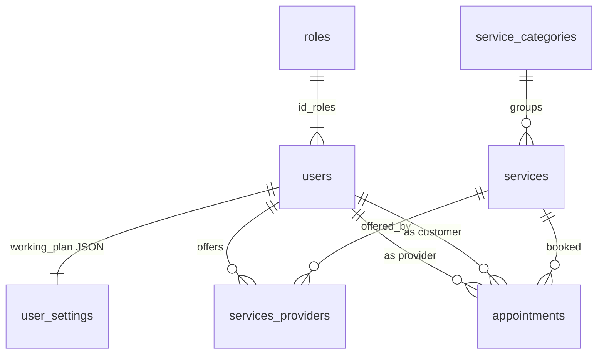

# Easy!Appointments — 주문 없는 슬롯 스케줄러

**코드:** `easyappointments/` · 앱 버전 `application/config/app.php` 1.6.0 · CodeIgniter 3 · PHP ≥ 8.2  
도메인 동작은 [../easyappointments.md](../easyappointments.md).

**한 줄:** `services`가 파는 것이고, `users` 한 테이블이 관리자·제공자·고객이다. 예약은 만드는 순간 `appointments`에 들어가며 결제 상태가 없다. 용량은 `attendants_number`와 시간 겹침이다.

이 레포는 커머스 뼈대가 없어서, **빼 먹으면 어떤 층이 사라지는지**를 보여 준다. 카트, 홀드 TTL, 결제, 환불, 스냅샷이 없다.

---

## 요청이 지나가는 길

```
index.php
  application/config + vendor autoload
  system/core/CodeIgniter.php
  application/config/routes.php
    default_controller = booking
    REST는 route_api_resource → application/controllers/api/v1/
```

공개 예약 `application/controllers/Booking.php` `register()`:

1. CSRF, `disable_booking` 설정
2. `check_datetime_availability` → `libraries/Availability.php` `get_available_hours`를 다시 계산
3. 캡차
4. 이메일로 고객 재사용, 같은 고객의 같은 슬롯 거부
5. `end_datetime = start + services.duration`
6. `Appointments_model->save`. 상태 문자열은 설정 배열의 첫 값(보통 Booked)
7. 캘린더 동기화, 메일, 웹훅

관리자 캘린더 `Calendar.php`는 `Appointments_model::has_provider_conflict`를 보되 `force_save`로 겹침을 통과시킬 수 있다.  
`api/v1/Appointments_api_v1.php`의 store는 **가용 검사 없이** save한다.

CI 훅은 `application/config/hooks.php`의 `post_controller_constructor`(보안 헤더), `post_system`(storage 정리)뿐이다. 도메인 플러그인 슬롯은 없고, 확장은 `application/libraries`와 나가는 `Webhooks_client`다.

---

## 디렉터리

| 경로 | 내용 |
|------|------|
| `application/controllers/Booking.php`, `Booking_cancellation.php`, `Calendar.php` | 공개 예약, 취소, 관리자 |
| `application/controllers/api/v1/` | REST |
| `application/models/` | Appointments, Services, Providers, Customers, Unavailabilities, Roles, Settings |
| `application/libraries/Availability.php` | 슬롯 생성 |
| `application/libraries/Notifications.php`, `Google_sync`, `Webhooks` 쪽 | 통지·동기화 |
| `application/migrations/001` … `069` | 스키마의 원본 |
| `system/` | 프레임워크. 도메인 아님 |

---

## DB

접두사 `ea_`는 `application/config/database.php`의 `dbprefix`에 박혀 있다.

사람 테이블은 `users` 하나다. `id_roles` → `roles`. role slug가 `admin`, `provider`, `customer`, `secretary`. `roles`에 권한 정수 컬럼이 있다. 제공자 근무시간은 `user_settings.working_plan` JSON이고, 날짜 예외는 `working_plan_exceptions`. 제공자가 하는 서비스는 `services_providers` (`id_users`, `id_services`) PK.

불가 시간도 `appointments`다. `Unavailabilities_model`이 `is_unavailability = 1`로 같은 테이블에 넣는다. 전 직원 휴무만 `blocked_periods`로 분리한다.



`appointments`: `start_datetime`, `end_datetime`, `hash`(취소 링크), `status` varchar, `is_unavailability`, `id_google_calendar`.  
`(provider, start)` 유니크는 없다. 인덱스만 있다.

`services`: `duration`, `price` decimal(10,2), `currency`, `slot_interval`, `attendants_number` default 1, `is_private`, `id_service_categories`.  
`price`는 확인 화면 표시다. 결제 행이 없다.

슬롯 알고리즘 (`Availability.php`):

1. 그날 `blocked_periods`면 빈 목록
2. 요일 `working_plan` 또는 예외
3. 예약 ∪ 불가 ∪ 휴식 ∪ 휴무를 빼 빈 구간
4. `slot_interval`로 걷고 `duration`이 들어가는 시작만
5. `attendants_number > 1`이면 그 구간의 같은 서비스 인원만 센다. 다른 서비스와 겹치면 거절
6. `book_advance_timeout`(기본 30분), `future_booking_limit`(기본 90일). `settings` 키-값

취소 `Booking_cancellation.php`: hash, IP당 10분에 5회, **DELETE**. `status='Cancelled'`로 바꾸지 않는다. 설정에 Cancelled라는 라벨이 있어도 공개 취소 경로는 쓰지 않는다. 삭제가 Google/CalDAV와 `WEBHOOK_APPOINTMENT_DELETE`의 신호다.

---

## 락

`trans_begin` / `FOR UPDATE`가 없다. `check_datetime_availability`와 `save`가 한 트랜잭션이 아니다. 두 요청이 동시에 “비어 있음”을 보면 두 행이 생긴다. `Booking.php` 주석이 그 창을 말한다.

---

## 커머스에 가져갈 것만

- 근무시간에서 점유를 빼 슬롯을 만드는 함수는 예약 상품의 `availability()`로 쓸 수 있다.
- `attendants_number`는 구간의 용량이다. 호텔 방 1칸(용량 1)과 단체 슬롯(용량 N)이 같은 필드다.
- 불가와 예약을 한 테이블의 `status=blocked`로 두면 충돌 검사가 한 쿼리다. QloApps는 중지 날짜를 따로 둔다.

가져가지 말 것: 검사와 INSERT의 분리, API의 검사 생략, 가격만 있고 결제가 없는 모델을 “주문”이라고 부르는 일. 슬롯을 커머스에 넣으려면 이 레포의 가용 함수 뒤에 pretix/Saleor식 홀드와 결제 확정이 붙어야 한다.

---

## 읽는 순서

1. `index.php`
2. `application/config/routes.php`
3. `application/config/database.php` — `dbprefix`
4. `application/migrations/001_specific_calendar_sync.php`
5. `application/models/Services_model.php`
6. `application/models/Providers_model.php` — `users` + `working_plan`
7. `application/libraries/Availability.php`
8. `application/controllers/Booking.php` — `register`, `check_datetime_availability`
9. `application/models/Appointments_model.php` — `has_provider_conflict`
10. `application/models/Unavailabilities_model.php`
11. `application/controllers/Booking_cancellation.php`
12. `application/controllers/api/v1/Appointments_api_v1.php` — 검사 없는 store
