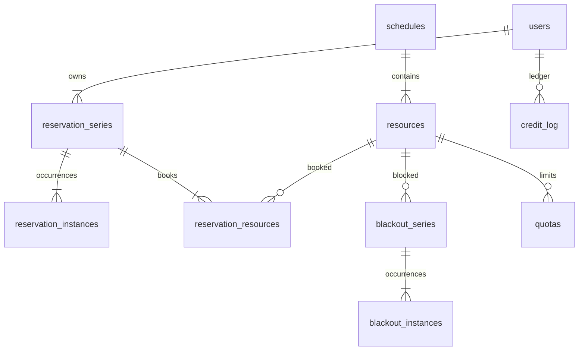

# LibreBooking — 규칙 파이프라인과 반복 예약

**코드:** `librebooking/` · 5.3.0 (`lib/Config/Configuration.php`) · PHP ≥ 8.2 · MySQL 8  
도메인 동작은 [../librebooking.md](../librebooking.md). Booked Scheduler 포크다.

**한 줄:** 페이지는 얇고, `ReservationHandler`가 검증 규칙을 순서대로 돌린 다음 series/instance를 넣는다. 재고는 자원의 시간 배타이고, 돈 자리에 크레딧 원장이 있다. DB는 문장마다 실행하고, 같은 시간의 유니크 제약이 없다.

---

## 레이어

```
Web/*.php                         스크립트 엔트리 (예: Web/ajax/reservation_save.php)
  Pages/                          HTTP 어댑터
    Presenters/                   폼 → 도메인 객체
      lib/Application/            유스케이스, 검증 규칙
        Domain/                   ReservationSeries, BookableResource, Quota
          Domain/Access/          ReservationRepository 등
            lib/Database/         SqlCommand. Commands.php / Queries.php
tpl/                              Smarty
plugins/                          설정에 적힌 클래스만 로드
database_schema/create-schema.sql + upgrades/2.5 … 2.9
```

저장 한 줄의 실제 경로:

```
Web/ajax/reservation_save.php
  Pages/Ajax/ReservationSavePage.php
    Presenters/Reservation/ReservationSavePresenter.php
      BuildReservation() → Domain ReservationSeries
      lib/Application/Reservation/ReservationHandler.php Handle()
        ReservationValidationFactory 규칙들
          ResourceAvailabilityRule
            ReservationConflictIdentifier
        AddReservationPersistenceService
          Domain/Access/ReservationRepository.php Add()
```

플러그인: `lib/Common/PluginManager.php`.  
`plugins/{PreReservation|PostReservation|Authentication|Permission|Authorization|PostRegistration|Styling|Export}/{ClassName}/{ClassName}.php`  
PreReservation은 `lib/Application/Reservation/Validation/ReservationValidationFactory.php`가 규칙 목록에 넣는다. 코어 규칙을 고치지 않고 거절 조건을 더하는 자리다.

---

## 도메인 모델과 DB

반복이 1급이다.

| 테이블 | 내용 |
|--------|------|
| `schedules` | 시간 격자. `total_concurrent_reservations`, `max_resources_per_reservation` (업그레이드) |
| `resources` | `schedule_id`, min/max duration, `requires_approval`, `max_participants`, 이후 컬럼으로 `buffer_time`, `enable_check_in`, `credit_count`, `peak_credit_count`, `additional_properties` JSON의 `MaxConcurrentReservations` |
| `reservation_series` | 제목, 반복, `owner_id`, `status_id` |
| `reservation_instances` | 회차마다 `start_date`, `end_date`, `reference_number`, `credit_count`, `checkin_date` |
| `reservation_resources` | PK `(series_id, resource_id)`. 한 예약이 자원 여러 개 |
| `blackout_series` / `blackout_instances` | 예약과 같은 모양이지만 항상 충돌 |
| `accessories` / `reservation_accessories` | `accessory_quantity` NULL이면 무제한. 시리즈에 붙음 |
| `quotas` | 건수·시간 한도. 자원·그룹·스케줄, 일/주/월/년 |
| `credit_log` | 변경 전 잔액, 변경 후, 메모 |
| `payment_configuration`, `payment_transaction_log`, `refund_transaction_log` | 크레딧 *팩 구매*와 그 관리자 환불 |

상태: `1 Created`, `2 Deleted`(소프트), `3 Pending`(승인 대기). 충돌 쿼리는 `status_id <> 2`.



겹침 SQL은 `lib/Database/Commands/Queries.php`의 날짜 fragment다. 시작이 구간 안이거나, 끝이 구간 안이거나, 구간을 완전히 덮으면 후보. PHP `DateRange::Overlaps`는 **끝이 다른 시작과 같으면 겹치지 않는다.** 비관리자는 `buffer_time`만큼 앞뒤를 늘린 뒤 비교한다 (`ReservationConflictIdentifier`).

악세서리만 수량이다 (`AccessoryAvailabilityRule`). 자원 자체는 개수가 아니라 `MaxConcurrentReservations`(기본 1)다.

승인: `resources.requires_approval`이고 예약자가 승인 권한이 없으면 `Pending`. `Pages/Ajax/ReservationApprovalPage.php`.  
체크인: `enable_check_in`이면 `ReservationCheckinPage`가 `checkin_date`. `auto_release_minutes`로 미체크인 회수를 돌릴 수 있다.

---

## 크레딧

`CreditsRule`이 잔액과 필요 크레딧을 비교한다.  
차감 SQL은 `credit_log`에 “이전 값, 이전−Δ”를 넣고 `users.credit_count`를 같은 Δ로 줄인다. 취소 환불은 Δ를 음수로 넣어 잔액이 늘어나게 한다. 예약 취소가 카드를 환불하지는 않는다. 카드 환불은 크레딧을 산 `payment_transaction_log`에 대한 관리자 `IssueRefund`다 (`Presenters/Admin/ManagePaymentsPresenter.php`).

---

## 락이 없는 이유까지

`lib/Database/Database.php`는 명령마다 연결해 실행한다. 예약 저장 경로에 `BEGIN`/`COMMIT`이 없다. `reservation_instances`에는 날짜 인덱스와 `reference_number` 인덱스만 있고 `(resource, start, end)` 유니크가 없다 (`database_schema/create-schema.sql`).

그래서 두 요청이 규칙을 동시에 통과하면 둘 다 INSERT된다. `InstanceAddedEventCommand`에 삽입 실패 시 시리즈를 지우던 코드가 주석으로 남아 있다. 설계했다면 그 주석이 “DB가 거절하면 롤백”이었는데, 거절할 제약이 없다.

검증 순서는 `ReservationValidationFactory`에 있다. 권한, 길이, 공지, 쿼터, 크레딧, 스케줄 동시 한도, 악세서리, 회차 자기 겹침, **자원 가용**. 규칙 객체로 나뉜 점은 가져갈 만하다. 그 규칙을 트랜잭션과 제약 안에 넣지 않은 점은 가져가지 않는다.

---

## 호텔·슬롯·SKU와 맞추면

LibreBooking의 series/instance는 반복 티켓·반복 회의를 한 헤더로 두는 방법이다. QloApps는 반복이 없고 날짜 범위 한 행이다. Easy!Appointments는 instance 한 행뿐이고 series가 없다.

한 점유 테이블로 맞출 때:

| 컬럼 | 누가 쓰나 |
|------|-----------|
| `resource_id` + 자원 종류 | 방, 제공자, 장비 |
| `start_at`, `end_at` | 셋 다 |
| `quantity` | EA `attendants_number`, LB 동시 한도. 방은 1 |
| `status` hold/confirmed/blocked/cancelled | QloApps 카트 vs 확정, EA 불가, LB Deleted |
| `series_id` nullable | LB 반복. 단건이면 null |
| `order_line_id` nullable | QloApps만 상거래 줄. 예약 단독이면 null |

blocked를 같은 테이블에 둘지(EA, LB 블랙아웃은 별 테이블)는 선택이다. 충돌 SQL이 한 번이 되려면 같은 테이블이 낫다. QloApps의 `htl_room_disable_dates`처럼 나누면 가용 함수가 항상 두 소스를 봐야 한다.

---

## 읽는 순서

1. `Web/ajax/reservation_save.php`
2. `Pages/Ajax/ReservationSavePage.php`
3. `Presenters/Reservation/ReservationSavePresenter.php`
4. `lib/Application/Reservation/ReservationHandler.php`
5. `lib/Application/Reservation/Validation/ReservationValidationFactory.php`
6. `lib/Application/Reservation/ReservationConflictIdentifier.php`
7. `lib/Application/Reservation/Validation/ResourceAvailabilityRule.php`
8. `Domain/ReservationSeries.php`
9. `Domain/Access/ReservationRepository.php` — 크레딧 조정 호출
10. `lib/Database/Commands/Queries.php` — 날짜 fragment, `ADJUST_USER_CREDITS`
11. `lib/Database/Database.php` — 트랜잭션 없음
12. `database_schema/create-schema.sql` — `reservation_instances` 인덱스
13. `lib/Common/PluginManager.php`
14. `Domain/Quota.php`
