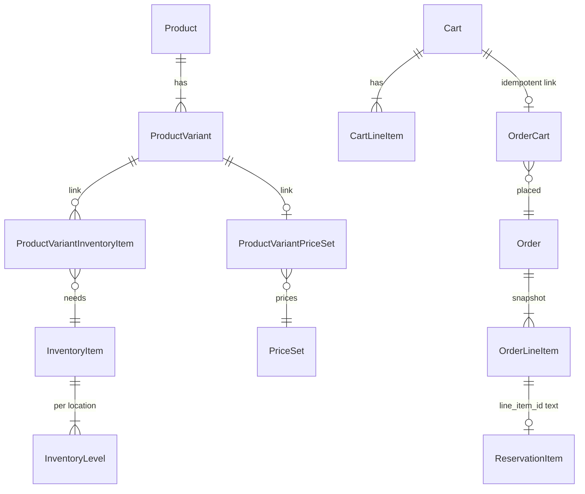

# Medusa — 모듈이 자기 테이블만 갖고, 워크플로가 붙인다

**코드:** `medusa/` · `@medusajs/medusa` 2.20.1  
**한 줄:** 상품·가격·재고·장바구니·주문·결제가 각각 패키지이고, 패키지 서비스는 서로를 import하지 않는다. 연결은 링크 테이블과 `core-flows` 워크플로다.

도메인 동작(예약 시점, 환불 락)은 [../medusa.md](../medusa.md).

---

## 프로세스가 뜨는 순서

`medusa start` → `packages/medusa/src/commands/start.ts` → `packages/medusa/src/loaders/index.ts`.

1. `medusa-config` 로드, DI 컨테이너, Postgres 연결 (`packages/core/framework`)
2. 플러그인 모듈을 config에 합침
3. `LinkLoader`가 플러그인 `links/`의 `defineLink`를 읽음
4. `MedusaAppLoader` → `packages/core/modules-sdk`의 `loadModules()`. 모듈마다 서비스 등록, 마이그레이션
5. 플러그인 `workflows/`
6. worker 모드가 아니면 Express 라우트와 Admin
7. `createDefaultsWorkflow`로 Store, Region 같은 기본 행

`projectConfig.workerMode === "worker"`이면 HTTP를 띄우지 않고 잡만 돈다. 웹과 워커가 같은 코드, 다른 엔트리라는 뜻이다.

---

## 디렉터리

```
packages/medusa/src/api/          HTTP. store/ 와 admin/. 라우트는 workflow.run 만 호출
packages/medusa/src/loaders/      부팅
packages/core/framework/          config, DI, MedusaAppLoader
packages/core/modules-sdk/        모듈 로드·마이그레이션
packages/core/workflows-sdk/      createWorkflow, createStep, hook
packages/core/core-flows/src/     cart, order, payment, inventory 워크플로
packages/core/utils/src/dml/      model.define → MikroORM
packages/core/query/              모듈을 가로지르는 Remote Query
packages/modules/<도메인>/        models, services, migrations, joiner-config
packages/modules/link-modules/    모듈 사이 조인 테이블 정의
packages/modules/providers/       stripe, s3, redis lock 같은 교체 구현
packages/admin, packages/cli, packages/js-sdk
```

모듈 안은 같은 모양이다. `order`를 보면 `src/models`, `src/services`, `src/migrations`, `src/index.ts`의 `Module(Modules.ORDER, { service })`.

`packages/modules`에 있는 도메인: product, pricing, inventory, stock-location, cart, order, payment, fulfillment, promotion, customer, region, sales-channel, store, tax, currency, auth, locking, notification, rbac, translation, workflow-engine-inmemory/redis, event-bus-local/redis.

---

## 요청이 지나가는 길

`POST /store/carts/:id/line-items`

```
packages/medusa/src/api/store/carts/[id]/line-items/route.ts
  workflow engine.run(addToCartWorkflow)
    packages/core/core-flows/src/cart/workflows/add-to-cart.ts
      acquireLockStep(cart_id)
      useQueryGraphStep("cart")                 모듈 join은 Remote Query
      getVariantsAndItemsWithPrices             pricing 모듈, variant↔price_set 링크
      confirmVariantInventoryWorkflow           inventory. 예약 행은 아직 없음
      createLineItemsStep                       cart 모듈 addLineItems
        compensation: 실패 시 deleteLineItems
      refreshCartItemsWorkflow                  세·프로모션·합계
      releaseLockStep
```

`POST /store/carts/:id/complete` → `complete-cart.ts`: 카트 락 → 이미 `order_cart` 링크가 있으면 그 주문 반환 → 주문 생성 → `reserveInventoryStep` → 결제 authorize → 트랜잭션 행.

스텝의 보상 함수는 다음 스텝이 실패하면 역순으로 돈다. `createLineItemsStep`은 만든 줄을 지운다 (`core-flows/src/cart/steps/create-line-items.ts`).

---

## 모듈 경계

`cart` 소스는 `@medusajs/order` 같은 다른 모듈 서비스를 import하지 않는다. 워크플로 스텝이 `container.resolve(Modules.CART)`처럼 꺼낸다.

링크 예 (`packages/modules/link-modules/src/definitions/product-variant-inventory-item.ts`):

- 테이블 `product_variant_inventory_item`
- id prefix `pvitem`
- extra 컬럼 `required_quantity` (decimal, 기본 1). variant 1개가 재고를 몇 단위 쓰는가

플러그인 링크는 `defineLink` 파일 하나다. loyalty 플러그인의 `links/cart-gift-cards-link.ts`가 카트와 기프트카드를 잇는다. 상품 모듈을 포크하지 않는다.

워크플로 훅(`addToCartWorkflow.hooks.validate`, `completeCartWorkflow.hooks.orderCreated`)이 플러그인이 끼어드는 자리다.

---

## DB 설계

DML `model.define`이 테이블이 된다. 공통으로 `created_at`, `updated_at`, `deleted_at`. `model.bigNumber()`는 numeric 컬럼과 `raw_*` jsonb를 쌍으로 만든다 (`packages/core/utils/src/dml/helpers/entity-builder/create-big-number-properties.ts`). 돈·수량의 반올림 전 값을 jsonb에 둔다.

| 소유 모듈 | 테이블 |
|-----------|--------|
| product | `product`, `product_variant`, `product_option`, `product_option_value` |
| pricing | `price_set`, `price`, `price_rule`, `price_list` |
| inventory | `inventory_item`, `inventory_level`, `reservation_item` |
| cart | `cart`, `cart_line_item`, `cart_address`, `cart_shipping_method` |
| order | `order`, `order_line_item`, `order_item`, `order_change`, `return`, `order_claim`, `order_exchange`, `order_transaction` |
| payment | `payment_collection`, `payment`, `capture`, `refund` |
| 링크 | `product_variant_inventory_item`, `product_variant_price_set`, `product_sales_channel`, `order_cart`, `sales_channel_location` |



읽을 제약:

- `inventory_level` unique `(inventory_item_id, location_id)` (soft delete 제외)
- variant `sku` / `barcode` unique
- `reservation_item.line_item_id`는 FK가 아니라 text. 주문 모듈과 재고 모듈의 DB가 달라도 되게 느슨한 참조다
- `order_line_item`은 `variant_id`와 함께 제목·sku·옵션·`unit_price`를 복사한다. 이후 카탈로그 수정과 무관
- `order_item`은 `order_line_item`의 버전별 수량(출고·반품)이다. `order.version`과 쌍

판매 채널이 경계다. `product_sales_channel`이 노출, `sales_channel_location`이 어느 창고를 보는지, `cart.sales_channel_id`가 그 카트에 적용된다.

**테넌트 컬럼은 없다.** `store`는 기본 채널·리전·통화 묶음이다. 여러 Store 행은 가능하지만 row-level `tenant_id` 격리는 직접 넣어야 한다. 채널 + publishable API key가 스토어프론트 경계에 가깝다.

통화는 `cart.currency_code`. 가격은 Price의 `currency_code` + `amount`. 카트에 담기는 순간 `calculated_price`가 라인 `unit_price`로 복사된다.

---

## 상품군을 얹는 seam

이미 있는 것: 한 카트의 여러 `cart_line_item`, `manage_inventory`, `required_quantity`, `metadata`, `requires_shipping = false`, validate 훅.

없는 것: 날짜 구간 점유, 쿼터 합산, 슬롯 엔티티, 라인 종류 enum. `product_type`은 라벨이다.

호텔을 넣으려면 Stay 모듈 테이블 + variant 링크 + `hooks.validate`에서 겹침 검사 + `orderCreated`에서 구간 commit. 셔츠 라인은 기존 inventory 링크를 그대로 쓴다. 주문 테이블은 그대로다.

---

## 읽는 순서

1. `packages/medusa/src/loaders/index.ts` — 부팅
2. `packages/core/modules-sdk/src/medusa-app.ts` — 모듈 로드
3. `packages/modules/link-modules/src/definitions/product-variant-inventory-item.ts`
4. `packages/modules/order/src/models/line-item.ts` — 스냅샷과 bigNumber
5. `packages/core/utils/src/dml/helpers/entity-builder/create-big-number-properties.ts`
6. `packages/medusa/src/api/store/carts/[id]/line-items/route.ts`
7. `packages/core/core-flows/src/cart/workflows/add-to-cart.ts`
8. `packages/core/core-flows/src/cart/steps/create-line-items.ts` — 보상
9. `packages/core/core-flows/src/cart/workflows/complete-cart.ts`
10. `packages/core/core-flows/src/cart/utils/prepare-confirm-inventory-input.ts` — 채널과 재고
11. `packages/modules/inventory/src/models/reservation-item.ts`
12. `packages/plugins/loyalty/src/links/cart-gift-cards-link.ts` — 포크 없이 붙이는 예
