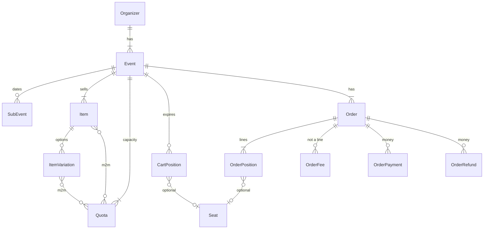

# pretix — 코어는 base, 가게는 플러그인 시그널, 용량은 합산

**코드:** `pretix/src/pretix/` · 2026.8.0.dev0 · Django 5.2  
도메인 동작(쿼터 식, advisory lock)은 [../pretix.md](../pretix.md).

**한 줄:** `pretix.base`만 도메인을 알고, presale/control/api는 그 위에 있다. 행사는 테넌트 트리의 한 단계이고, 카트 줄과 주문 줄은 같은 `AbstractPosition`이다. 용량 컬럼을 감소시키지 않고 센다.

---

## 앱 의존

설정 모듈은 `pretix.settings` (`wsgi.py`). 기본값은 `pretix/_base_settings.py`. URL 조립의 시작은 `ROOT_URLCONF = pretix.multidomain.maindomain_urlconf`.

| 앱 | 하는 일 |
|----|---------|
| `base` | 모델, `services/`, 시그널, 결제 베이스, Celery 태스크. 다른 UI 앱을 import하지 않음 |
| `presale` | 공개 샵, 카트, 체크아웃 스텝 |
| `control` | 주최자 백오피스 |
| `api` | REST |
| `multidomain` | 호스트 → 행사, URL conf 교체 |
| `plugins.*` | 결제, PDF, 체크인. `pyproject` 엔트리 포인트 `pretix.plugin`으로 `INSTALLED_APPS`에 추가 |

`base/apps.py` `ready()`가 `services.cart`, `orders`, `quotas`, `locking`을 import해 수신기와 태스크를 등록한다. 켜는 시점이 여기다.

플러그인은 설치와 활성화가 다르다. 활성화는 주최자 또는 행사의 `plugins` 문자열이고, `PluginSignal.send`가 `is_app_active`로 거른다.

---

## 요청이 지나가는 길

`MultiDomainMiddleware` (`multidomain/middlewares.py`)가 호스트로 `request.event`를 정한다.  
`multidomain/maindomain_urlconf.py`가 control/api 공통 패턴, 플러그인 `urls.py`, presale의 `/{organizer}/{event}/`를 붙인다.

체크아웃:

```
presale/views/checkout.py  CheckoutView
  validate_cart 시그널
  presale/checkoutflow.py  get_checkout_flow
    DEFAULT_FLOW + checkout_flow_steps 시그널이 돌려준 스텝
    우선순위: addons 40, customer 45, membership 47, questions 50, payment 200, confirm 1001
  ConfirmStep → Celery perform_order
```

스텝 클래스는 `BaseCheckoutFlowStep`. 플러그인 우선순위는 1000 이하라 confirm 앞에만 끼운다.

| 파일 | 역할 |
|------|------|
| `base/services/cart.py` | `CartManager`. 담기·빼기·만료·세금 |
| `base/services/quotas.py` | `QuotaAvailability` 배치 SQL |
| `base/services/locking.py` | `pg_advisory_xact_lock` |
| `base/services/orders.py` | `_perform_order`. `@app.task`, 락 타임아웃 재시도 최대 5 |

`perform_order`가 비동기인 이유: 쿼터 락을 잡는 트랜잭션이 길고, 3초 락 실패를 재시도해야 하며, 브라우저는 `async_id`를 폴링한다 (`ConfirmStep`이 `AsyncAction`).

`reservation_time` 설정(분)이 카트 줄 `expires`다. 한 카트의 줄은 같은 만료로 맞춘다.

---

## 시그널이 확장 계약이다

`base/signals.py`의 `GlobalSignal`, `EventPluginSignal`, `OrganizerPluginSignal`.

주문·용량에 손대는 이름:

| 시그널 | 언제 |
|--------|------|
| `validate_cart` / `validate_order` | 체크아웃 전, 주문 생성 직전 |
| `order_placed` / `order_paid` / `order_canceled` / `order_expired` | 수명 |
| `order_fee_calculation` | 수수료 줄 |
| `quota_availability` | 합산 결과를 플러그인이 고침 |
| `register_payment_providers` | 행사 `get_payment_providers()`가 모음 |

`presale/signals.py`의 `checkout_flow_steps`, `fee_calculation_for_cart`, `order_meta_from_request`.

결제: `base/payment.py`의 `PaymentProvider`. Stripe는 `plugins/stripe/signals.py`에서만 등록되고, 코어 코드는 Stripe를 import하지 않는다. `execute_refund` 기본 구현은 “자동 환불 미지원”이다.

설정은 `base/settings.py`의 hierarkey. 전역 → 주최자 → 행사(`parent_field='organizer'`). 읽는 법은 `event.settings.reservation_time`.

---

## DB: 테넌트 트리

앱 라벨 `pretixbase`. 테이블 접두사 `pretixbase_`.



주최자가 테넌트다. 행사(`Event`)가 통화, 판매 기간, 샵 URL의 경계다. 아이템·쿼터·카트·주문·바우처·좌석·세금 규칙은 `event_id`를 가진다. `Order`와 `OrderPosition`에는 `organizer_id`가 중복으로 있어 `(organizer, code)` `(organizer, secret)` 유니크에 쓴다.

금액은 `DecimalField(max_digits=13, decimal_places=2)`.  
`OrderPosition.blocked`는 JSON(체크인 차단 이유). `meta_info`는 JSON 텍스트.  
`secret`은 QR, `web_secret`은 URL, `pseudonymization_id`는 별도 유니크.

`CartPosition`과 `OrderPosition`은 abstract `AbstractPosition`을 공유한다 (`base/models/orders.py`). 공통 필드: `item`, `variation`, `subevent`, `price`, `voucher`, `addon_to`, `seat`, `is_bundled`, 참석자, 주소.  
카트만: `cart_id`, `expires`.  
주문만: `positionid`, `secret`, 세금 분해, `canceled`, `blocked`, `valid_from`/`valid_until`.

한 주문 안의 종류는 테이블이 아니라 플래그다.

| 종류 | 표시 |
|------|------|
| 입장권 | `Item.admission` |
| 비입장(상품성 아이템) | `admission=False`. 배송 파이프라인은 없음. `OrderFee.FEE_TYPE_SHIPPING`만 있음 |
| 애드온 | 카테고리 `is_addon`, 줄의 `addon_to` |
| 번들 구성품 | `is_bundled` |
| 수수료 | `OrderFee` 행. 포지션이 아님 |

좌석·서브이벤트·체크인·`release_after_exit`는 입장 가정이다. 범용 커머스에서는 라인 공통 컬럼이 아니라 가용성 정책 쪽으로 내려야 한다.

`Quota.size`는 정원이다. 사용량은 `quotas.py`가 미만료 카트 + pending/paid 주문 + `block_quota` 바우처 + 대기열을 센다. 감소 트리거가 없어 취소·만료가 다음 합산에서 저절로 빠진다. 그 합산을 독점으로 만드는 것이 `locking.py`다.

---

## 상품군을 얹을 때

쿼터 합산은 [한 커머스로 모으기](00-한-커머스로-모으기.md)의 `StockStrategy.availability`와 같은 자리다. `quota_availability` 시그널이 이미 “이 합산을 덮어라”는 훅이다.

가져가면 안 되는 고정: 판매물마다 `event_id`. 셔츠 카탈로그는 주최자(테넌트) 아래에 있고, 행사 날짜는 `SubEvent`처럼 **정책의 시간 키**여야 한다. pretix에서 그 시간 키는 줄 위의 `subevent` FK로 모든 입장권에 붙어 있다.

---

## 읽는 순서

1. `src/pretix/_base_settings.py`
2. `src/pretix/base/apps.py`
3. `src/pretix/base/signals.py`
4. `src/pretix/multidomain/maindomain_urlconf.py`
5. `src/pretix/presale/checkoutflow.py`
6. `src/pretix/presale/views/checkout.py`
7. `src/pretix/base/models/orders.py` — `AbstractPosition`부터
8. `src/pretix/base/models/items.py` — `Item`, `Quota`
9. `src/pretix/base/services/cart.py`
10. `src/pretix/base/services/quotas.py`
11. `src/pretix/base/services/locking.py`
12. `src/pretix/base/services/orders.py` — `perform_order`
13. `src/pretix/base/settings.py`
14. `src/pretix/plugins/stripe/signals.py` — 코어 밖 결제
