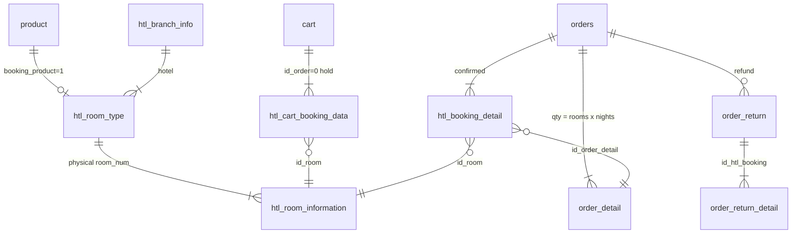

# QloApps — PrestaShop 주문에 객실 날짜를 붙인다

**코드:** `QloApps/` · PrestaShop 1.6.1.23 포크, 호텔 모듈 1.7.1  
도메인 동작은 [../qloapps.md](../qloapps.md).

**한 줄:** 프론트 컨트롤러 디스패치와 `product`/`orders`는 PrestaShop 그대로다. 진짜 재고는 `htl_*` 테이블이고, 결제 확정 함수 `PaymentModule::validateOrder`가 카트 홀드를 예약 행으로 바꾼다. 호텔 코드가 코어 클래스 안에 들어와 있다.

---

## 요청이 지나가는 길

```
index.php
  config/config.inc.php
  classes/Dispatcher.php  dispatch()
    FC_FRONT | FC_ADMIN | FC_MODULE
    Hook::exec('actionDispatcher')
    Controller::getController()->run()
```

검색부터 확정까지:

```
modules/wkroomsearchblock          날짜·인원 폼 (displayTop 훅)
controllers/front/ProductController.php
modules/hotelreservationsystem/classes/HotelBookingDetail.php   가용 방
controllers/front/CartController.php
  HotelCartBookingData::updateCartBooking / addCartBookingData
classes/PaymentModule.php  validateOrder
  htl_cart_booking_data를 읽고
  방이 남아 있으면 htl_booking_detail INSERT (ASSIGNED)
  아니면 다른 방으로 바꾸거나 is_back_order=1
  order_detail.id 를 예약 행에 연결
```

환불은 `classes/order/OrderReturn.php`와 `order_return_detail.id_htl_booking`. 관리자 승인은 `modules/hotelreservationsystem/controllers/admin/AdminOrderRefundRequestsController.php`.

`override/`는 클래스 인덱스(`cache/class_index.php`)로 코어를 갈아끼우는 PrestaShop 장치다. 호텔의 중심은 override가 아니라 모듈 + 코어에 직접 넣은 분기(`booking_product`)다.

---

## 비즈니스 코드가 있는 곳

| 경로 | 내용 |
|------|------|
| `classes/` | Product, Cart, Order, PaymentModule, Hook, Dispatcher |
| `classes/order/` | OrderDetail, OrderReturn, OrderSlip |
| `controllers/front/` | Cart, Product, OrderDetail |
| `modules/hotelreservationsystem/classes/` | 호텔 모델, DDL, 가용성, 환불 규칙 |
| `modules/hotelreservationsystem/hotelreservationsystem.php` | 훅 등록 |
| `modules/wkroomsearchblock/` | 검색 |
| `modules/qlopaypalcommerce/` 등 | 결제 |

훅은 모듈이 `registerHook`, 코어·도메인이 `Hook::exec`. 예: `HotelBookingDetail`의 `actionBookingDataParamsModifier`. 검색 파라미터를 다른 모듈이 고칠 수 있다.

ObjectModel은 클래스의 `$definition = ['table' => ..., 'primary' => ..., 'fields' => ...]`. 호텔 테이블 생성은 `HotelReservationSystemDb.php`.

---

## DB

테이블 접두사는 설치 때 정한다. `_DB_PREFIX_`. 인스톨러가 비어 있을 때 넣는 기본값은 `qlo_`다 (`install-dev/controllers/http/database.php`). 저장소에 `config/settings.inc.php`가 없으면 실제 접두사는 설치본마다 다르다.

객실 타입은 `product.booking_product = 1`인 상품이다 (`classes/Product.php`). `htl_room_type.id_product`가 그 상품을 가리킨다. 서비스 상품은 `booking_product = 0`이고 `htl_room_type_service_product`로 호텔·객실 타입에 붙는다.

`stock_available`은 객실 타입에 매우 큰 수를 넣어 둔다. 날짜 가용성의 원본이 아니다.



| 테이블 | 역할 |
|--------|------|
| `htl_branch_info` | 호텔. 체크인 시각, `active_refund`, 카테고리 FK |
| `htl_room_type` | 인원, min/max LOS. 상품 FK |
| `htl_room_information` | 방 번호, `id_status` 1 판매 / 2 중지 / 3 임시 중지 |
| `htl_room_disable_dates` | 방·타입의 중지 구간 |
| `htl_cart_booking_data` | 방 1개 × `date_from`/`date_to`. 카트 수량과 별개로 이게 홀드 |
| `htl_booking_detail` | 확정. 가격·호텔명 스냅샷, `id_status`, `is_back_order` |
| `htl_order_refund_rules` | 체크인 N일 전, 완납/선결제별 공제 |
| `orders` | `is_advance_payment`, `advance_paid_amount` |

날짜별 재고 테이블은 없다. `HotelBookingDetail::getSearchAvailableRooms`가 활성 방에서 겹치는 예약·중지·LOS·**이 카트**를 빼서 센다. 다른 카트의 홀드는 빼지 않는다.

카트 상품 수량은 `방 수 × 박 수`다. PrestaShop 주문 줄은 “몇 개”만 알아서, 기간의 진실은 `htl_*`에 있다. 두 표현을 결제 함수가 맞춰야 한다.

락: 호텔 경로에 `GET_LOCK`도 `FOR UPDATE`도 없다. 담을 때, `validateCartBookings`, `validateOrder`가 다시 조회한다. 동시에 같은 방을 담으면 결제에서 교체 또는 `is_back_order=1`이다. 오버부킹은 설정 `PS_OVERBOOKING_ORDER_ACTION`으로 주문 상태를 바꾼다.

환불 규칙에 맞는 구간이 없으면 공제 100%다 (`HotelOrderRefundRules::getBookingCancellationDetails`). 호텔이 `active_refund`와 `htl_branch_refund_rules`로 규칙을 켠다.

---

## 설계에 남길 것 / 남기지 말 것

남길 것: **홀드 테이블과 확정 테이블을 분리**하고, 확정 행이 `order_detail`에 FK를 가진다. 환불 완료 id를 서브쿼리로 모아 가용 검색에서 뺀다 (`OrderReturn::getRefundedBookingIdsSubquery`). bool `is_refunded`를 예약 행에 중복하지 않으려는 방향이다.

남기지 말 것: 코어 `validateOrder` 안에 도메인 INSERT. 실패 보상과 락 범위가 결제·메일·재고에 걸쳐 버린다. 그리고 `stock_available` 더미. 가용성 전략은 `htl_booking_detail` 쪽 하나여야 한다.

---

## 읽는 순서

1. `index.php`
2. `classes/Dispatcher.php`
3. `classes/Hook.php` — `exec`
4. `classes/Product.php` — `booking_product`
5. `modules/hotelreservationsystem/classes/HotelReservationSystemDb.php`
6. `modules/hotelreservationsystem/classes/HotelRoomType.php`
7. `modules/hotelreservationsystem/classes/HotelBookingDetail.php` — `getSearchAvailableRooms`, 상태 상수
8. `modules/hotelreservationsystem/classes/HotelCartBookingData.php`
9. `controllers/front/CartController.php` — 담기 분기
10. `classes/PaymentModule.php` — `validateOrder`의 호텔 블록
11. `modules/hotelreservationsystem/classes/HotelOrderRefundRules.php`
12. `classes/order/OrderReturn.php` — `id_htl_booking`
