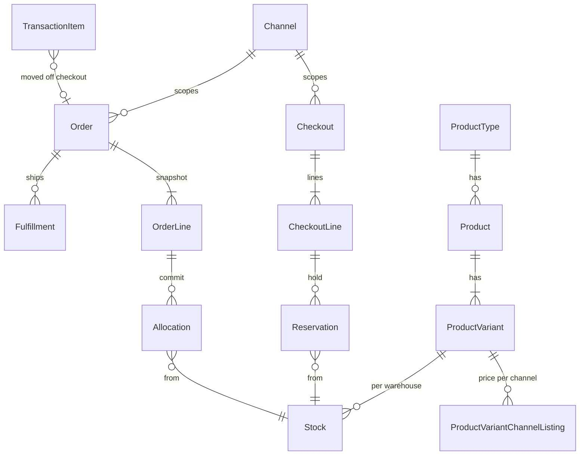

# Saleor — 채널이 상점이고, GraphQL은 얇고, 돈은 앱이 가진다

**코드:** `saleor/saleor/` · 3.24.0-a.0 · Django 5.2 · GraphQL · Celery · PostgreSQL  
도메인 동작은 [../saleor.md](../saleor.md).

**한 줄:** 도메인 앱이 규칙과 테이블을 갖고, `graphql/`은 그 앱을 호출만 한다. 체크아웃은 재고를 *예약*하고, 주문은 *할당*한다. 결제 금액의 최신 경로는 코어가 아니라 결제 앱의 `TransactionItem`이다.

---

## 레이아웃

`saleor/settings.py`의 `INSTALLED_APPS`가 로컬 앱을 등록한다. HTTP는 `saleor/asgi` → `urls.py`의 `/graphql/` → `graphql/views.py` → `graphql/api.py`.

도메인 앱과 `graphql/<같은 이름>/`이 쌍이다. mutation 파일은 `perform_mutation`에서 도메인 함수로 넘긴다.

| 앱 | 책임 |
|----|------|
| `product` | ProductType, Product, Variant, 채널별 가격·공개 |
| `attribute` | 타입마다 다른 필드를 테이블 추가 없이 |
| `channel` | 통화, 창고 전략, 미결제 주문 허용, 자동 확정 |
| `warehouse` | Stock, Reservation, Allocation |
| `checkout` | 카트. 완료 시 주문으로 바뀜 |
| `order` | 주문, 출고, 환불 허가 |
| `payment` | 레거시 Payment, 현재 TransactionItem |
| `plugins` | 프로세스 안 파이썬 플러그인. 채널별 설정 |
| `app` | 외부 앱 설치, 토큰, 권한 |
| `webhook` | 앱으로의 sync/async 전달 |
| `discount`, `giftcard`, `tax`, `shipping`, `account`, `permission` | 각각 할인, 기프트카드, 세금, 배송, 계정, 권한 코드 |

`plugins`는 설정 `PLUGINS`에 클래스 경로로 들어 있고, 엔트리 포인트로 외부 패키지를 덧붙일 수 있다. 앱(`app`)은 파이썬을 주입하지 않는다. 웹훅과 GraphQL만 쓴다.

---

## 요청이 지나가는 길

### 라인 추가 `checkoutLinesAdd`

`graphql/checkout/mutations/checkout_lines_add.py`  
→ `checkout/utils.py` `add_variants_to_checkout`  
→ 체크아웃 락, `CheckoutLine` 생성·수정  
→ `warehouse/reservations.py` `reserve_stocks_and_preorders`

mutation이 재고 수식을 들고 있지 않다. `graphql/checkout/mutations/utils.py`의 `check_lines_quantity`가 `warehouse/availability.py`로 간다.

### 완료 `checkoutComplete`

`graphql/checkout/mutations/checkout_complete.py`  
→ `checkout/complete_checkout.py` `complete_checkout`  
→ 채널과 승인 상태에 따라 트랜잭션 흐름 또는 레거시 결제  
→ `_create_order_from_checkout`: `OrderLine.objects.bulk_create`  
→ `warehouse/management.py` `allocate_stocks(..., check_reservations=True)`

완료된 체크아웃의 `token`으로 주문을 다시 찾으면 기존 주문을 돌려준다 (`Order.checkout_token`).

---

## 채널이 바꾸는 것

`channel/models.py`의 `Channel` 한 행이 스토어프론트다.

채널별: 통화, 기본 국가, 상품·변형 가격과 공개(`ProductChannelListing`, `ProductVariantChannelListing`), 창고 우선순위와 `allocation_strategy`, `allow_unpaid_orders`, 자동 주문 확정, 기프트카드 자동 출고, 체크아웃 만료 시 승인 해제.

전역: 상품 정의, 창고의 물리 `Stock`, 사용자, 앱. 재고 행은 전역이고, **그 채널에 연결된 창고만** 가용 계산에 들어간다.

플러그인 설정도 `(identifier, channel)`이다.

---

## DB

| 패턴 | 실례 |
|------|------|
| UUID PK | Checkout.token, CheckoutLine, Order, OrderLine, Warehouse |
| int PK | Stock, Allocation, Reservation, Product, Variant, Channel, TransactionItem |
| 금액 | `price_amount` Decimal + `currency` Char. `MoneyField`가 둘을 묶음 |
| 무결성 | `Stock` unique (warehouse, variant). `Reservation` unique (checkout_line, stock). `Allocation` unique (order_line, stock). 채널 리스팅 unique (product 또는 variant, channel) |

`Stock.quantity_allocated`는 Allocation 합의 캐시다. 진실은 `warehouse_allocation` 행이고, Celery가 캐시를 맞춘다. `quantity >= allocated + reserved`를 강제하는 CheckConstraint는 없고, `select_for_update` 순서가 그 역할을 한다 (`warehouse/lock_objects.py`, pk 오름차순).

`CheckoutLine`은 `variant` FK와 계산된 가격만 있다. 이름이 없다.  
`OrderLine`은 `product_name`, `variant_name`, `product_sku`, `is_shipping_required`, `is_gift_card`를 **복사**한다 (`order/models.py`). 주문 이후 카탈로그 변경이 과거 영수증을 바꾸지 않게 하는 자리다.

체크아웃과 주문은 다른 aggregate다. 예약은 체크아웃이 지워지면 cascade로 사라지고, 할당은 주문에 남는다.

---

## 속성과 권한

다른 상품에 다른 필드를 주려면 `attribute` 앱이다. `Attribute.input_type`(dropdown, text, numeric, date, reference). `AttributeVariant.variant_selection = true`인 속성이 변형의 정체성(사이즈, 색)이다. 값은 `AssignedVariantAttribute`. 호텔 체크인 날짜를 *보여 주는* 데는 이것으로 된다. *그 날짜의 방을 원자적으로 잠그는* 데는 부족하다. 잠금은 warehouse 전략이 해야 한다.

권한은 `permission/enums.py`의 코드네임. 스태프 그룹 또는 `App`에 붙인다. 스토어프론트 고객은 체크아웃 토큰으로 접근하고 관리 권한은 없다. 웹훅 이벤트마다 앱이 가져야 하는 권한이 매핑돼 있다.

---

## 확장: 플러그인 vs 앱

| | 플러그인 `plugins/` | 앱 `app/` + `webhook/` |
|--|---------------------|-------------------------|
| 실행 | 같은 프로세스 | 외부 |
| 설정 | 채널별 `PluginConfiguration` | 앱 설치, 토큰 |
| 돈이 급할 때 | 게이트웨이 플러그인 (레거시 Payment) | **sync** webhook (`transaction_initialize_session`, 세금, 배송 목록). 응답 올 때까지 요청이 기다림 |
| 통지 | 훅 | **async** Celery (`order_created` 등) |

`TransactionItem`은 `authorized_value`, `charged_value`, `refunded_value`와 `app` FK를 가진다. 체크아웃에 붙었다가 완료 시 주문으로 옮겨진다. 코어는 “전액 승인됐는가 / `allow_unpaid_orders`인가”만 보고 주문을 만든다.

`ProductTypeKind`는 `normal`과 `gift_card`뿐이다 (`product/__init__.py`). 전략 인터페이스는 없다. 이미 스위치로 쓰이는 필드:

- `ProductType.is_shipping_required`
- `ProductVariant.track_inventory`
- `ProductVariant.quantity_limit_per_customer` (티켓 한도에 가장 가까운 기존 필드)
- `Channel.allocation_strategy`
- Reservation / Allocation 두 단계

날짜 재고·행사 쿼터를 넣으려면 `warehouse/availability.py`, `reservations.py`, `management.allocate_stocks`에 kind별 분기를 **새로** 두어야 한다. 그 세 파일이 이미 모든 재고 결의 입구다.

---

## 읽는 순서

1. `saleor/settings.py` — 앱과 플러그인
2. `saleor/urls.py`
3. `saleor/graphql/api.py`
4. `saleor/graphql/checkout/mutations/checkout_lines_add.py`
5. `saleor/checkout/utils.py` — `add_variants_to_checkout`
6. `saleor/warehouse/reservations.py`
7. `saleor/warehouse/lock_objects.py`
8. `saleor/graphql/checkout/mutations/checkout_complete.py`
9. `saleor/checkout/complete_checkout.py`
10. `saleor/warehouse/management.py` — `allocate_stocks`
11. `saleor/channel/models.py`
12. `saleor/order/models.py` — OrderLine 스냅샷 필드
13. `saleor/product/__init__.py` — kind가 둘뿐인 이유
14. `saleor/attribute/models/product_variant.py`
