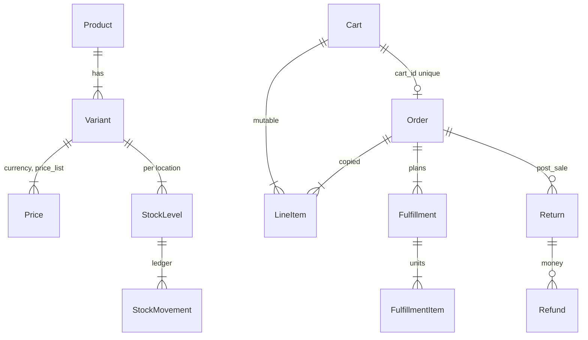

# Spree 6 alpha — 카트와 주문이 다른 aggregate다

**코드:** `spree/` (Ruby gem) + `packages/` (JS). 버전 `spree/core/lib/spree/core/version.rb`의 6.0.0.alpha.  
도메인 동작은 [../spree.md](../spree.md). 4/5 문서의 `order.state`, `StockItem`, `Shipment`는 이 트리의 현재 이름이 아니다.

**한 줄:** HTTP는 `spree/api`, 규칙은 `spree/core`의 workflow. 체크아웃은 `Cart`에서 끝나고, `Carts::Complete`가 불변 `Order`로 복사한다. 결제 HTTP는 DB 트랜잭션 밖 `external_step`이다.

---

## 모노레포에서 요청에 들어가는 것

```
spree/core        모델, workflow, service, subscriber. 컨트롤러 없음
spree/api         /api/v3 컨트롤러, 시리얼라이저, routes
spree/emails      주문 이벤트 구독 메일
spree/providers/stripe|easypost|meilisearch
spree/dashboard   엔진 껍질
packages/         React 대시보드, SDK, CLI. Rails 요청 경로 밖
```

의존성 교체: `spree/core/lib/spree/core/dependencies.rb`가 `Spree.cart_add_item_workflow` 같은 상수를 들고, 호스트 앱이 클래스를 바꿀 수 있다.

workflow 어휘는 `spree/core/lib/spree/workflow.rb`.

- `step` — 메서드. 커밋 후 실패하면 `on_flow_failure`로 되돌림
- `external_step` — DB 트랜잭션 안에서 호출하면 안 됨
- `run_hooks` — `Spree.hooks.register('carts.add_item.validate')`
- 반환은 예외보다 `Spree::ServiceModule::Result`

6.0이 상태 머신을 뺀 이유(`docs/plans/decisions.md`): 전이 콜백이 게이트웨이 I/O를 상태 저장과 같은 트랜잭션에 넣었고, 부분 전이의 인자와 보상 이야기가 없었다.

| 4/5 | 6.0 |
|-----|-----|
| 미완료 Order = 카트 | `Cart`. 완료 시각만 있고 status 컬럼으로 체크아웃 단계를 저장하지 않음 |
| `order.complete!` | `POST /api/v3/store/carts/:id/complete` |
| `shipment` | `fulfillment` |
| `StockItem` | `StockLevel` |
| AASM 이벤트 | workflow + `HasStatus` 값 |

체크아웃 “현재 단계”는 `Cart#current_checkout_step`이 `Checkout::Requirements`로 계산한다.

---

## 요청이 지나가는 길

### 담기

`POST /api/v3/store/carts/:cart_id/items`  
`spree/api/config/routes.rb`  
→ `spree/api/app/controllers/spree/api/v3/store/carts/items_controller.rb`  
→ `Spree.cart_add_item_workflow`  
→ `spree/core/app/workflows/spree/carts/add_item.rb`

안에서 가용성(`Carts::CheckAvailability`), 가격, 재고 예약, 합계 재계산이 이어진다. 응답 시리얼라이저는 api gem의 `cart_serializer.rb`.

### 완료

`spree/api/.../store/carts_controller.rb#complete`  
→ `spree/core/app/workflows/spree/carts/complete.rb`

```
cart.with_lock
  동시 완료 방지
  락 안에서 합계 재계산
  검증
  draft Order 생성 + 라인·출고 계획·금액 행 복사
external_step process_payments!     # 트랜잭션 밖
finalize
  판매자가 여럿이면 주문 분할
  Orders::Complete (order.with_lock, allocated 재고 이동)
  cart.completed_at
```

`orders.cart_id` unique가 두 번 누르기를 막는다. 돈 행(결제, 예약)은 복사하지 않고 주문으로 **포인터만 옮긴다.**

---

## Cart와 Order가 공유하는 것

`app/models/concerns/spree/purchase/` 아래 작은 모듈들이다. 파일 하나가 아니다. 합계, 세금, 주소, 결제 처리, 기프트카드, 디지털, 통화, 수량 규칙이 양쪽에 include된다.

카트만: `CheckoutSteps`.  
주문만: `status`(`draft|placed|canceled`), `number`, `seller_id`, `order_group_id`, 반품·정산, `belongs_to :cart`.

라인·출고·세금·할인·수수료·결제는 `cart_id`와 `order_id` 중 하나가 채워지는 이중 FK다.

---

## DB

금액은 `decimal(10,2)`. 센트 정수가 아니다. 수량은 integer.

| 묶음 | 테이블 |
|------|--------|
| 테넌시 | `spree_stores`, `spree_markets`, `spree_channels` |
| 카탈로그 | `spree_products`, `spree_variants`, `spree_prices`, `spree_price_lists` |
| 재고 | `spree_stock_locations`, `spree_stock_levels`, `spree_stock_movements`, `spree_stock_reservations` |
| 구매 | `spree_carts`, `spree_orders`, `spree_order_groups`, `spree_line_items`, `spree_fulfillments`, `spree_fulfillment_items` |
| 금액 행 | `spree_tax_lines`, `spree_discounts`, `spree_fees` |
| 결제 | `spree_payments`, `spree_refunds`, `spree_payment_splits` |
| 판매 후 | `spree_returns`, `spree_return_line_items` |
| 마켓 | `spree_sellers`, `spree_commission_lines` |

`store_id`가 멀티 스토어. `seller_id`가 상품·변형·라인·주문에 있어 한 결제가 `order_groups`로 판매자별 주문이 된다. `payment_splits` unique `(payment_id, order_id)`.

`stock_levels` unique `(variant_id, stock_location_id) WHERE deleted_at IS NULL`.  
`lock_version`은 카트·주문에 있으나 `lock_optimistically = false`. API가 버전을 비교해 409를 낸다.

재고 원장 `stock_movements.kind`: `received | allocated | shipped | released | adjusted`. 원인 FK가 `order`, `fulfillment`, `return`, `exchange`, `stock_transfer`로 타입되어 있다. 다형 `originator`는 후퇴 중이다. `allocated_count`와 `count_on_hand`가 나뉘어, 주문은 약속만 올리고 출고가 선반을 깎는다 (`stock_movement.rb`, `orders/complete.rb`, `fulfillments/fulfill.rb`).



스키마 파일은 없고 `spree/core/db/migrate/`가 원본이다. 설명은 `docs/plans/6.0-cart-order-split.md`.

---

## 두 번째 상품 행동이 이미 있는 곳

디지털: `app/models/spree/delivery_profiles/digital.rb`, `fulfillment_provider/digital.rb`, `digital_link.rb`, `concerns/spree/purchase/digital_items.rb`. 선반을 쓰지 않고 출고 provider가 자동 이행한다.

기프트카드: `gift_card.rb`, `workflows/spree/gift_cards/`, api의 `carts/gift_cards_controller.rb`. 재고가 아니라 잔액이다.

재고 전략을 바꿀 자리:

- `app/models/spree/inventory_provider/base.rb`와 `internal.rb`. 스토어가 internal이 아니면 `Carts::CheckAvailability`가 provider로 간다
- `app/models/spree/stock/packer.rb` — variant 수량으로 on_hand / backordered를 나눔. 대체 불가능한 좌석을 모른다
- `Variant#should_track_inventory?` — variant 플래그 ∧ 스토어 `track_inventory_levels`
- `config.spree.stock_splitters`, `FulfillmentProvider`, `DeliveryRateProvider`

호텔 1박이나 지정석을 `count_on_hand` 정수와 `line_items.quantity`만으로 표현할 자리는 없다. `metadata`에 날짜를 적어도 `Packer`와 `fill_status(variant, qty)`는 그 날짜를 재고로 보지 않는다. `track_inventory: false`로 끄면 디지털처럼 검사는 빠지지만, 달력 진실이 생기지 않는다. 구간 재고는 `InventoryProvider`와 홀드 테이블을 새로 가져야 한다.

---

## 읽는 순서

1. `spree/docs/plans/6.0-cart-order-split.md`
2. `spree/core/lib/spree/workflow.rb`
3. `spree/core/lib/spree/core/dependencies.rb`
4. `spree/core/app/models/spree/cart.rb`
5. `spree/core/app/models/spree/order.rb`
6. `spree/core/app/workflows/spree/carts/add_item.rb`
7. `spree/core/app/workflows/spree/carts/complete.rb`
8. `spree/core/app/workflows/spree/orders/complete.rb`
9. `spree/api/app/controllers/spree/api/v3/store/carts/items_controller.rb`
10. `spree/core/app/models/spree/stock_movement.rb`
11. `spree/core/app/models/spree/stock/packer.rb`
12. `spree/core/app/models/spree/inventory_provider/base.rb`
13. `spree/core/app/models/spree/fulfillment_provider/digital.rb`
