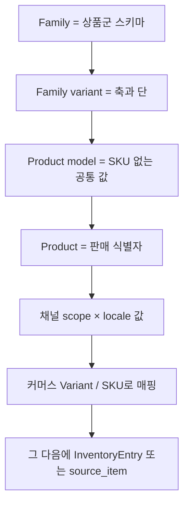
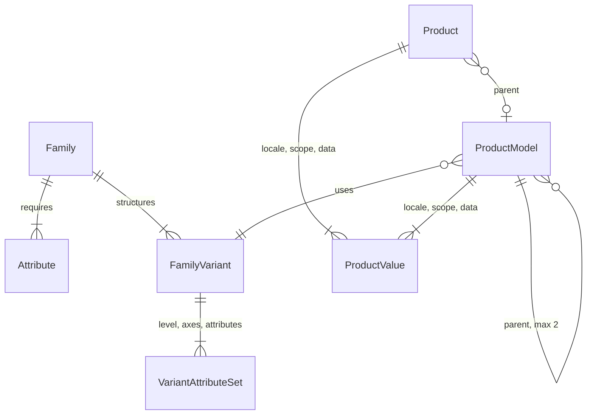

# Akeneo PIM — 팔기 전에 상품군을 나누는 카탈로그

로컬은 `pim-community-dev`의 `main` 얕은 클론이다. 원본은 [akeneo/pim-community-dev](https://github.com/akeneo/pim-community-dev)다. 주문, 결제, 재고 락, 환불은 **이 제품의 일이 아니다.** 기업 카탈로그가 Saleor 속성 한 단으로 안 끝나는 이유를 보는 문서다.

근거:

- [Catalog structure](https://api.akeneo.com/concepts/catalog-structure.html)
- [Products and product models](https://api.akeneo.com/concepts/products.html)
- [Variants 도움말](https://help.akeneo.com/serenity-your-first-steps-with-akeneo/serenity-what-about-products-with-variants)

커머스로 넘기는 연결 가이드: [Understand Akeneo PIM](https://api.akeneo.com/guides/ecommerce-connection/step2-understand-akeneo-pim.html). PIM이 부모이고, 쇼핑몰 SKU는 그 아래 식별자다.

---

## 무엇을 상품이라고 부르는가

| 이름 | 식별자 | 하는 일 |
|------|--------|---------|
| Family | code | 속성 묶음. 라벨 속성, 대표 이미지 속성을 지정. “티셔츠 상품군” |
| Attribute | code | 필드. 타입은 select, 측정, 불리언, 참조 등. **변형 축이 될 수 있는 타입만** 축으로 쓴다 |
| Family variant | family 안 code | 변형 **단 수**, 단마다 축, 속성을 어느 단에 둘지 |
| Product model | code. SKU 없음 | 공통 값. 루트와, 2단이면 서브 모델 |
| Product | identifier 또는 UUID. SKU는 비울 수 있다 | 실제로 내보내는 판매 단위. 부모가 있으면 변형 상품 |

티셔츠 예(도움말에 있는 구조):

- Family variant `의류 색/사이즈`, 변형 단 2.
- 1단 축 color. 그 단 속성: 사진, 소재, 색.
- 2단 축 size. 그 단 속성: SKU, EAN, 무게, 사이즈.
- 공통: 이름, 브랜드, 세탁법.
- 데이터는 최대 세 층이다. 루트 product model, 색 product model, 색+사이즈 product.

상품은 가족 변형이 정한 속성을 부모에게서 받는다. 변형 상품의 `parent`를 `null`로 PATCH하면 단순 상품이 되고, 기본은 부모 값을 자기 값으로 남긴다.

축은 한 family variant에서 최대 10개까지 단에 나누어 둔다는 현재 도움말이 있다. 단 구조 자체는 “product model 최대 2단 + 판매 product 1단”이다. 3단 카탈로그(모델 / 색 / SKU)를 2단 variant 테이블로 누르면 색 공통 사진이 SKU마다 복사된다.

---

## 값의 좌표: 채널 × 로케일

속성 값은 스칼라가 아니다. `values.<attribute>[]`의 원소가 `locale`, `scope`(채널), `data`다. 둘 다 `null`이면 전역 값이다.

그래서 “영어 이름”과 “미국 이커머스 채널의 영어 이름”이 공존한다. Saleor의 `ProductChannelListing`이 가격·공개만 채널로 나누는 것과 달리, **설명·이미지·속성 값 전체**가 채널 좌표를 가진다. 가격 자체는 PIM의 1급 재고가 아니다. 금액은 커머스(Offer)로 넘긴 뒤의 일이다.

카테고리는 product와 product model 둘 다에 붙일 수 있다.

연관은 두 가지다. `associations`(관련 상품)와 `quantified_associations`(수량 있는 연관). 후자는 구성품 수량을 PIM에 적는 자리이지, 주문 시점 재고 차감은 아니다.

---

## 재고·환불·락

없다. `quality_scores`나 워크플로 상태는 콘텐츠 완성도다. 창고 수량을 PIM에 두면 커머스 예약과 두 원장이 된다. Akeneo가 쇼핑몰에 주는 것은 identifier, family, 축 값, 채널별 콘텐츠다. 재고 모드는 commercetools나 Magento가 받는다.

환불 문서도 없다. 반품은 판매 주문의 일이다.

---

## 커머스로 넘기는 흐름

내보낼 때 부모가 가진 값을 자식 레코드에 풀어 담거나, 커머스가 부모 FK를 유지하거나 둘 중 하나다. Magento configurable은 자식 simple이 독립 상품이라 부모 공통 속성을 자식에 복사하는 쪽이 자연스럽다. Saleor는 Product(공통) + Variant(축)라 product model → Product, 마지막 단 → Variant로 떨어진다.

---

## 데이터 모양

API 식별자: product model은 `code`, product는 `identifier`와 UUID. SKU 속성은 2단의 속성일 뿐 테이블 PK가 아니다. 커머스 SKU와 PIM identifier를 같은 문자열로 두면 나중에 상품군이 늘 때 충돌한다. Stripe가 Product id를 외부 id로 받게 두는 것과 같은 이유로, PIM code를 외부 키로 저장한다.

---

## 가져갈 것

판매 단위를 만들기 **전에** “이 상품군의 스키마”와 “축이 몇 단인가”를 둔다. 지금 레포의 Product / Variant 두 층은 축이 한 단일 때 맞다. 색마다 사진이 다르고 사이즈마다 SKU가 다르면 중간 모델이 있어야 사진이 SKU 수만큼 복사되지 않는다.

가져가지 말 것: PIM 안에 가용 수량. 채널별 콘텐츠와 채널별 재고는 다른 저장소다. scope는 문구의 좌표이고, Magento stock이나 commercetools supply channel은 수량의 좌표다.
