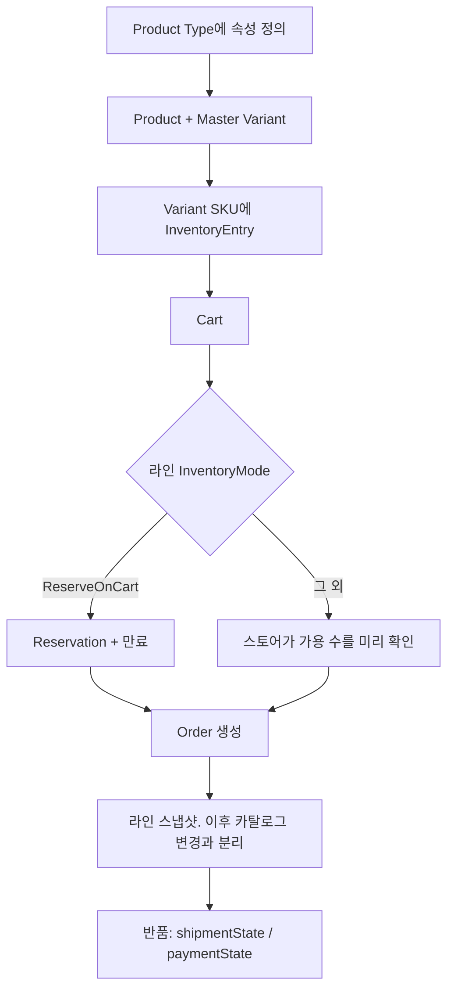
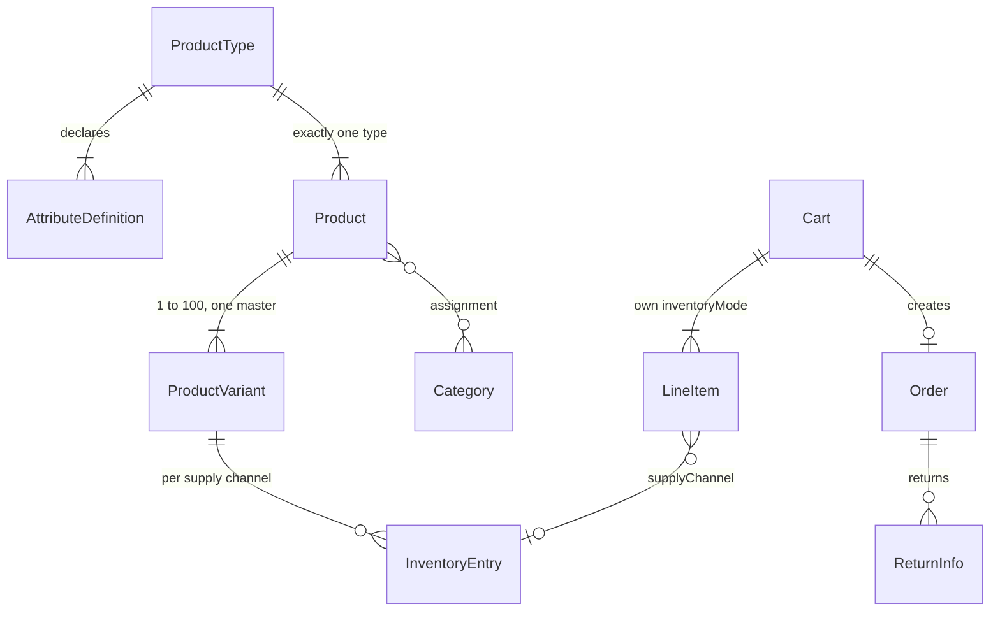

# commercetools — 상품 타입은 스키마고, 재고 모드는 라인마다 고른다

로컬 레포는 없다. 아래는 공식 학습 문서와 HTTP API다.

- [Modeling products](https://docs.commercetools.com/learning-model-your-product-catalog/product-modeling/modeling-products)
- [Cart inventory](https://docs.commercetools.com/learning-model-your-product-catalog/inventory-modeling/cart-inventory)
- [Inventory management](https://docs.commercetools.com/learning-model-your-product-catalog/inventory-modeling/inventory-management)
- [Orders](https://docs.commercetools.com/api/projects/orders)

Saleor의 채널, Medusa의 “언제 예약하나”, pretix의 카트 만료가 여기 한 표에 있다.

---

## 상품

| 개념 | 역할 |
|------|------|
| Product Type | 속성 정의의 템플릿. 상품군마다 하나. Attribute가 0개여도 된다 |
| Attribute | 그 타입의 필드. 필수 여부가 있다 |
| Product | 타입을 **정확히 하나** 가진다. **그 자체는 못 판다** |
| Product Variant | 파는 단위. SKU. Product당 최소 1개(Master Variant), 상한 100개 |
| Category | Product와 다대다. 마케팅·검색 묶음이지 재고가 아니다 |

셔츠와 호텔 객실 타입은 다른 Product Type이다. 같은 주문 엔진이 속성을 해석하지 않고, 타입에 선언된 필드만 채운다. Saleor `ProductType.kind`가 `normal | gift_card`뿐인 것과 달리, 타입 개수에 플랫폼 상한이 이 두 값으로 고정돼 있지 않다.

가격은 Product에 박힌 한 컬럼이 아니다. Price는 통화, 국가, 고객 그룹, 채널, 유효 기간을 갖고, 고르는 순서가 있다. 외부 가격을 쓰면 라인에 금액을 직접 넣는다. [Price selection](https://docs.commercetools.com/learning-price-and-discount-your-products/price-calculation/price-selection)

---

## 재고

`InventoryEntry`가 SKU의 물리 수량이다. `supplyChannel`이 있으면 그 채널(창고, 매장, 드롭십)의 수량이고, 없으면 채널 없는 일반 재고다.

카탈로그 응답의 `ProductVariantAvailability`는 이 엔트리를 모아 보여 주며 **eventual**이다. 엔트리에 `AddQuantity` 같은 직접 수정은 **strong**이다. 주문·카트 예약이 가용 수량에 반영되는 것도 eventual이고, 문서상 최대 약 10초다.

### InventoryMode

카트 기본값이고, 라인마다 덮어쓸 수 있다.

| 모드 | 담을 때 | 주문 만들 때 |
|------|---------|----------------|
| `None` | 플랫폼은 재고를 안 본다 | 그대로. 외부 시스템이 책임 |
| `TrackOnly` | 수량 검사로 막지 않음 | 재고를 줄인다. **음수가 될 수 있다** |
| `ReserveOnOrder` | 예약 없음 | 가용 수량을 보고, 부족하면 `OutOfStock` |
| `ReserveOnCart` | 라인 추가 즉시 예약. 프로젝트에 `reservationExpirationInMinutes`가 있어야 함 | 그 예약을 주문으로 넘긴다 |

`None`/`TrackOnly`/`ReserveOnOrder`에서는 담기 거절을 스토어프론트가 해야 한다. 플랫폼이 막는 담기는 `ReserveOnCart`뿐이다.

같은 SKU를 창고 둘에서 나누어 보내면 라인을 두 개 만들고 `supplyChannel`을 각각 단다. 한 라인에 창고를 여러 개 싣지 않는다.

예약은 라인을 지우거나 모드를 `ReserveOnCart`가 아닌 값으로 바꾸면 풀린다. 만료 시각이 지나면 풀린다.

---

## 환불·반품

돈과 물건이 주문 안의 다른 상태다.

`ReturnInfo` → `LineItemReturnItem.quantity`, `lineItemId`.

| 축 | 값 |
|----|-----|
| 물건 `ReturnShipmentState` | 생성 시 `Advised` 또는 `Returned`. 그 다음 `Returned`에서만 `BackInStock` 또는 `Unusable` |
| 돈 `ReturnPaymentState` | `NonRefundable`, `Initial`, `Refunded`, `NotRefunded` |

`BackInStock`이 재고 원복, `Unusable`은 돌아왔지만 다시 안 파는 경우다. 결제 캡처 취소는 이 상태 이름과 별도다. 플랫폼이 “환불 상태”를 기록하고, 결제사 호출은 결제 연동이 한다.

---

## 흐름

주문 수정은 update action 목록과 함께 **읽었던 version**을 보낸다. 다르면 `ConcurrentModification`(기대 버전 ≠ 실제 버전). 다시 읽어 재시도한다. 행 락을 밖에서 잡는 프로토콜이 아니라 낙관적 버전이다.

---

## 데이터 모델에서 기억할 관계

가격 스코프(국가, 고객 그룹, 채널, 기간)는 variant에 붙거나 standalone price로 빠진다. 재고 스코프는 supply channel이다. **가격 채널과 재고 채널이 다른 축**이다. Saleor는 판매 채널 하나가 가격과 창고 배정을 같이 잡는 경우가 많다.

---

## 지금 레포와 맞추면

- Medusa는 카트에서 검사만 하고 주문에서 예약한다. 그건 `ReserveOnOrder`에 가깝다. 한정 티켓 라인만 `ReserveOnCart`로 덮어쓰는 것이 이 문서의 라인 오버라이드다.
- pretix 카트 `expires`는 `reservationExpirationInMinutes`와 같은 자리다.
- QloApps 오버부킹은 `TrackOnly`(음수 허용)에 가깝고, `is_back_order`는 그 음수를 사람이 푸는 표시다.
- 검색 화면 품절과 결제 직전 품절이 10초 어긋날 수 있다. 판매 판단은 `ProductVariantAvailability`가 아니라 Inventory API를 본다.

가져가지 말 것: variant 100개 상한을 설계 한도로 베끼기. 그건 플랫폼 제한이다. 색×사이즈가 넘치면 Akeneo처럼 상위 모델을 나눈다.
