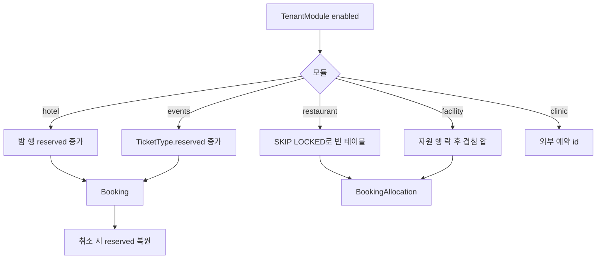

# FastBooking — 모듈마다 할당 전략, 락은 그 재고 행에 건다

소스는 [predictivelabsai/FastBooking](https://github.com/predictivelabsai/FastBooking)다. Python, FastAPI와 FastHTML, PostgreSQL, Apache-2.0. 커밋 수가 적고 스타가 없다. 운영 레퍼런스라기보다, 모듈을 나눈 예약·판매 스케치로 본다.

할당은 `app/services/booking.py`다. 테넌트가 켠 모듈만 예약을 받는다. 공통 줄은 `Booking`이고, 자리·테이블·시설은 `BookingAllocation`이다.

---

## 모듈

| 모듈 | 잠그는 행 | 가용성 |
|------|-----------|--------|
| restaurant | 수용 인원이 파티 이상인 `table`을 `FOR UPDATE SKIP LOCKED`, 작은 테이블부터 | 겹치는 `BookingAllocation`이 없으면 그 테이블 |
| hotel | `HotelRoomType`과 밤별 `HotelNightInventory`를 `FOR UPDATE` | 반열린 구간 `[check_in, check_out)`. 밤 행이 없으면 `units`와 `nightly_rate`로 만든다. `reserved + rooms`가 `capacity`를 넘거나 `closed`면 거절 |
| events | `TicketType`을 `FOR UPDATE` | `reserved + quantity <= capacity`. 판매 창, 회차 `published`, `max_per_booking` |
| recreation 시설 | `Resource`를 `FOR UPDATE` | 겹치는 allocation 수량 합 + 요청 수량 ≤ `resource.capacity` |
| recreation 프로그램 | 취소 경로에서 `RecreationProgramme` 행 락 | `enrolled` 카운터. 등록 행은 `ProgrammeEnrolment` |
| clinic | FastBooking 재고 행이 아님 | FastClinic HTTP로 예약. `Idempotency-Key`. 409면 그 시각은 없음. 임상 기록은 여기 두지 않는다 |

세는 예약 상태는 `pending`, `confirmed`다. 호텔·티켓·프로그램 취소는 같은 행을 다시 잠그고 `reserved` 또는 `enrolled`을 줄인다. 0 밑으로는 내리지 않는다.

호텔 요금은 밤마다 `rate`가 있으면 그 값, 없으면 룸타입 `nightly_rate`다. 숙박 합이 예약의 `subtotal`이 된다.

---

## 흐름

README는 모듈이 테넌트, 장소, 고객, 예약 참조, allocation, 알림, 결제 원장을 공유한다고 적는다. Stripe가 있으면 hosted Checkout이고, 없으면 시설에서 받는다. 이 노트의 재고 문장은 `booking.py`의 행 락이다.

---

## 지금 레포와 맞추면

- 호텔의 밤별 `capacity` / `reserved`는 QloApps의 방 행×날짜 겹침과 다르다. 룸타입 수량을 날짜마다 둔다. 물리 방 번호는 이 함수에 없다.
- 티켓 `reserved` 증가는 Saleor `quantity_allocated`에 가깝고, pretix처럼 주문 행을 매번 세지 않는다. 취소가 카운터를 되돌린다.
- 식당 테이블의 `SKIP LOCKED`는 alf.io가 빈 티켓 행을 집어 가는 방식과 같다. 잠긴 테이블은 건너뛰고, 맞는 빈 테이블이 없으면 거절한다.
- 클리닉은 재고의 주인이 외부다. Sharetribe `InventoryMode.None`처럼 이 저장소는 거절 코드만 받는다.

가져갈 것: 모듈이 달라도 `Booking`은 하나이고, 락과 복원은 그 모듈의 재고 행이 한다.

가져가지 말 것: 이 저장소의 카운터를 그대로 운영 원장으로 쓰기. 이동 이력 없이 `reserved`만 증감한다. 이력은 Odoo `stock.move`나 Sharetribe adjustment 쪽을 본다.
