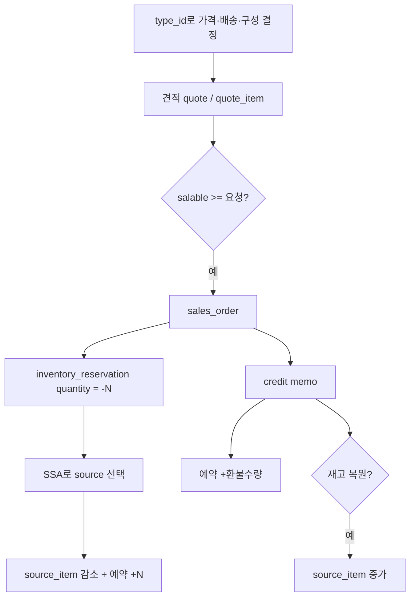
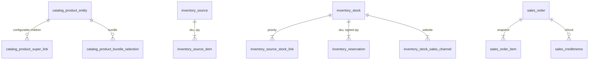

# Magento Open Source — 상품 타입은 클래스이고, 판매 가능 수량은 로그를 더한 값이다

로컬은 얕은 클론이다. `magento2`는 `2.4-develop`([magento/magento2](https://github.com/magento/magento2)), `magento-inventory`는 MSI 위키가 있는 `develop`([magento/inventory](https://github.com/magento/inventory))이다. 근거는 그 소스와 Adobe Commerce 문서다.

- [상품 타입](https://experienceleague.adobe.com/en/docs/commerce-admin/catalog/products/product-create)
- [타입을 추가하는 방법](https://developer.adobe.com/commerce/php/development/components/catalog/types/)
- [Salable quantity and reservations](https://github.com/magento/inventory/wiki/Salable-Quantity-Calculation-and-Mechanism-of-Reservations)
- [Inventory REST](https://developer.adobe.com/commerce/webapi/rest/inventory/)

GitHub `magento/magento2`의 `Magento_Catalog`, `Magento_ConfigurableProduct`, `Magento_Bundle`, `Magento_GroupedProduct`, `Magento_Inventory*`를 연다.

---

## 상품 타입

카탈로그 행은 하나(`catalog_product_entity`)이고, `type_id`가 동작을 고른다. 타입은 `product_types.xml`에 모델, 가격 모델, 재고 인덱서를 등록한다. 코어 여섯 가지다.

| type_id | 파는 것 | 재고 | 배송 |
|---------|---------|------|------|
| `simple` | SKU 하나인 실물 | 자기 SKU | 함 |
| `virtual` | 서비스, 보증, 멤버십 | 선택 | 안 함 |
| `downloadable` | 파일 또는 URL | 보통 없음 | 안 함. 구매 후 링크 |
| `configurable` | 옵션 목록으로 보이는 부모 | **자식 simple마다 SKU·재고.** 부모는 집계 | 자식이 실물이면 함 |
| `grouped` | 독립 SKU를 한 페이지에 모음 | 각각 | 부모 가격 없음. 줄마다 삼 |
| `bundle` | 고객이 고르는 구성 | 선택지마다 자식 simple | 구성품 출고. 가격은 고정 또는 구성 합 |

configurable의 “빨간 M”은 부모의 속성이 아니라 **다른 simple 상품**이다. `catalog_product_super_link`가 부모-자식을 잇고, 슈퍼 속성이 옵션 축이다. Saleor/Medusa의 variant 행과 같고, 그 variant가 카탈로그에서도 독립 상품이라는 점이 다르다.

grouped는 묶어 보여 줄 뿐 한 줄로 재고를 잠그지 않는다. bundle은 옵션(`catalog_product_bundle_option`)과 선택(`catalog_product_bundle_selection`)이 있고, 고객 선택이 주문 줄의 자식이 된다.

simple에 custom option을 붙이면 각인용 텍스트처럼 **SKU가 안 갈라지는** 선택이다. 필터도 안 되고 옵션별 재고도 없다. Shopware Custom Products와 같은 자리다.

EAV라 속성은 `catalog_product_entity_{varchar,int,decimal,text,datetime}`에 값만 쌓인다. 타입을 늘리려면 테이블을 만들기보다 `product_types.xml`에 `type name`, `modelInstance`, `priceModel`, `isQty`를 넣는다. Adobe 자습서의 예가 `rental`이다.

---

## 재고 (MSI)

단일 창고 시절의 `cataloginventory_stock_item.qty`와 별도로, Multi-Source Inventory가 판매 수량의 기준이다.

| 개념 | 테이블에 가까운 이름 | 의미 |
|------|----------------------|------|
| Source | `inventory_source` | 물리 창고·매장 |
| SourceItem | `inventory_source_item` | SKU가 그 창고에 몇 개인지. **프론트에 그대로 보여 주지 않는다** |
| Stock | `inventory_stock` | 판매 채널이 보는 창고 집합 |
| 연결 | `inventory_source_stock_link` | stock 안에서 source의 우선순위 |
| 채널 | `inventory_stock_sales_channel` | 웹사이트 → stock |
| Reservation | `inventory_reservation` | append-only 로그. `stock_id`, `sku`, `quantity`(음수 또는 양수), `metadata` JSON |

판매 가능 수량(한 stock, 한 SKU):

```
salable = (그 stock에 묶인 source들의 수량 합)
        + (그 stock·sku 예약 quantity의 합)
        - minQty   /* 품절 임계 */
```

예약은 주문이 생기면 **−N**이다. source 수량은 이때 안 줄어든다. 출고할 때 source를 정하고 source 수량을 줄이며, 예약을 상쇄하는 **+N** 행을 추가한다. 취소·크레딧 메모도 `order_canceled`, `creditmemo_created`라는 양의 예약으로 더한다. 기존 예약 행은 고치지 않는다.

위키의 예: source 20+25+10 → stock 인덱스 55. 주문 30은 예약 −30. 다음 손님은 55+(−30)=25로 판단한다. 어느 창고에서 뺄지는 주문 시점에 모른다.

출고 창고는 Source Selection Algorithm이다. 코어는 우선순위와 거리다. 더 싼 배송 같은 규칙은 같은 인터페이스의 확장이다. 가상·다운로드는 출고 때 알고리즘 결과를 그대로 쓴다.

장바구니 15분 예약은 MSI 위키가 **백로그**로 적은 기능이다. 기본 구현의 예약은 주문 접수다. Medusa/Saleor의 체크아웃 홀드와 같다고 보면 안 된다.

---

## 환불

Magento 환불 문서는 크레딧 메모(`sales_creditmemo`)다.

1. 돈: 온라인(결제 취소) 또는 오프라인(장부만) 크레딧 메모.
2. 판매 가능 수량: `creditmemo_created` 예약이 양의 수량으로 주문 예약과 상쇄된다.
3. 창고 수량: “재고로 되돌리기”를 켠 경우에 source 수량이 늘어난다. 예약 로그가 곧 창고 가산은 아니다.

부분 수량 크레딧 메모와 부분 출고가 겹치면, 위키는 “주문 줄의 개별 단위를 추적하지 못해 가정이 들어간다”고 적는다. 출고 전 환불과 출고 후 반품을 Shopify의 `cancel` / `return`처럼 타입이 강제하지 않는다.

---

## 흐름



견적과 주문은 테이블이 따로다(`quote`, `sales_order`). 주문 줄은 이름·SKU·가격을 복사한다.

---

## 데이터



예약 metadata 예: `{"event_type":"order_placed","object_type":"order","object_id":"8"}`. 주문 id로 집계할 뿐, 예약 테이블의 FK로 묶여 있지 않다. 주문 말고도 예약의 원인이 될 수 있게 일부러 느슨하다.

---

## 동시성

위키는 예약 insert를 append-only로 두고, 체크아웃에서 source 행을 잠그지 않는다고 설명한다. 판매 가능 수량은 인덱스 수량과 예약 합이다. 합이 맞는 이유는 행을 수정하지 않아서다.

그 설명이 **조회와 insert를 한 행 락으로 묶는다**는 뜻은 아니다. 두 주문이 같은 salable을 읽고 둘 다 −N을 넣으면 합이 음수가 될 수 있다. Saleor의 `select_for_update`보다 느슨하고, pretix의 합산과 비슷하되 용량 상한을 insert 시점에 락으로 확인한다는 문장은 위키에 없다.

인덱스(`inventory_stock_*` 계열)는 source 합의 캐시다. 프론트는 source 행을 직접 읽지 않는다.

---

## 가져갈 것

상품군을 늘릴 때 주문 테이블을 포크하지 않고 **타입 모델 + 가격 모델 + isQty**를 등록한다. 재고는 “창고 수량”과 “판매 채널 기준 판매 가능 수량”을 나누고, 후자는 이벤트 로그의 합이다. 창고를 고르는 일은 결제 후 출고 알고리즘이다.

configurable을 variant 테이블로 단순화해도 된다. 다만 bundle(구성이 주문 줄의 자식)과 grouped(부모는 진열일 뿐)은 한 `quantity` 컬럼으로 구분이 안 된다.
