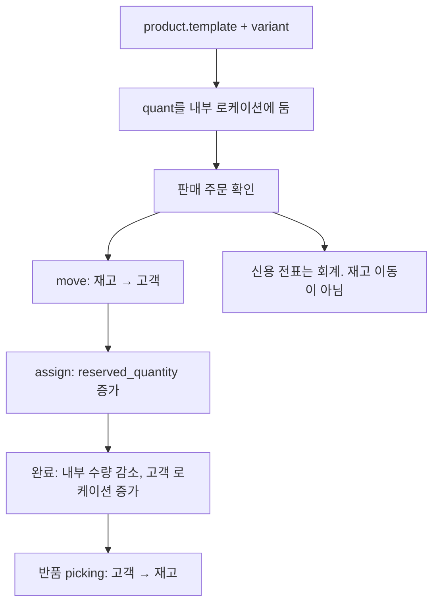
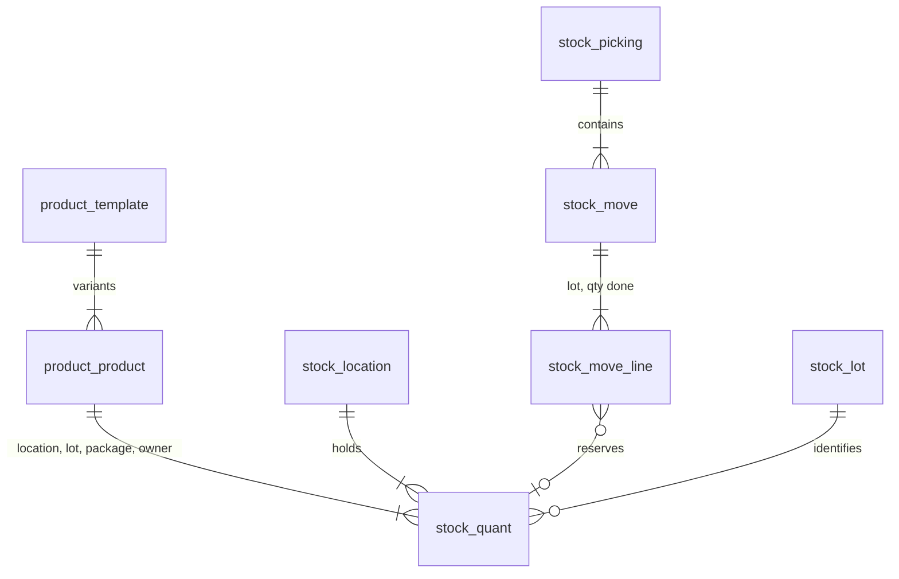

# Odoo stock — 재고는 장소에서 장소로 옮기는 전표다

전체 ERP를 읽지 않는다. 로컬 `odoo`는 17.0 얕은 클론(약 1.1GB, 히스토리 없음)이다. 원본은 [odoo/odoo](https://github.com/odoo/odoo)다. 기준은 `addons/stock`이다.

- [`stock_quant.py`](https://github.com/odoo/odoo/blob/17.0/addons/stock/models/stock_quant.py)
- [`stock_move.py`](https://github.com/odoo/odoo/blob/18.0/addons/stock/models/stock_move.py) (이동 필드는 18 표기와 같이 본다)
- 변형: [Product variants](https://www.odoo.com/documentation/16.0/applications/sales/sales/products_prices/products/variants.html)

판매 주문 확인 시 배송을 만드는 연결은 `sale_stock`이다. 견적서에서 재고를 미리 잡는 기능은 커뮤니티 모듈이지 코어가 아니다.

---

## 상품

| 모델 | 의미 |
|------|------|
| `product.template` | 이름, 속성, 판매·구매 플래그. 변형들의 합계를 보여 줌 |
| `product.product` | 팔고 재고를 세는 variant. 속성이 없으면 템플릿당 하나 |
| 속성 | 색 4 × 사이즈 5면 variant 20. 생성 시점은 Instant(조합 즉시) 등 |

재고 수량은 template이 아니라 **variant**에 있다. template 화면의 수량은 변형 합이다.

제품 유형이 재고를 탈지 정한다. 17 기준으로 보관(`product`, storable)만 quant를 탄다. 소모품·서비스는 예약 대상이 아니어서 `_should_bypass_reservation`이 참이 된다. 18 이후 유형 이름이 바뀌었으면 그 버전 소스를 다시 본다. 이 노트의 락 문장은 17 `stock_quant.py`다.

---

## 재고 원장

Spree `stock_movement`는 “이 SKU가 ±N 됐다”이다. Odoo `stock.move`는 **출발 로케이션 → 도착 로케이션**이다.

| 모델 | 역할 |
|------|------|
| `stock.location` | 내부, 고객, 공급사, 가상, 반품 로케이션. 사용처(`usage`)가 있다 |
| `stock.picking` | 입고·출고·내부 이동 문서. move를 묶음 |
| `stock.move` | 수요 수량(`product_uom_qty`). 상태 기계 |
| `stock.move.line` | 실제로 집은 수량. 로트, 패키지, 소유자 |
| `stock.quant` | 한 장소에 있는 실물. 키는 product, location, lot, package, owner |
| `stock.lot` | 로트·시리얼 |

```
가용 = quant.quantity - quant.reserved_quantity
예상(forecast) = 현재 + 입고 예정 − 출고 예정
```

판매가 확정되면 고객 로케이션으로 가는 move가 생기고, 예약은 그 move가 quant의 `reserved_quantity`를 올리는 일이다. 출고를 완료하면 내부 로케이션 수량이 줄고 고객 로케이션으로 수량이 간다. 수량을 지우지 않고 **옮긴다.**

로트·패키지·소유자가 키에 들어 있으므로 “같은 SKU 10개”가 로트마다 다른 quant다. 식품·시리얼 보증을 수량 카운터에 나중에 붙이면 키가 깨진다.

---

## 예약이 일어나는 때

코어는 견적(quotation)에서 재고를 잠그지 않는다. 그 버튼은 `odoo_stock_reservation` 같은 별도 모듈 설명에 있다.

확인된 판매 주문은 배송 picking을 만든다. 예약 시점은 출고 유형의 예약 방식이다. 확인 즉시, 수동, 예정일 이전이 있다. `stock.move`의 `_action_assign`이 가용 quant를 보고 `stock.move.line`을 만들고 `reserved_quantity`를 올린다.

예약 우회: 제품이 보관 타입이 아니거나, 로케이션이 예약을 쓰지 않으면 quant를 건드리지 않는다.

반품 picking은 고객 → 내부(또는 반품 로케이션) move다. 출고된 로트를 다시 집도록 예약 우회를 켜지 않는 수정이 17 전후에 들어가 있다. 돈 환불(신용 전표, `account.move`)은 재고 반품과 다른 앱이다. 반품 입고가 카드 환불을 호출하지 않는다.

---

## 락

`stock.quant` `_update_available_quantity` (Odoo 17):

```sql
SELECT id FROM stock_quant
WHERE id IN (...)
ORDER BY lot_id
LIMIT 1
FOR NO KEY UPDATE SKIP LOCKED
```

한 quant만 집어 잠그고 `quantity` 또는 `reserved_quantity`를 갱신한다. `SKIP LOCKED`라 다른 트랜잭션이 잠근 행은 건너뛴다. alf.io가 빈 티켓 행을 집어 가는 것과 같은 패턴인데, 대상이 “상태 FREE인 티켓”이 아니라 “그 장소의 quant”다.

`_update_reserved_quantity`는 이 함수에 `reserved_quantity`만 넘겨 호출한다. 주석대로 move가 quant를 직접 고르기보다 move line 생성·수정이 예약을 일으키게 층을 맞춘 이력이 있다. `stock.move` ↔ `stock.move.line` ↔ `stock.quant`.

`ORDER BY lot_id`는 잠금 순서를 고정해 교착을 줄인다. Saleor가 stock pk 순으로 잠그는 것과 같은 목적이다.

---

## 흐름



---

## 데이터



회사(`company_id`)가 멀티 컴퍼니 경계다. quant 검색 도메인에 회사가 들어간다. Saleor의 채널과는 다르다. 채널은 판매 조건이고, 회사는 재고 장부의 테넌트다.

---

## 가져갈 것

수량 컬럼 하나를 두기 전에 **이동 전표**를 두면 입고, 출고, 매장 이동, 반품, 폐기(가상 로케이션으로 이동)가 같은 코드다. 폐기 = 수량 감소 함수가 아니라 도착지가 가상 로케이션인 move다.

로트는 나중에 컬럼으로 붙이지 않는다. quant의 유니크 키에 빈 로트를 허용한 채 처음부터 넣는다.

가져가지 말 것: 견적 단계에서 예약한다고 가정하는 것. 코어의 예약은 배송 move가 assign될 때다. 카트 15분이 필요하면 commercetools `ReserveOnCart`를 보고, Odoo 코어에서 찾지 않는다.
