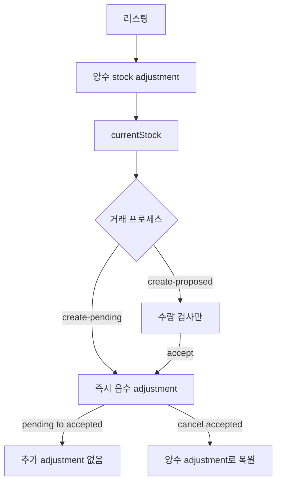

# Sharetribe — 재고는 불변 조정 원장이고, 좌석은 다른 기능이다

플랫폼 소스는 없다. 리스팅 하나의 정수 수량을 마켓플레이스 거래 프로세스에 묶는다.

- [Inventory management](https://www.sharetribe.com/docs/concepts/availability/inventory-management/)
- [Listing stock](https://www.sharetribe.com/docs/references/stock/)
- [Stock reservation actions](https://www.sharetribe.com/docs/references/transaction-process-actions/#stock-reservations)
- [Manage seats](https://www.sharetribe.com/docs/concepts/availability/manage-seats/)
- [Compare and set total stock](https://www.sharetribe.com/api-reference/integration.html#compare-and-set-total-stock)

수량의 단위는 물리 개수, 가상 개수, 배치 수처럼 마켓이 정한다. 정수가 아니면 이 기능이 아니다.

---

## 세 객체

| 객체 | 역할 |
|------|------|
| stock | 리스팅의 지금 팔 수 있는 수량. `listing.currentStock` |
| stock adjustment | 수량의 증감 기록. 양수는 입고, 음수는 판매. **만든 뒤 고치지 못한다** |
| stock reservation | 거래(transaction)가 잡아 둔 수량. 거래당 최대 하나 |

입고는 작성자나 운영자가 adjustment를 만든다. 판매 차감은 거래 프로세스가 reservation을 만들 때만 일어난다. Integration API로 다른 사이트의 판매를 같은 adjustment로 맞출 수 있다.

`compare and set`은 `oldTotal`이 지금 총량과 같을 때만 `newTotal`로 맞추는 adjustment를 만든다. 둘이 같으면 기록을 만들지 않는다. 외부 재고를 덮어쓸 때의 낙관적 조건이다.

과거 시점은 지금 총량에서 adjustment를 거꾸로 더해 복원한다. 조정 조회 창은 시작 시각 기준 약 366일이다.

---

## 예약 상태

상태 변경은 거래 transition의 액션으로만 된다.

| 상태 | 가용 수량에 잡힘 | adjustment |
|------|------------------|------------|
| `pending` | 예. 생성 즉시 음수 adjustment | `:action/create-pending-stock-reservation` |
| `proposed` | 아니오. 수량은 검사만 한다 | 생성 때는 없음 |
| `accepted` | 예 | `proposed`에서 올 때만 음수 adjustment. `pending`에서 오면 추가 기록 없음 |
| `declined` | 아니오 | `pending`이었으면 그 음수를 되돌리는 양수 adjustment |
| `cancelled` | 아니오 | `accepted`를 되돌리는 양수 adjustment |

수량을 푸는 액션(`decline-stock-reservation`, `cancel-stock-reservation`)은 transition 액션 목록의 **맨 뒤**에 둔다. 해제보다 앞선 액션이 실패하면 총량이 음수가 될 수 있고, 문서는 그걸 오류로 본다. 정상 경로에서 총량은 0 미만이 아니다.

거래가 끝나면 잡힌 수량은 재고에서 빠진다. 취소되면 양수 adjustment로 돌아온다. 품절 리스팅을 자동으로 닫는 기능은 기본 템플릿에 없고, 앱이 만든다. 닫지 않아도 가용 수량을 넘는 구매는 예약 생성 조건에서 거절된다.

---

## 좌석은 재고가 아니다

행사·수업의 자리는 [seats](https://www.sharetribe.com/docs/concepts/availability/manage-seats/)다. 시간대의 자리 수는 availability plan과 exception에 있고, 예약은 booking 액션이 잡는다. 재고 adjustment 원장과 섞지 않는다. 웹 템플릿 기본값은 시간대당 1자리다.

---

## 흐름

---

## 지금 레포와 맞추면

- Spree `stock_movement`와 같이 수량 변화는 원장 행이다. Sharetribe는 그 합이 곧 가용 수량이다. 선반 숫자와 할당 숫자를 따로 두지 않는다.
- `pending`은 Medusa가 주문 확정 때 예약하는 자리에 가깝고, `proposed`는 판매자 수락 전까지 재고를 안 잡는 제안이다. commercetools `ReserveOnOrder`와 `None`을 거래 프로세스 액션으로 고른 형태다.
- `compare and set`의 `oldTotal`은 commercetools 주문 수정의 version과 같은 역할이다. 읽은 총량과 다르면 덮어쓰지 않는다.

가져갈 것: 판매로 인한 차감과 입고를 같은 불변 기록으로 남기고, 해제는 그 기록의 역분개로만 한다.

가져가지 말 것: 좌석 시간표와 리스팅 수량을 한 카운터에 넣기. Sharetribe도 둘을 다른 기능으로 둔다.
