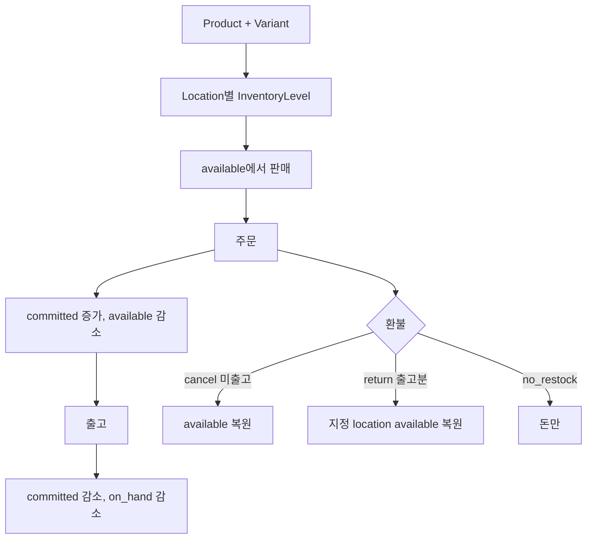

# Shopify — 재고는 상태 버킷이고, 환불은 돈과 재입고를 따로 고른다

플랫폼 소스는 없다. 아래 Admin 문서가 기준이다.

- [Inventory states](https://help.shopify.com/en/manual/products/inventory/managing-inventory-quantities/inventory-states)
- [앱이 보는 상태](https://shopify.dev/docs/apps/build/orders-fulfillment/inventory-management-apps)
- [번들](https://shopify.dev/docs/apps/build/product-merchandising/bundles)
- [RefundLineItemRestockType](https://shopify.dev/docs/api/admin-graphql/latest/enums/RefundLineItemRestockType)
- [Refund REST](https://shopify.dev/docs/api/admin-rest/latest/resources/refund)

---

## 상품

| 객체 | 역할 |
|------|------|
| Product | 진열 이름, 옵션 정의(Color, Size) |
| ProductVariant | 옵션 값의 조합. 파는 단위. 상품당 개수 상한이 있어 번들도 그 안에 넣어야 한다 |
| InventoryItem | SKU가 재고로 추적되는지, 추적 여부 |
| InventoryLevel | InventoryItem × Location의 수량 버킷 |
| Location | 매장·창고. 재고의 장소 |

옵션 조합마다 variant가 생긴다. Magento configurable과 같이 “변형 = 자기 SKU”다. 부모 Product를 직접 담지 않는다.

판매 계획(selling plan)은 구독, 프리오더, 써 보고 사기처럼 **청구·이행 일정**이다. 상품 타입 필드가 아니다. 문서상 번들은 selling plan과 같이 팔지 못한다. 구독과 구성품 묶음을 한 줄에 겹치지 않게 막아 둔 플랫폼 제약이다.

---

## 재고 버킷

장소마다 수량을 상태별로 둔다. 앱 문서의 정의가 운영 도움말보다 버킷이 많다.

| 상태 | 의미 | 판매에 포함 |
|------|------|-------------|
| `available` | 지금 팔 수 있음. 주문·예약에 안 묶임 | 예 |
| `committed` | 미출고 주문, 드래프트 예약, 출고 준비된 이동 | 아니오. **플랫폼만 증감** |
| `reserved` | 판매 불가 예약 버킷 | 아니오 |
| `damaged`, `safety_stock`, `quality_control` | 있지만 못 팜 | 아니오 |
| `on_hand` | 그 장소에 있는 물리 합. available+committed+reserved+파손+안전+QC | — |
| `incoming` | 이동·발주·앱으로 오는 중. 도착 장소에 표시. 받기 전에는 물리 재고가 아님 | 아니오 |

받기 완료 후 기본은 `available`로 들어가며 `on_hand`에 더해진다. 앱은 받은 수량을 안전 재고로 넣을 수 있다.

Saleor의 `quantity` / `quantity_allocated` 둘과 비교하면, Shopify는 “팔 수 있음 / 주문에 묶임 / 망가져 못 팜 / 오는 중”을 한 레벨 레코드의 상태로 유지한다. `committed`를 앱이 Admin API로 직접 조정하지 못한다. 주문 생성, 출고, 드래프트 예약, 이동의 “출고 준비”가 그 버킷을 바꾼다. 외부 재고를 믿을 거면 `available`을 맞추고, 주문 약속은 Shopify에 맡긴다.

### 번들

고정 번들(standard, multipack)은 부모 variant가 있고, 부모의 판매 가능 수량은 **구성품 수량의 최솟값**이다. 플랫폼이 부모 수량을 유지해 과판매를 막는다.

맞춤 번들은 `cartTransform`이 장바구니에서 여러 variant를 하나의 묶음으로 바꾸고 가격을 조정한다. 구성품은 장바구니·체크아웃에서 다시 검사된다. 부모를 구성 없이 팔면 안 되는 경우 `requiresComponents`를 켠다.

구성품 재고가 번들 부모보다 먼저 0이 되면 고정 번들은 부모가 같이 0이 된다. Medusa의 `required_quantity` 링크와 같은 방향인데, Shopify는 그 최솟값을 부모가 캐시한다.

---

## 환불

`Refund`는 주문에 붙는다. 줄(`RefundLineItem`)과 돈(`Transaction`)이 같이 있되 역할이 다르다.

`restock_type` ([REST 설명](https://shopify.dev/docs/api/admin-rest/latest/resources/refund)):

| 값 | 언제 | 재고 |
|----|------|------|
| `cancel` | 아직 미출고 | 취소수량을 `available`로 되돌림. 출고 가능 수량은 줄어듦 |
| `return` | 이미 출고·인도 | 반품 수량을 `available`로 되돌림. 출고 가능 수량은 그대로 |
| `no_restock` | 돈만 | 재고 불변 |
| `legacy_restock` | 과거 데이터 | 새 환불에는 넣지 못함 |

`return`과 `cancel`은 `location_id`가 필수다. 그 장소에 재고 연결이 없으면 연결을 만들고, 풀필먼트 서비스 장소와 다른 장소를 주면 오류다.

GraphQL enum은 `CANCEL`, `RETURN`, `NO_RESTOCK`이다. 돈 트랜잭션(원결제 환불, 금액)은 재입고 타입과 별도로 환불 객체에 실린다. 전액이 기본이 아니다.

---

## 흐름

드래프트 주문에 재고를 예약하면, 문서에 따라 그 시점부터 `committed`다. 도움말 일부는 드래프트가 커밋되지 않는다고도 적어 앱 문서와 결이 다르다. **구현 기준은 앱 문서**로 둔다. 드래프트 예약은 완료 전에 `committed`다.

---

## 지금 레포와 맞추면

- Spree `allocated_count`는 `committed`에 가깝고, `count_on_hand`는 `on_hand`에 가깝다. Shopify는 거기에 파손·안전·검수·incoming을 더한다. 식품·반품 대기 재고를 설계하면 이 버킷이 필요하다.
- 환불 API가 `cancel`과 `return`을 나눠, 미출고 취소가 창고 수량을 올리지 않고 **약속만 푼다**. Magento는 그 구분을 크레딧 메모의 “재고 복원” 체크에 맡긴다. Shopify 쪽이 실수가 적다.
- 번들 부모 = min(구성품)은 쿼리 때마다 최솟값을 계산하는 대신 부모 수량을 플랫폼이 맞춘다. 구성품을 단독으로도 팔면 부모 갱신이 늦으면 과판매다. 고정 번들은 플랫폼이 그 갱신을 자기 일로 둔다.

가져가지 말 것: `committed`를 애플리케이션이 고치게 두기. 주문과 재고 약속의 주인이 둘이면 Saleor의 `quantity_allocated` 드리프트와 같은 문제가 난다.
