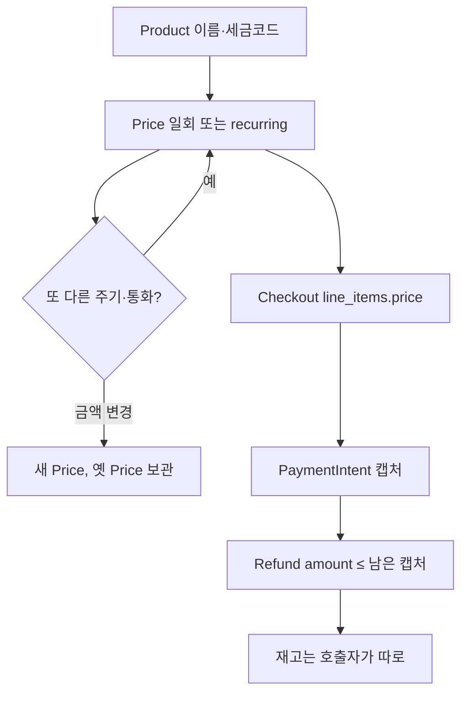
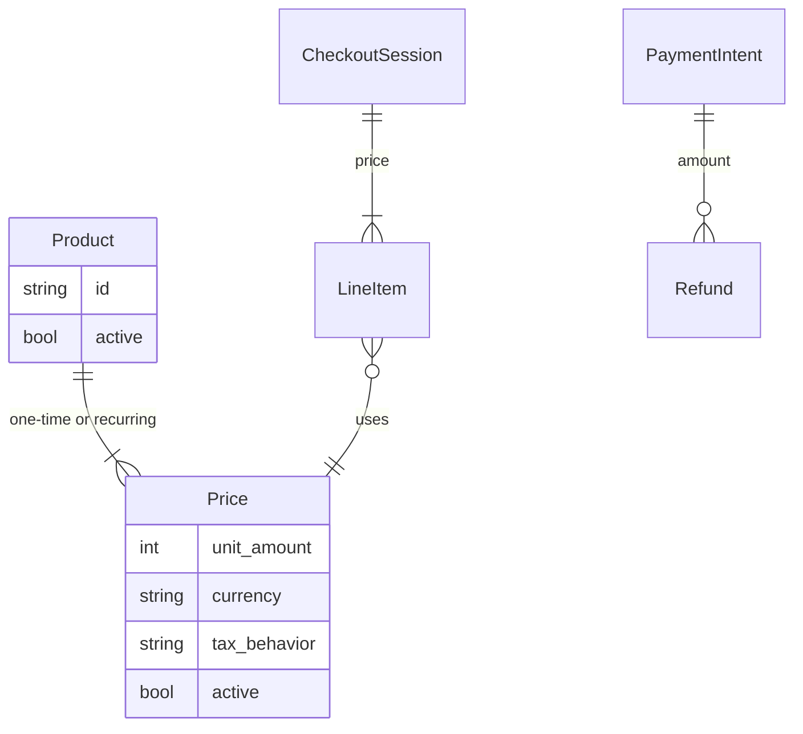

# Stripe Product / Price — 파는 것은 상품이 아니라 가격이다

재고 엔진이 아니다. 카탈로그와 청구를 나눈 모델이라, 커머스 주문 줄의 “단가”를 어디에 둘지 정할 때 본다.

근거: [How products and prices work](https://docs.stripe.com/products-prices/how-products-and-prices-work). 환불은 [Refunds API](https://docs.stripe.com/refunds). 재고 수량은 없다.

---

## 상품과 가격

| 객체 | 역할 |
|------|------|
| Product | 이름, 설명, 이미지, 세금 코드, 명세서 표기. id는 직접 지정 가능(자사 SKU를 id로) |
| Price | 얼마를, 얼마나 자주. `unit_amount`는 최소 통화 단위의 정수(센트). 사용량 과금은 decimal 수량을 허용하는 API가 따로 있다 |
| Price `recurring` | `interval` + `interval_count`. 없으면 일회성 |
| Price의 통화 | 한 Price 객체에 여러 통화를 넣을 수 있다. 결제는 그 중 하나 |

문서의 설계 규칙:

- 가격표에서 **다른 행**이면 Product를 나눈다. Starter와 Pro는 Product 둘.
- **같은 행의 청구 주기·통화**만 다르면 한 Product의 Price 여러 개. 월간과 연간.
- 영수증 줄 이름은 Product에서 온다. 티어를 Price로만 나누면 줄 이름이 같아진다.
- 금액을 바꿀 때 `unit_amount`를 수정하지 않는다. Price를 새로 만들고 기존 것은 `active=false`로 보관한다. 과거 인보이스가 옛 금액을 가리키게 두기 위해서다.

기본 가격(`default_price`)은 “보통 보여주는 가격”일 뿐 유일 가격이 아니다.

`price_data`로 체크아웃 때 금액을 넘기면, 그 Price는 대시보드 카탈로그에 안 잡히는 일회성 가격이 될 수 있다. 카탈로그 밖의 견적 금액이다. 기부와 같이 고객이 금액을 정하는 가격은 일회성만 된다. 구독은 안 된다.

세금: Product의 tax code와 Price의 `tax_behavior`(포함인지 별도인지). 포함 여부는 상품이 아니라 **가격**에 있다. 같은 상품을 미국(별도)과 유럽(포함)으로 팔 때 가격이 갈라지는 이유다.

---

## 구독은 타입이 아니다

Subscription은 recurring Price를 가리킨다. 한 구독에 Price를 여러 개 넣으려면, 유연 청구 모드가 아니면 `interval`과 `interval_count`가 같아야 한다. 간격 상한은 3년이다.

그래서 “구독 상품 타입”을 Magento `type_id`처럼 두지 않는다. 같은 실물·같은 이름이라도 청구 주기만 Price다. 기능이 다르면 Product다.

Checkout Session 라인은 `price` id를 받는다. 세션이 Price로 합계를 내고, Product로 이름·이미지를 그린다. 주문 줄 스냅샷의 두 출처가 이미 나뉘어 있다.

---

## 환불

Refund는 Charge 또는 PaymentIntent에 붙는다. Product에 붙지 않는다.

- 금액은 센트 정수. 생략하면 남은 금액 전액에 가깝게 환불한다. 부분 환불은 `amount`.
- 한 결제에 환불을 여러 번 할 수 있고, 합은 캡처액을 넘지 못한다.
- `Idempotency-Key` 헤더가 재시도를 한 환불로 만든다. Medusa가 `refund.id`를 결제사 멱등 키로 넘기는 것과 같은 자리다.
- 재고는 안 움직인다. `reason`은 요청 사유(`duplicate`, `fraudulent`, `requested_by_customer`)일 뿐 반품 입고가 아니다.

카드 환불과 창고 입고를 한 API에 넣지 않은 것이 설계다. Shopify는 환불 한 번에 `restock_type`을 받고, Stripe는 돈만 받는다. 자체 커머스를 만들면 창고는 자기 `Return`이 하고, Stripe에는 금액만 보낸다.

분쟁(dispute)은 환불과 다른 객체다. 고객이 카드사에 이의한 돈이라 판매자가 만든 Refund와 상태가 겹칠 수 있다. 원장은 Refund 합과 Dispute를 둘 다 본다.

---

## 없는 것

장바구니, 재고 예약, 출고, 반품 상태 기계, 행 락. 낙관적 잠금은 상품 객체에 없고, 쓰기 재시도는 멱등 키와 에러 코드(`idempotency_error`)다.

상품·가격 삭제는 원칙적으로 불가하고 보관(`active=false`)이다. 한 번도 안 쓴 가격만 예외적으로 지울 수 있다.

---

## 흐름

---

## 데이터

고객, 쿠폰, 상품, 가격 개수 상한은 문서가 “없다”고 한다. 구독에 섞인 청구 주기만 제한이 있다.

---

## 가져갈 것

주문 줄은 **Price의 불변 금액**을 가리키거나 그 금액을 복사한다. 상품의 `unit_amount`를 고쳐 과거 주문이 바뀌게 두지 않는다. commercetools가 가격에 유효 기간을 두고, Stripe는 가격 행을 닫고 새로 연다. 둘 다 “팔린 금액은 불변”이다.

통화가 여럿이면 상품을 복제하지 않고 가격만 늘린다. 이름·자격이 다르면 상품을 나눈다.

가져가지 말 것: Stripe Product를 재고 SKU의 원장으로 쓰기. id를 외부 SKU와 같게 둘 수는 있어도, 수량과 예약은 InventoryEntry, source_item, quant 쪽에 둔다.
