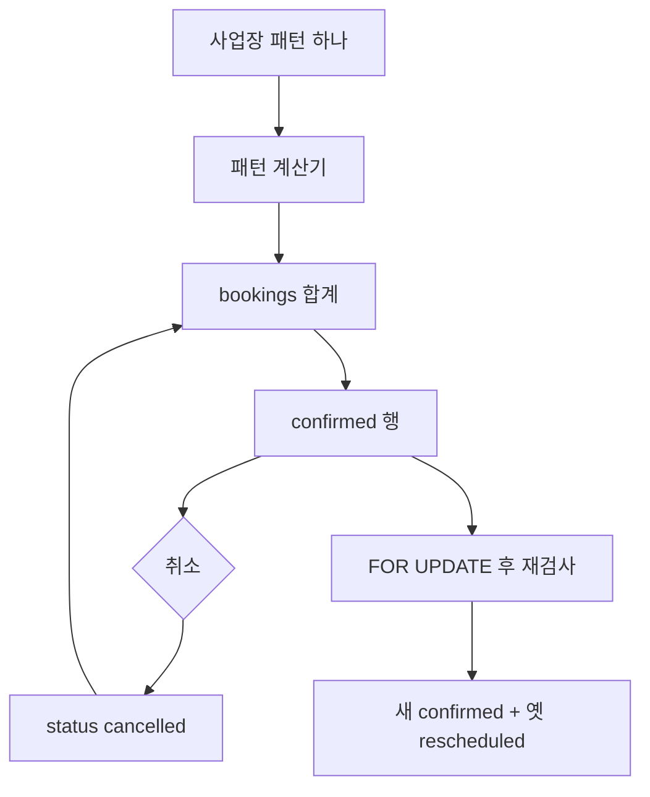

# VoxelBooking — 패턴은 사업장마다 하나, 예약 행은 한 테이블

소스는 [NowSquare/VoxelBooking](https://github.com/NowSquare/VoxelBooking)다. PHP 8.3, MySQL 8, AGPL-3.0. 커머스 주문이 아니라 예약 설치본이다. 사업장(tenant)을 만들 때 패턴을 하나 고르고, 네 패턴이 `bookings`를 같이 쓴다.

계산기는 `app/Engine/`에 있다. `TimeSlotCalculator`, `ResourceCalculator`, `CapacityCalculator`, `EventCalculator`. 취소·일정 변경은 `BookingService`.

---

## 네 패턴

| 패턴 | 파는 단위 | 가용성 |
|------|-----------|--------|
| timeslot | 서비스 × 직원 | 슬롯 길이, 버퍼, 근무시간 |
| resource | 객실·자원 1단위 | 박 단위. 체크인·체크아웃 요일 제한 (`027_add_resource_checkin_checkout_days`) |
| capacity | 슬롯의 파티 크기 | `capacity_slots.max_capacity`에서 그 시각의 `party_size` 합을 뺀다 |
| event | 회차의 자리 | RRULE 반복, 대기(`waitlisted`), 예약당 자리 상한 |

용량 패턴의 남은 수는 컬럼이 아니다. `CapacityCalculator`가 `status IN ('confirmed', 'rescheduled')`인 예약의 `party_size`를 합한다. 파티는 `min_party_size`와 `max_party_size` 사이에 있어야 한다. 전역 `blocked_dates`면 그날 슬롯은 없다. `max_advance_days` 기본은 90일이다.

---

## 상태와 취소

취소는 행을 지우지 않고 `status = cancelled`로 둔다. 계산기는 `confirmed`, `rescheduled`, 이벤트 대기를 세므로 취소 분은 다음 조회부터 빠진다.

일정 변경(`rescheduleBooking`)은 트랜잭션 안에서 한다.

1. 패턴별 기존 예약 행을 `SELECT … FOR UPDATE`
2. 기존 행을 잠시 `cancelled`로 바꿔, 재검사 합계에 자기 자리가 다시 들어가게 한다
3. 계산기로 목표 시각을 다시 확인한다. 이벤트는 결과가 대기열이면 거절한다
4. 새 `confirmed` 행을 넣고, 옛 행을 `rescheduled`와 `rescheduled_to_id`로 남긴다
5. 실패하면 트랜잭션이 옛 `confirmed`로 돌아간다

락 범위는 패턴마다 다르다. timeslot은 그날·그 직원, resource는 그 자원과 날짜가 겹치는 행, capacity는 그 시작 시각, event는 그 회차의 그날(`waitlisted` 포함)이다.

공개 생성 경로의 용량 검사는 `checkSlotAvailability`의 합계 재조회다. 행 락이 코드로 드러나는 곳은 일정 변경이다.

---

## 흐름

결제 원장, SKU, 주문 줄은 이 설치본의 예약 모델 밖에 있다. 가격은 화면에 쓰는 값이다.

---

## 지금 레포와 맞추면

- timeslot은 Easy!Appointments의 서비스×제공자 슬롯, resource는 QloApps의 날짜 점유, capacity는 `attendants_number`를 슬롯 정원과 파티 최소·최대로 키운 것, event는 pretix 쿼터에 가깝다.
- 네 계산기가 `bookings` 한 테이블을 공유하고 `booking_pattern`으로 가른다. 사업장 안에서는 패턴이 하나라, 한 주문에 셔츠와 티켓을 섞는 문제는 아직 없다.
- 남은 용량을 컬럼으로 캐시하지 않는 점은 pretix `quota.size`에서 팔린 수를 매번 세는 방식과 같다. 일정 변경만 그 합계를 행 락 안에서 다시 센다.

가져갈 것: 패턴별 가용성 계산과 공통 예약 행. 취소는 삭제가 아니라 합계에서 빠지는 상태.

가져가지 말 것: “한 사업장 = 한 패턴”을 한 카트의 상품군 경계로 쓰기. 그건 설치 단위의 선택이다.
